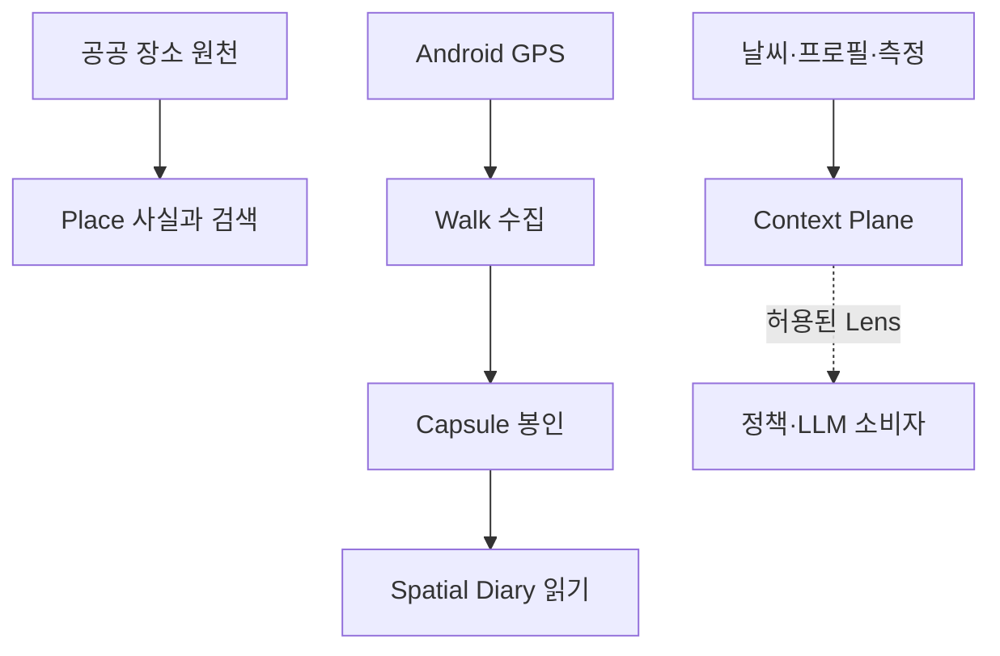

# DAENGS_geo

[](https://github.com/rkbuhtig/DAENGS_geo/actions/workflows/ci.yml)

장소 원천과 산책 측정을 재현 가능한 공간 증거로 만들고, 사용자가 증언한 장면을 조건별
공간 일기로 다시 읽는 DAENGS의 **지오 R&D·검증 원본**이다.

> 운영 Place/Journey 백엔드의 canonical 저장소는
> [SAJOYO/DAENGS_dev](https://github.com/SAJOYO/DAENGS_dev), 운영 Android 앱은
> [SAJOYO/DAENGS_app](https://github.com/SAJOYO/DAENGS_app)이다. 이 저장소의 코드는
> 전체 동기화하지 않고 측정과 계약으로 닫힌 단위만 선택적으로 승격한다.

[현재 컨셉과 범위](docs/overview.md) · [문서 지도](docs/README.md) ·
[Android 기준 구현](android/README.md) · [공급자 조립 현황](docs/provider-assembly.md)

## 작업별 입구

| 하려는 일 | 먼저 읽을 문서 |
|---|---|
| Place 검색·시설 UI·외부 제공사 확인 | [시설 탐색](docs/explorations/facility/README.md), [공급자 조립](docs/provider-assembly.md) |
| 산책 수집·실기기 관측·재생 | [기록·재생](docs/explorations/walk/recording/README.md), [Android 기준 구현](android/README.md) |
| 셀로판·조건별 공간 분포 읽기 | [공간 분석](docs/explorations/walk/spatial/README.md) |
| 공간 일기·장면·사용자 증언 | [일기 작업 입구](docs/explorations/walk/diary/README.md) |
| 점령 정책·시즌·DEV/APP 이관 | [게임 작업 입구](docs/explorations/walk/game/README.md) |
| 산책·점령 세션 통계 | [통계 작업 입구](docs/explorations/walk/statistics/README.md) |
| 화면을 열어 검토 | [도구 목록과 실행 조건](tools/README.md), [시설 AI 검토](tools/facility-review/README.md) |
| 변경 검증·운영 승격 범위 확인 | [테스트 안내](tests/README.md), [승격 원장](docs/promotion-ledger.toml) |

각 주제 문서에서 계획·구현·검증 결과를 구분한다. Geo의 구현이나 검토 화면이 있다는 사실만으로
운영 채택을 판단하지 않으며, DEV·APP 반영 범위는 인수인계와 승격 기록을 확인한다.

## 빠른 실행

아래 명령은 **Geo 저장소 루트의 Bash** 기준이다. Python 3.12와 `uv`, Docker가 필요하다.
로컬 API를 직접 띄우고 Docker는 DB만 사용하는 경로가 가장 단순하다.

```bash
cp .env.example .env  # 최초 준비 시. 기존 .env가 있으면 그 설정을 사용한다
docker compose up -d db
uv sync --frozen
uv run alembic upgrade head
uv run uvicorn app.main:app --reload
```

검색용 가상 시설이 필요하면 [개발 seed 안내](seeds/README.md)를 따른다.
Windows PowerShell에서는 첫 복사 명령을 `Copy-Item .env.example .env`로 실행하고, 나머지 명령은 같다.

OpenAPI는 `http://127.0.0.1:8000/docs`, 상태 확인은 `/health`와 `/health/ready`다.
검토 화면은 공용 API와 분리된 입구에서 선택해 실행한다. 예를 들어
`uv run python -m tools.lab_server --tool cellophane --tool spatial-diary --port 8001`을
실행하면 해당 서버에서 기존 URL로 열린다. 도구별 명령·데이터·저장 조건은
[tools 안내](tools/README.md)를 따른다. `DAENGS_DEV_CONSOLE=true`만으로 검토 화면이 열리지는 않는다.

테스트와 정적 검사는 다음으로 실행한다. DB·선택 의존성·별도 도구 검사의 조건은
[테스트 안내](tests/README.md)를 따른다. `skip`이 있으면 해당 검증은 실행되지 않은 것이다.

```bash
uv run ruff check .
uv run pytest -q -rs
```

### Place 검색만 실행

Place 검색은 provider·LLM 키 없이 PostGIS만으로 실행되는 독립 import closure를 가진다.

```bash
uv run uvicorn app.search_main:app --reload
```

`tests/test_search_closure.py`가 이 경계를 검사한다. DB 이미지는 PostgreSQL 18 · PostGIS 3.6 ·
pgvector 0.8.6 조합이다. Compose로 API까지 띄울 때도 Alembic은 자동 실행되지 않으므로 먼저
`docker compose run --rm api alembic upgrade head`를 실행한다.

## 저장소 지도

| 위치 | 책임 |
|---|---|
| `app/core`, `geo`, `place`, `providers`, `usage` 등 | 공통 설정·공간 primitive·검색·제공사·사용량 |
| `app/discovery/place_intent` | intent compiler·planner·lens·관측 저장 |
| `app/features/walk` | 세션 수집·사실·Capsule 생산 |
| `app/features/territory` | Cellophane·Field·조건별 View·Memory Place |
| `app/features/territory_game` | 점령 정책·트랜잭션·PostgreSQL·순수 시즌 규칙 |
| `app/features/spatial_diary`, `storyboard`, `activity_statistics` | 공간 일기·장면 구성·산책과 게임 통계 |
| `app/features/context_plane`, `journey`, `scene` | 기존 도메인 adapter·Journey HTTP·산책 사실 소비 |
| `app/main.py`, `app/search_main.py` | 공용 기준 API, Place 검색 전용 실행 |
| [tools/](tools/README.md) | 도구별 검토 HTTP·화면·로컬 저장. `lab_server.py`는 선택·연결 |
| [scripts/](scripts/README.md) | 관리 명령·공용 시뮬레이터·관통 검증·갈래별 실험 |
| [tests/](tests/README.md) | 기능·도구 소유권별 검증. 새 테스트는 소유 폴더에 배치 |
| [alembic/](alembic/README.md), [seeds/](seeds/README.md) | 단일 스키마 변경 경로, 수동 개발용 가상 데이터 |
| [docs/](docs/README.md), [android/](android/README.md) | 문서 유형별 기록, Kotlin/Compose 연구·대조 구현 |

파일 이동과 유지한 실행·저장 경계, 기준선 대비 검증은
[구조 정리 결과](docs/research/2026-09-07-repository-reorganization.md)에 있다.

## 핵심 흐름



`WalkFacts`와 그 canonical 자식은 관측 사실만 소유한다. 행동 원인·일기 문장·개의 목소리는
생산 사실에 넣지 않는다. Spatial Diary는 같은 증거를 다시 읽는 별도 소비자이며, Candidate나
단순 interaction이 아니라 사용자 `Attestation`만 안정적인 `EpisodePin` 의미로 승격한다.

개인정보와 주장 권위까지 포함한 상세 경계는 [컨셉과 범위](docs/overview.md), 객체별 수명은
[Walk Capsule 계약](docs/contracts/walk-capsule.md)과
[Spatial Diary 결정 #74](docs/decisions/2026-09-01-spatial-diary.md)를 따른다.

## 주요 API 입구

아래는 대표 표면이다. 전체 경로·요청·응답은 실행 중인 공용 API의 `/docs`에서 확인한다.

| 표면 | 역할 |
|---|---|
| `POST /v2/places/search` | canonical Place 검색 |
| `POST /journey` | 선택 목적지의 이동 snapshot과 지도 handoff |
| `POST /walk/sessions` | 멱등 산책 시작 |
| `POST /walk/sessions/{session_id}/fixes` | 원본 fix 배치 수신 |
| `POST /walk/sessions/{session_id}/finish` | Capsule 봉인과 raw fix purge |
| `GET /territory/sites/nearby` | 적재한 중립 점령지 조회 |
| `/spatial-diary/*` | View·Offer·Pin·Memory Place·Journal·Snapshot |

Spatial Diary는 인증 principal을 요구한다. 앱 조립부가 실제 인증 dependency를 주입하기 전에는
기본 구현이 503으로 fail closed한다.

## 스키마 변경

스키마 변경과 기존 DB 판별 절차는 [Alembic 안내](alembic/README.md)를 따른다.
개발용 가상 데이터는 [seed 안내](seeds/README.md)에서 별도로 적재한다.

## 공공데이터 적재

행정안전부 동물병원·동물약국 인허가 API는 사용자 검색 중 호출하지 않고 배치에서만 호출한다.
좌표는 적재 시 WGS84로 변환하고, 인허가 상태가 활성인 Place만 기본 검색 후보가 된다.

```bash
DAENGS_DATA_GO_KR_SERVICE_KEY=... uv run python -m app.ingest full
DAENGS_DATA_GO_KR_SERVICE_KEY=... uv run python -m app.ingest incremental
```

이 원천은 현재 영업시간·야간·24시간·진료과목을 제공하지 않는다. `open_now` 미상을 닫힘으로
바꾸거나 이름 기반 태그를 원천 사실처럼 사용하지 않는다. 한 종류만 적재할 때는
`--kind hospital` 또는 `--kind pharmacy`를 사용한다. 다른 원천은 `app/ingest/`를 따른다.

## 외부 제공사와 사용량 Gate

NAVER Static Map, 실측 경로, LLM 호출은 같은 Usage Gate를 통과한다. 코드 기본값
`DAENGS_USAGE_POLICY=deny-all`에서는 실제 외부 호출을 허용하지 않는다. 로컬 키 검증 때만
`dev`를 명시한다.

```env
DAENGS_USAGE_POLICY=dev
```

제공사 선택·폴백·현재 검증 범위는 [docs/provider-assembly.md](docs/provider-assembly.md),
설정 키는 [.env.example](.env.example)을 따른다. 키가 없어도 Place 검색 전용 앱과 대부분의
테스트는 동작한다.

## Android

`android/`는 독립 Gradle 프로젝트다. 위치 구독 소유권, foreground service, Room 원본 저장,
`DEV_DOG_ID` 기반 종료 업로드, debug replay와 실측 export는
[android/README.md](android/README.md)에 정리돼 있다.

실제 프로필·인증 연동, process-death 복구 UI, 원본 fix 보관 기간·삭제 UI, release 배포 설정은
이 Geo 기준 구현의 남은 범위다. 운영 앱의 구현 여부는 `DAENGS_APP`에서 별도로 확인한다.

## 문서

- [docs/overview.md](docs/overview.md) — 현재 컨셉·소유권·성숙도·개인정보 경계
- [docs/README.md](docs/README.md) — 결정·계약·탐색·연구 전체 지도
- [docs/contracts/](docs/contracts/) · [docs/decisions/](docs/decisions/) — 계약과 채택된 결정
- [docs/provider-assembly.md](docs/provider-assembly.md) — 외부 제공사 조립 현황
- [tools/README.md](tools/README.md) · [scripts/README.md](scripts/README.md) · [tests/README.md](tests/README.md) — 검토 도구·명령·테스트 소유권
- [docs/backlog.md](docs/backlog.md) — 갈래에 붙지 않은 미결

날짜가 붙은 `docs/research/`는 당시 관찰 기록이다. 현재 상태 문서처럼 소급해서 고치지 않고,
뒤 결정에서 결론이 바뀌면 superseded 관계로 연결한다.

## 운영 승격

| 운영 표면 | canonical 저장소 | 이 저장소의 역할 |
|---|---|---|
| Place 검색·Journey 백엔드 | [SAJOYO/DAENGS_dev](https://github.com/SAJOYO/DAENGS_dev) | 새 원천·분류·ranking·계약 후보 검증 |
| Android 지도·Place UX·산책 수집 | [SAJOYO/DAENGS_app](https://github.com/SAJOYO/DAENGS_app) | walk·공간 실험과 기준 구현 검증 |

`docs/promotion-ledger.toml`은 마지막 Geo 승격 커밋과 운영 착륙 커밋을 함께 기록한다.

```bash
uv run python -m scripts.promotion_status
```

`pending`은 오류나 자동 복사 지시가 아니라 마지막 승격 뒤 관련 실험이 생겼다는 검토 표식이다.
운영 PR에서 가져갈 것·남길 것·의도적으로 다르게 구현할 것을 정한 뒤 원장을 갱신한다.
