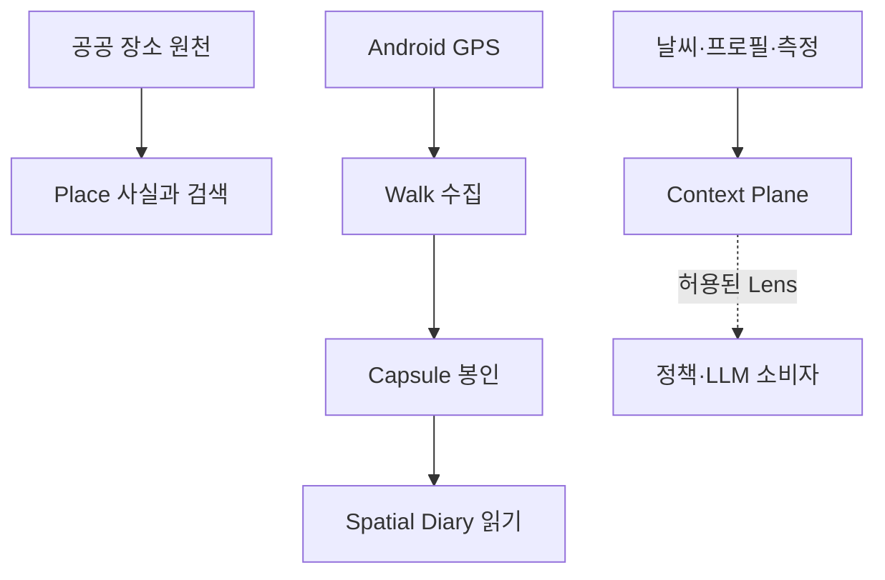

# DAENGS_geo

[](https://github.com/rkbuhtig/DAENGS_geo/actions/workflows/ci.yml)

장소 원천과 산책 측정을 재현 가능한 공간 증거로 만들고, 사용자가 증언한 장면을 조건별
공간 일기로 다시 읽는 DAENGS의 **지오 R&D·검증 원본**이다.

> 운영 Place/Journey 백엔드의 canonical 저장소는
> [SAJOYO/DAENGS_dev](https://github.com/SAJOYO/DAENGS_dev), 운영 Android 앱은
> [SAJOYO/DAENGS_app](https://github.com/SAJOYO/DAENGS_app)이다. 이 저장소의 코드는
> 전체 동기화하지 않고 측정과 계약으로 닫힌 단위만 선택적으로 승격한다.

[현재 컨셉과 범위](docs/overview.md) · [문서 지도](docs/README.md) ·
[Android 기준 구현](android/README.md) · [공급자 조립 현황](docs/provider-assembly.md)

## 현재 상태

| 축 | 구현 상태 | 운영 경계 |
|---|---|---|
| Place 검색 | canonical `POST /v2/places/search`, kind별 그룹·사실 조건·공통 identity | 운영 원본은 `DAENGS_dev` |
| Journey | 선택한 Place의 이동 snapshot과 NAVER handoff | 운영 원본은 `DAENGS_dev` |
| Android | 위치·Place·Journey·foreground 산책·Room·명시적 종료 업로드 | 운영 원본은 `DAENGS_app` |
| Walk Capsule | WalkFacts·Cellophane·측정 영수증·당시 문맥을 봉인한 뒤 raw fix purge | 이 저장소의 증거 생산 계약 |
| Spatial Diary | 조건별 View, Offer·Attestation·Pin, Memory Place, Journal, 비공개 Snapshot | DB/API 구현, 인증 미조립 시 503 |
| Context Plane | typed Atom·Facet·Lens와 기존 객체 adapter | 계약 구현, 기존 소비자의 전면 이행은 아직 |
| 자연어 Place intent | hypothesis·lens·open discovery·관측 로그 | dev-only lab, 제품 필수 경로 아님 |

CI는 실제 PostGIS를 포함한 backend `ruff + pytest`와 Android unit test + `assembleDebug`를 병렬로
검증한다.

## 핵심 흐름



산책 종료는 다음 순서를 지킨다.

```text
start / fixes / finish
→ canonical fix chain
→ WalkFacts · occurrence · micro observation
→ 8u Cellophane · MeasurementReceipt · TrailContextSnapshot
→ WalkCapsuleManifest seal
→ raw fix purge
```

`WalkFacts`와 그 canonical 자식은 관측 사실만 소유한다. 행동 원인·일기 문장·개의 목소리는
생산 사실에 넣지 않는다. Spatial Diary는 같은 증거를 다시 읽는 별도 소비자이며, Candidate나
단순 interaction이 아니라 사용자 `Attestation`만 안정적인 `EpisodePin` 의미로 승격한다.

개인정보와 주장 권위까지 포함한 상세 경계는 [컨셉과 범위](docs/overview.md), 객체별 수명은
[Walk Capsule 계약](docs/contracts/walk-capsule.md)과
[Spatial Diary 결정 #74](docs/decisions/2026-09-01-spatial-diary.md)를 따른다.

## 저장소 지도

```text
app/
├── api/                         Place v2·정적 지도 HTTP 표면
├── context_plane/               typed Atom·Facet·Lens·registry
├── core/                        설정·DB·clock·스키마 판별
├── discovery/place_intent/      intent compiler·lens·dev lab
├── features/
│   ├── walk/                    세션→사실→Capsule 생산
│   ├── territory/               Cellophane·Field·View·Memory Place
│   ├── spatial_diary/           Offer·Attestation·Pin·Journal·Snapshot
│   ├── context_plane/           기존 도메인 객체 adapter
│   ├── journey/                 Journey HTTP 표면
│   └── scene/                   walk 사실의 규칙 기반 소비자
├── geo/                         좌표·시간·태그·PostGIS primitive
├── ingest/                      공공 원천 정규화·적재·연결
├── journey/                     경로·advice·handoff
├── place/                       canonical Place 계약·검색·평가
├── profile/                     외부 프로필 계약과 fixture source
├── providers/                   지도·경로 제공사 adapter
├── usage/                       실제 외부 호출 Gate
├── main.py                      전체 R&D 앱
└── search_main.py               Place 검색 전용 앱

android/                         Kotlin/Compose 기준 구현
alembic/                         단일 스키마 변경 경로
docs/                            결정·계약·탐색·연구
scripts/                         운영 도구·검증 하네스·측정 spike
tests/                           도메인 소유권별 회귀 테스트
```

## 빠른 실행

Python 3.12와 `uv`, Docker가 필요하다. 로컬 API를 직접 띄우고 Docker는 DB만 사용하는 경로가
가장 단순하다.

```bash
cp .env.example .env
docker compose up -d db
uv sync
uv run alembic upgrade head
docker compose exec -T db psql -U daengs -d daengs < migrations/dev_seed.sql
uv run uvicorn app.main:app --reload
```

OpenAPI는 `http://127.0.0.1:8000/docs`, 상태 확인은 `/health`와 `/health/ready`다.
`DAENGS_DEV_CONSOLE=true`이면 `/facility-map`·`/place-intent-lab`·`/cellophane` 같은
검증 화면도 열린다. `.env.example`은 로컬용으로 켜져 있지만 코드 기본값은 닫혀 있다.

테스트와 정적 검사는 CI와 같은 명령으로 실행한다.

```bash
uv run ruff check .
uv run pytest -q -rs
```

### Place 검색만 실행

Place 검색은 provider·LLM 키 없이 PostGIS만으로 실행되는 독립 import closure를 가진다.

```bash
uv run uvicorn app.search_main:app --reload
```

`tests/test_search_closure.py`가 이 경계를 검사한다. DB 이미지는 PostgreSQL 18 · PostGIS 3.6 ·
pgvector 0.8.6 조합이다. Compose로 API까지 띄울 때도 Alembic은 자동 실행되지 않으므로 먼저
`docker compose run --rm api alembic upgrade head`를 실행한다.

## API 입구

| 표면 | 역할 |
|---|---|
| `POST /v2/places/search` | canonical Place 검색 |
| `POST /journey` | 선택 목적지의 이동 snapshot과 지도 handoff |
| `POST /walk/sessions` | 멱등 산책 시작 |
| `POST /walk/sessions/{session_id}/fixes` | 원본 fix 배치 수신 |
| `POST /walk/sessions/{session_id}/finish` | Capsule 봉인과 raw fix purge |
| `/spatial-diary/*` | View·Offer·Pin·Memory Place·Journal·Snapshot |

Spatial Diary는 인증 principal을 요구한다. 앱 조립부가 실제 인증 dependency를 주입하기 전에는
기본 구현이 503으로 fail closed한다.

## 스키마 변경

스키마 변경은 Alembic 한 경로다. `--autogenerate`는 쓰지 않는다. ORM metadata가 전체 legacy
테이블을 표현하지 않아 정상 테이블을 삭제 대상으로 오판할 수 있기 때문이다.

```bash
uv run alembic upgrade head
uv run alembic revision -m "무엇을 바꾸는지"
```

Alembic 도입 전 DB에 일괄 `stamp head`를 하면 안 된다. 먼저 실제 스키마 지표를 판별한다.

```bash
uv run python -m scripts.detect_schema_revision
```

출력된 `stamp <revision>`과 `upgrade head`를 검토해 실행한다. 자세한 수명과 과거 SQL 경계는
[migrations/README.md](migrations/README.md)를 따른다.

## 공공데이터 적재

행정안전부 동물병원·동물약국 인허가 API는 사용자 검색 중 호출하지 않고 배치에서만 호출한다.
좌표는 적재 시 WGS84로 변환하고, 인허가 상태가 활성인 Place만 기본 검색 후보가 된다.

```bash
DAENGS_DATA_GO_KR_SERVICE_KEY=... uv run python -m app.ingest full
DAENGS_DATA_GO_KR_SERVICE_KEY=... uv run python -m app.ingest incremental
```

이 원천은 현재 영업시간·야간·24시간·진료과목을 제공하지 않는다. `open_now` 미상을 닫힘으로
바꾸거나 이름 기반 태그를 원천 사실처럼 사용하지 않는다. 한 종류만 적재할 때는
`--kind hospital` 또는 `--kind pharmacy`를 사용한다. 다른 원천은 `app/ingest/`를 따른다.

## 외부 제공사와 사용량 Gate

NAVER Static Map, 실측 경로, LLM 호출은 같은 Usage Gate를 통과한다. 코드 기본값
`DAENGS_USAGE_POLICY=deny-all`에서는 실제 외부 호출을 허용하지 않는다. 로컬 키 검증 때만
`dev`를 명시한다.

```env
DAENGS_USAGE_POLICY=dev
```

제공사 선택·폴백·현재 검증 범위는 [docs/provider-assembly.md](docs/provider-assembly.md),
설정 키는 [.env.example](.env.example)을 따른다. 키가 없어도 Place 검색 전용 앱과 대부분의
테스트는 동작한다.

## Android

`android/`는 독립 Gradle 프로젝트다. 위치 구독 소유권, foreground service, Room 원본 저장,
`DEV_DOG_ID` 기반 종료 업로드, debug replay와 실측 export는
[android/README.md](android/README.md)에 정리돼 있다.

실제 프로필·인증 연동, process-death 복구 UI, 원본 fix 보관 기간·삭제 UI, release 배포 설정은
아직 운영 앱에서 닫아야 한다.

## 문서

- [docs/overview.md](docs/overview.md) — 현재 컨셉·소유권·성숙도·개인정보 경계
- [docs/README.md](docs/README.md) — 결정·계약·탐색·연구 전체 지도
- [docs/contracts/](docs/contracts/) · [docs/decisions/](docs/decisions/) — 계약과 채택된 결정
- [docs/provider-assembly.md](docs/provider-assembly.md) — 외부 제공사 조립 현황
- [scripts/README.md](scripts/README.md) · [tests/README.md](tests/README.md) — 실행 도구와 테스트 소유권
- [docs/backlog.md](docs/backlog.md) — 갈래에 붙지 않은 미결

날짜가 붙은 `docs/research/`는 당시 관찰 기록이다. 현재 상태 문서처럼 소급해서 고치지 않고,
뒤 결정에서 결론이 바뀌면 superseded 관계로 연결한다.

## 운영 승격

| 운영 표면 | canonical 저장소 | 이 저장소의 역할 |
|---|---|---|
| Place 검색·Journey 백엔드 | [SAJOYO/DAENGS_dev](https://github.com/SAJOYO/DAENGS_dev) | 새 원천·분류·ranking·계약 후보 검증 |
| Android 지도·Place UX·산책 수집 | [SAJOYO/DAENGS_app](https://github.com/SAJOYO/DAENGS_app) | walk·공간 실험과 기준 구현 검증 |

`docs/promotion-ledger.toml`은 마지막 Geo 승격 커밋과 운영 착륙 커밋을 함께 기록한다.

```bash
uv run python -m scripts.promotion_status
```

`pending`은 오류나 자동 복사 지시가 아니라 마지막 승격 뒤 관련 실험이 생겼다는 검토 표식이다.
운영 PR에서 가져갈 것·남길 것·의도적으로 다르게 구현할 것을 정한 뒤 원장을 갱신한다.
