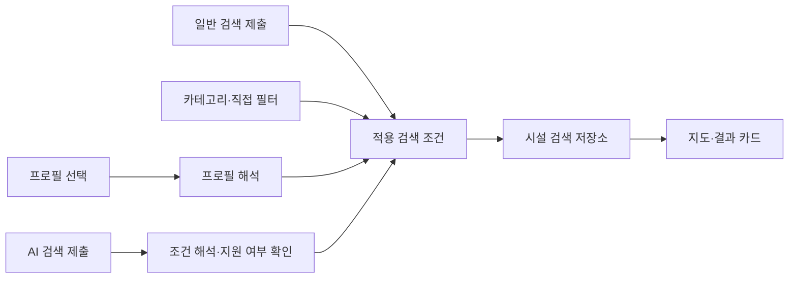

# 시설 검색 구현 작업 계획

작성일: 2026-09-05. 상태: Kotlin 화면·일반 검색·반경·전체보기 구현, 3단계 조사 완료.
실기기 검증과 운영 기본 화면 전환은 남아 있다.

### 1단계 작업 기록 (2026-09-05)

- 앱 최신 dev 기준점: `2102ff7`. 작업 브랜치: `feat/place-search-ui-lab`.
- 앱 PR (병합됨): [DAENGS_APP #143](https://github.com/SAJOYO/DAENGS_APP/pull/143).
- debug 전용 `PlaceSearchLabActivity`에서 저장 응답으로 검색창·2행 카테고리·프로필 자리·
  결과 헤더·서랍식 카드를 검토한다. 운영 진입점은 유지한다.
- 입력/적용 조건/선택/펼침 상태 분리, 제한 JSON 보존, 기존 MapHost 선택 연결을 구현했다.
- Windows 로컬 JDK 25·SDK로 APK 빌드 및 단위 테스트 수행. 최종 결과는 앱 PR에 기록한다.
- 프로필/AI/전화/길찾기 미연결. 실제 지도·큰 글자·작은 화면·회전·접근성 검증은 남아 있다.
- 따라서 개발용 구현을 운영 화면 이식 완료나 1단계 전체 검증 완료로 취급하지 않는다.

## 목표와 기준

웹에서 합의한 시설 검색 화면을 Kotlin 앱으로 옮기고 일반 검색, 직접 필터,
반려견 프로필, AI 조건 검색을 순차적으로 연결한다. 첫 실제 사용 가능한 버전은
AI 없이 일반 검색과 직접 조건 선택으로 시설을 탐색할 수 있는 화면이다.

- UI 기준: [웹 검토판](place-ui-web.md)의 제한사항 보완안.
- 프로필 기준: [반려견 선택 계약 초안 v1](place-search-profile-contract.md).
- 실험·계약·검토 기록은 DAENGS_geo에 둔다. 실제 Kotlin 반영 대상은 DAENGS_app,
  운영 검색 변경 대상은 DAENGS_dev이며 각 레포의 최신 구조를 구현 착수 시 다시 확인한다.
- 웹 기준 원본은 DAENGS_app@a36a4c9a10556c87efc3fa433c5bc51e74803258이다.
  Geo 내부 Android 모듈을 운영 앱과 동일한 것으로 취급하지 않는다.

현재 웹은 저장된 공개 응답과 가상 프로필을 사용한다. AI는 특정 예시 문장만 처리하는
데모이며 실제 모델 호출이 없다. 웹의 동작 확인은 네이티브 지도·프로필·다견 평가·운영 API
연결의 완료를 의미하지 않는다.

## 합의한 화면

| 영역 | 구현 기준 |
|---|---|
| 검색창 | 하나의 입력창, 기본 일반 검색, 로봇 버튼으로 AI 전환. 입력 유지. 전환·타이핑만으로 요청하지 않음 |
| 모드 안내 | 일반 검색 안내문 없음. AI 모드만 명확하게 표시 |
| 카테고리 | 아이콘과 짧은 이름을 2행으로 배치. 전체보기는 모든 업종 범위, 기타는 미분류 업종 |
| 필터 줄 | 반려견 이름 복수 선택·거리·적용 조건·설정 버튼을 같은 줄에 배치 |
| 지도 | 결과 마커, 장소 선택과 카드 연결, 내 위치·이 지역 검색 |
| 결과 헤더 | '내 주변 장소' 제목 없이 '카페 14곳' 등 업종·개수와 정렬 선택 |
| 접힌 카드 | 이름·업종·거리, 발자국+등록 상태 아이콘, 펼침 화살표. 조건·출처·액션 숨김 |
| 펼친 카드 | 등록 상태 문구, 동반 조건·원문·출처와 기준일, 방문 정보, 전화·길찾기 |

카드는 한 번에 하나만 펼친다. 지도 마커 선택은 카드 선택·이동까지만 수행한다.
화살표에만 작은 터치 영역을 두지 않고 카드 머리로 여닫는다. 아이콘에는 접근성 이름을
붙이고 가능·불가·미상을 색상 외의 방식으로 구분한다. 오래된 등록 정보와 현재 입장 가능
보증을 혼동하지 않게 하며 크기 평가와 추가 동반 제한은 별도로 표시한다.

## 구조

컴포넌트 이름은 제안이며 기존 앱 코드에 맞춰 재사용·조정한다.

| 구성 | 책임 |
|---|---|
| PlaceSearchBar | 작성 중인 입력, 일반/AI 모드, 제출 이벤트 |
| PlaceCategoryGrid | 2행 업종 선택, 전체보기 범위 |
| PlaceFilterRow / PlaceFilterSheet | 프로필 선택과 조건 편집·해제 |
| PlaceResultsSheet | 개수·정렬·로딩·오류·빈 결과와 카드 목록 |
| PlaceCard / Presentation | 접힘·펼침과 조건·출처·액션 표시 모델 |
| PlaceSearchViewModel | 입력과 적용 조건, 요청 수명, 결과와 선택 상태 관리 |
| ProfileRepository | 선택 ID에 해당하는 최신 프로필과 로딩·오류 상태 공급 |
| PlaceSearchRepository | 공통 조건을 지원 API로 변환, 응답 계약 보존 |
| PlaceIntentInterpreter | 자연어를 실행 가능한 조건 제안 및 미지원 조건으로 변환 |

입력 중인 상태와 적용된 상태를 분리한다.

- 입력: 검색 모드, 작성 중인 문장, 편집 중인 조건.
- 적용 조건: 검색어, 중심·반경, 카테고리 범위, 반려견 ID 목록, 직접 조건, 정렬.
- 결과: 요청 식별자, 결과 목록, 로딩·오류, 반환 범위·잘림 여부.
- 화면: 선택한 장소 ID, 펼친 카드 ID, 조건 패널 열림 상태.

조건 변경 시 이전 요청을 취소하거나 응답 식별자로 오래된 결과를 무시한다.
장소 선택은 안정적인 원천+시설 ID로 보존하며 목록 인덱스에 의존하지 않는다.
프로필 기본값·직접 입력·AI 제안의 출처를 구분해 충돌을 처리한다.

## 단계별 실행

### 1. Kotlin 화면·상태 이식

- [ ] 기존 PlacesScreen, PlaceDiscoveryPanel, PlaceCard, PlaceCardPresentation, PlaceModels와 상태 흐름 확인.
- [ ] 저장 응답을 사용하는 개발용 데이터 공급자를 두고 화면 컴포넌트와 검색 상태 분리.
- [ ] 검색창 모드 전환, 2행 카테고리, 필터 줄, 결과 헤더, 서랍식 카드 이식.
- [ ] restrictions·원문·출처·기준일·미상 정보를 표시 모델까지 보존.
- [ ] 지도 선택·카드 이동·단일 펼침 연결, 상태 변경에 따른 위치 튐 방지.
- [ ] 로딩·빈 결과·오류·권한 없음·미지원 데이터 상태 구현.

완료 기준: fixture 기준 UI 흐름과 상태 테스트 통과, Kotlin 빌드 성공.
실기기/에뮬레이터 확인이 가능해지면 작은 화면·큰 글자·접근성·지도·키보드·회전을 검증한다.
현재 PC의 Android 실행 제약이 유지되면 빌드/CI와 실제 화면 검증을 구분해 기록한다.
프로필과 AI 미연결 기능은 개발용으로 구분하며 운영 기능처럼 노출하지 않는다.

### 2. 일반 검색·직접 필터 연결

지원 범위와 공개 서버 확인 결과: [2단계 조사](place-search-stage2-audit.md).

#### 반경·전체보기 구현 기록 (2026-09-05)

- 앱 후속 PR [#146](https://github.com/SAJOYO/DAENGS_APP/pull/146): 반경 1·3·5·10·20km와 전체보기 연결.
- 18종류를 최대 6개씩 3묶음으로 조회. 모두 성공해야 게시하고 하나라도 실패하면 형제 취소·전체 오류·재시도.
- canonical ID로 표시 중복을 접고 통합 거리/주차 정렬. 원본 그룹·분류는 응답에 보존.
- 반경·이름·업종은 지도 이동/내 위치/재시도에서 유지. truncated는 +와 반경 축소 안내.
- APK 빌드·관련 테스트 60개 통과. 개발 API 성수 5km 3요청에서 18종류·합계 145개(중복 제거 전),
  펫샵/미용 truncated 확인. 실기기 검증·지역명 검색·출시 배포는 남아 있다.

#### 첫 연결 구현 기록 (2026-09-05)

- 후속 앱 PR [#145](https://github.com/SAJOYO/DAENGS_APP/pull/145)에 ConnectedPlaceSearchScreen을 추가해 기존 운영 ViewModel/Coordinator/
  Repository에 새 UI를 연결했다. PlaceSearchLabViewModel은 fixture 검토 용도로 유지한다.
- debug 전용 PlaceSearchLiveActivity는 개발 API·성수 고정 좌표·프로필 없음으로 실제
  단일 업종 조회를 한다. PlacesRoute(useConnectedSearch=true)로 실제 위치 흐름에도 연결 가능하다.
- 이름 검색·주차 우선·지도 중심 재검색·실패 재시도·전화·Journey 액션을 기존 경로에 연결했다.
- APK 빌드와 관련 테스트 58개 통과. 실기기 지도·GPS·외부 앱 동작 검증은 남아 있다.
- 운영 기본 UI 전환·출시 서버 배포는 하지 않았다. 전체보기·반경 선택 확장·지역 검색·다견·AI는 후속 작업이다.

- [ ] 최신 API의 장소명·주소 검색, 지역 해석, 중심·반경, 업종, 전체보기 지원 범위 조사표 작성.
- [ ] 지원되는 요청·응답 계약을 확정하고 필요한 변경을 DAENGS_dev에 구현.
- [ ] 일반 검색 제출, 카테고리·직접 조건 변경, 지도 지역 재검색을 공통 요청 경로에 연결.
- [ ] 전체보기의 중복 제거·통합 정렬·종류별 제한·페이지 처리·결과 수 의미 확정.
- [ ] 주차 필수 조건과 주차 우선 정렬을 구분. 실제 지원하지 않는 조건은 적용된 것처럼 표시하지 않음.
- [ ] 역순 응답·검색 실패·재시도·결과 잘림을 처리하고 지도와 카드의 결과 일치 확인.

완료 기준: 실제 API로 AI 호출 없이 일반 검색·필터·정렬·장소 선택·전화/길찾기 흐름 동작.
서버 계약 테스트와 앱 저장소 테스트를 수행한다. 문자열 부분 검색만으로 지역 검색이
완성됐다고 간주하지 않는다. 웹의 카페·음식점 표본 합산은 운영 전체보기 구현을 대체하지 않는다.

### 3. 실제 프로필·다견 평가 연결

조사 결과: [실제 프로필·다견 시설 검색 조사](place-search-stage3-audit.md).
실제 목록/인증은 재사용 가능하지만 단일 대표견 평가를 복수 선택으로 바꿀 계약이 필요하다.
크기 등급·응답 수정 버전·마릿수 적용 범위의 공백, 평가 순서 의존성을 확인했다.
권장 구현 단위와 DB 없이 가능한 검증 범위는 조사 문서에 기록했다. 아직 프로필/다견 구현 완료는 아니다.

- [ ] 프로필 API·인증·소유권·버전 계약 확인, 실제 이름과 ID로 복수 선택 연결.
- [ ] 기본 선택·선택 유지 범위·프로필 삭제/변경·프로필 없음/실패 정책 확정.
- [ ] 선택된 각 반려견의 평가와 집계 이유를 반환하는 검색 계약 구현.
- [ ] 크기·체중과 추가 조건, 동반 마릿수 제한을 구분하고 미상 처리 정책 확정.
- [ ] 프로필과 직접 조건 충돌 표시, 프로필 변경 후 결과 갱신 구현.
- [ ] 카드에서 어떤 반려견에게 어떤 제한이 적용되는지 확인 가능하게 연결.

완료 기준: 한 마리/여러 마리, 모두 충족/일부 불일치/일부 미상, 동일 이름·삭제된 ID,
프로필 수정 사례 검증. 가장 큰 한 마리로 다견 평가를 대체하지 않는다.
개별 크기 평가 통과를 실제 모든 동반 조건 통과로 표시하지 않는다.

### 4. AI 조건 검색 연결

- [ ] 서버의 조건 해석 인터페이스와 구조화된 응답 스키마 정의.
- [ ] 지원 조건·미지원 조건·모호한 요청을 구분해 반환하고 적용 조건을 칩으로 노출.
- [ ] 검색 제출 시에만 모델 호출. 전환·타이핑·필터 수정은 모델 호출 없이 처리.
- [ ] AI가 선택 프로필이나 신체 정보를 덮어쓰지 않게 계약 검증.
- [ ] 중복 제출·시간 초과·실패·잘못된 응답·취소 처리, 일반 검색으로 복귀 지원.
- [ ] 서버에서 키 관리·사용량 계측·요청 제한·비용 상한 설정. 모델과 수치는 연결 시 결정.

완료 기준: AI는 시설을 임의로 추천 목록으로 만들지 않고 공통 검색 계약의 조건을 생성한다.
실패·미지원 요청이 기존 검색을 조용히 바꾸지 않으며 조건 수정에 재호출이 발생하지 않는다.
모의 해석기 테스트와 제한된 실제 호출로 기능·사용량을 확인한다.

## 진행과 검증 기록

단계별로 앱 UI, 서버 계약, 앱 연결의 변경을 구분해 리뷰 가능한 PR로 진행한다.
각 단계의 기록에는 변경 레포·커밋·검증 결과·미검증 환경·남은 결정 사항을 남긴다.
이 문서 추가 자체는 구현 단계 완료가 아니다. 배포·병합·네이티브 실기기 검증 완료도
별도 사실로 기록하며 웹 검토 결과로 대신하지 않는다.

앱 PR #143·#145·#146은 병합되었다. 다음 구현 후보는 3단계의 실제 프로필 공급/선택 상태이며,
다견 평가와 카드 반영은 조사 문서의 계약·검증 범위에 따라 이어간다.
