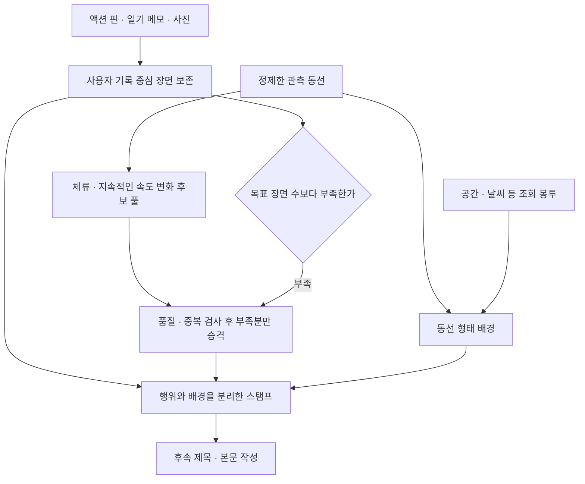

# 사용자 행위 · 배경 · 부족분 보충

현재 구현은 후속 [장면 중심 생성과 공통 배경 조립](scene-pipeline.md)의 v2 경로다.
이 문서의 보충 판정 기준은 유지했고, HOW 조립 의존과 사용자 기록 전용 배경 대상을 분리했다.
아래 v1 코드·수치·제약은 당시 구현 기록이며 저장 결과 재현을 위해 그대로 남긴다.

현재 합의한 방향은 **사람이 남긴 행위 기록을 중심에 두고 시스템은 배경을 붙이는 것**이다.
사용자 기록이 없거나 장면 수가 부족할 때에만 체류·속도 관측을 별도의 유사 행위 후보로 승격한다.
이 승격은 장면에서 맡는 역할의 변경이며, 사용자 작성 기록이나 확인된 행동으로 출처가 바뀌지 않는다.

이 문서와 `StampTool("action_background", ...)`가 새 정책 경로다.
기존 `record_how`와 HOW 작성 A/B는 당시 조립·출력을 재현하는 경로로 유지한다.
그 실험의 이동 중심 카드 수나 문장 품질을 이 정책의 검증 결과로 재해석하지 않는다.



## 세 종류의 자료

| 자료 | 출처와 의미 | 장면에서의 역할 |
| --- | --- | --- |
| 사용자 기록 | 액션·원문 글·사진 참조, 원래 시각과 위치 유지 | 최우선 중심. 위치가 없어도 삭제하지 않음 |
| 파생 관측 후보 | `derived_observation`, 관측 기기의 체류·저속·고속 구간 | 기록이 없거나 부족할 때만 보충 중심 |
| 배경 | 공간·환경 조회와 직선·회전·되짚기 등 동선 자료 | 행위와 별도로 연결. 스스로 행동 원인이나 내용을 만들지 않음 |

사진 참조만으로 피사체나 촬영 의도를 해석하지 않는다. 글은 원문을 유지한다.
“이 구간에서 이동이 느려졌다”는 관측 재료가 될 수 있지만 “강아지가 냄새를 맡았다”는 사용자 기록이 필요하다.
장면 대표 위치는 실제 관측점이며, 관측 구간은 행동의 시작·종료 시각으로 바꾸지 않는다.

## 승격 정책

1. 사용자 기록 중심 스탬프를 먼저 만든다. 현재는 기록 하나당 하나이며 글·사진·액션 모두 센다.
2. `부족분 = max(0, target_scene_count - 사용자 기록 중심 스탬프 수)`를 계산한다.
3. 부족할 때만 관측 후보를 선택한다. 잠정 정렬은 체류 우선, 그다음 속도 변화이며 같은 종류는 관측 시간이 긴 것부터다.
4. 기존 기록 시각에 가까운 후보와 이미 고른 관측에 겹치는 후보를 제외한다. 최대 부족분만 채운다.
5. 후보가 없거나 모두 제외됐으면 남은 부족분을 기록한다. 일반 회전·직선이나 거리 간격으로 채우지 않는다.

`target_scene_count`는 필수 실행 인자다. 제품 최소 개수는 정하지 않았다. 데모의 3은 비교용이다.
0이면 보충을 끈다. 목표가 기록 수보다 작아도 원본 기록을 줄이지 않는다.
기존 작성 계약의 `max_cards`를 넘는 사용자 기록도 조립 결과에는 남는다. 작성 호출 준비는 기존처럼
명시적 분할이 필요하다는 오류를 낸다. 대량 기록 분할·여러 기록의 장면 묶기는 이번 범위 밖이다.
나중에 장면 묶기를 넣으면 부족분 계산 입력을 그 편집 결과로 바꿔야 한다.

현재 중복 제외는 관측 지지 구간 전후 20초 안의 기록 시각을 사용한다. 이는 편집상 반복을 줄이는 기준이며
같은 장소에 있었다는 판정이 아니다. `session_fallback` 메모 시각은 특정 순간을 대표하지 않아 이 제외에 쓰지 않는다.
파생 후보끼리도 지지 구간이 겹치거나 간격이 20초 이하면 하나만 채택한다. 체류와 해당 구간의 저속을 두 장으로 만들지 않는다.

## 관측 검출의 범위

새 행동 분류기를 만든 것이 아니다. 기존 HOW 체류 검출과 storyboard의 속도 변화 묶기 함수를 재사용한다.
이 임계값은 합성 입력에서 쓰는 잠정값이며 통계적으로 검증된 유의성·신뢰도 기준이 아니다.

| 항목 | 현재 방법 |
| --- | --- |
| 동선 품질 | canonical 단절·점프 제거 + HOW의 정확도 20m·속도 4m/s 초과 제외 경계를 유지 |
| 보충 품질 | 정확도 미상의 관측은 보충에 사용하지 않음. 배경·원본 기록 삭제와는 별개 |
| 체류 | 기존 `local_stay`: 20m 범위, 30초 이상, 5점 이상, 10초 단위 진행 속도 0.4m/s 이하 |
| 속도 재료 | 같은 관측 run에서 10초 이상 창의 양 끝 변위/시간. 짧은 흔들림 영향을 줄이는 근사값 |
| 속도 기준 | 0.5m/s 이상 창의 시간 가중 중앙값. 최소 5창·60초의 이동 관측이 있을 때만 계산 |
| 변화 후보 | 기준의 0.5배 미만 또는 1.75배 초과, 절대 차이 0.3m/s 이상, 연속 20초·5점 이상 |
| 시각·위치 | 원본 지지 구간과 실제 대표 관측점을 보존. GPS 공백을 연결하지 않음 |

속도 기준은 **이번 산책 안의 비교**다. 과거 평소 속도나 특정 강아지 행동을 뜻하지 않는다.
속도 창의 끝점 변위는 굽은 길의 실제 이동 거리를 과소평가할 수 있다. 긴 저속 이동이 체류 범위에
들어올 수도 있다. 따라서 `observed_dwell/slow/fast`는 잠정 관측 후보이며 휴식·달리기·냄새 맡기로 확정하지 않는다.
전체 산책 기준을 사용하므로 이 어댑터는 산책 종료 후 배치이며 실시간 판정 결과가 아니다.

## 스탬프와 구현 경계

모델용 재료는 `action`과 `background`를 분리한다.
`action.origin=user_record`면 원문과 기록 참조, `derived_observation`이면 후보 참조·종류·관측 구간·속도 등의 근거를 가진다.
`background.trajectory`가 WHAT을 덮어쓰거나 모든 문장이 HOW를 거치도록 만드는 경로는 없다.
보충으로 이미 선택한 스탬프는 `selection_basis=scene_deficit_policy`로 고정한다.
기존 소비 계약의 `required=true`는 이번 작성에서 빠뜨리지 말라는 의미이며 사용자 작성 사실이라는 뜻이 아니다.

| 코드 | 책임 |
| --- | --- |
| [action_candidates.py](../../../../scripts/spikes/diary_storyboard/action_candidates.py) | 검출·품질 검사, 독립 관측 후보 풀과 속도 기준 |
| [action_background.py](../../../../scripts/spikes/diary_storyboard/action_background.py) | 사용자 중심 보존, 부족분·중복 정책, 행위/배경 조립 |
| [stamp_tool.py](../../../../scripts/spikes/diary_storyboard/stamp_tool.py) | 새 어댑터 진입점, 고정 참조·조회·재생 |

새 책에는 전체 원본·HOW 카탈로그·파생 후보 풀·선택/제외 이유와 부족분을 보존한다.
선택되지 않은 관측 후보도 풀에는 남는다. 출력 편집은 원본 사용자 기록 저장소에 쓰지 않는다.

현재 공간/날씨 봉투는 **사용자 기록을 대상으로 조회한 자료**다. 파생 관측 위치의 배경 조회는 아직 없으므로
그 스탬프는 `context_status=not_requested_for_observation`으로 둔다. 가까운 기록의 장소·날씨를 가져다 붙이지 않는다.
실제 provider, Dev/App 저장·화면, 새 작성 프롬프트와 LLM 품질 검증은 아직 연결하지 않았다.

## 오프라인 확인

```powershell
uv run python -m scripts.spikes.diary_storyboard.action_background_demo --target-scene-count 3 --out ../diary-lab/action-background-01
```

`report.json`은 조건별 사용자 기록·보충·부족분을, `prepared_stamps.json`은 분리한 행위/배경을,
`stamp_book.json`은 원본·정책·후보·선택 이유를 보여준다. 기존 출력 폴더를 덮어쓰지 않는다.
검사는 `test_action_background.py`, 공용 연결 회귀는 `test_stamp_tool.py`와 `test_how_stamps.py`에 한정한다.
네트워크·새 LLM 호출·운영 DB 변경 없이 정책과 연결을 검사하는 단계다.

2026-09-08 실행에서는 아래 결과가 나왔다. 공통 합성 동선에는 체류와 지속적인 고속 구간을 넣었고,
체류와 겹치는 저속 후보도 검출되지만 중복 승격하지 않았다. 목표는 실행 인자로 3을 지정했다.

| 조건 | 사용자 기록 | 보충 | 미달 | 해석 |
| --- | ---: | ---: | ---: | --- |
| 기록 3개 | 3 | 0 | 0 | 후보 풀은 있어도 사용자 기록이 충분해 보충하지 않음 |
| 앞부분 기록 1개 | 1 | 2 | 0 | 체류·고속 관측으로 부족분만 보충 |
| 기록 없음 | 0 | 2 | 1 | 관측 2개만 남기고 세 번째 장면을 만들지 않음 |
| 체류 중 기록 1개 | 1 | 1 | 1 | 체류·저속 중복을 제외하고 고속 관측만 보충 |
| 평범한 회전만 | 0 | 0 | 3 | 동선 형태를 행위로 승격하지 않음 |
| GPS 공백 | 0 | 0 | 3 | 비관측 시간을 체류·행위로 바꾸지 않음 |

새 정책 검사 19개와 기존 스탬프/HOW 연결 회귀 39개가 통과했다. 첫 실행의 1개 실패는 행동 fixture에
선택 필드 `pet_id`가 빠져 정규화된 계약과 달랐던 문제였고, fixture를 수정해 새 정책 검사를 다시 통과했다.
변경 Python 5파일의 Ruff 검사, 6조건 책 재생과 보존된 HOW 작성 Gemini 입력·출력 재생도 통과했다.
이는 구조·출처·부족분 정책의 확인이며 실제 산책에서 체류나 이상 속도를 정확히 분류한다는 평가는 아니다.
