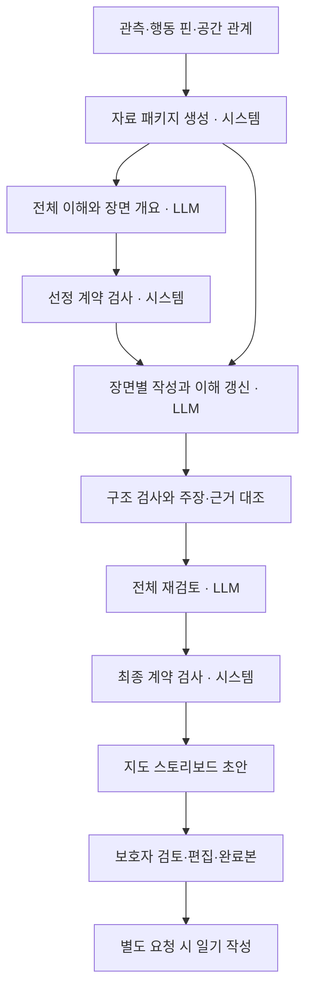

# 산책 스토리보드 LLM층 아키텍처 초안

> 2026-09-08 후속: 현재 기본 실험은 [스탬프 툴 중심의 세 책임](stamp-tool.md)으로 단순화했다.
> 아래 전체 이해·순회·재검토 설계와 기존 구현은 앞선 비교 경로로 보존하며, 새 기본 경로의 필수 단계가 아니다.

이 세션에서 Codex가 직접 수행한 [셀로판·Gemini 1~3차 실험](../../../research/2026-09-07-walk-diary-experiment-report.md)을 바탕으로 작성했다. [기존 제작 계획](plan.md)의 전체 이해 → 순차 장면 작성 → 재검토 → 사용자 검토 → 선택적 일기 흐름을 구체화한다. 확인한 Geo 기준은 `c2f8922`와 이 워크트리의 미커밋 작업이다. 2026-09-08에 기존 후보 선택 골격을 이어받아 사건→장면 구성을 오프라인으로 연결했다. 아래 전체 설계 중 API·DB·주장 단위 의미 검사·실행 예산·동시성·실제 지도 연결은 미구현이며 제품 채택 선언이 아니다.

## 1. LLM층의 입력과 결과

LLM층은 한 산책의 관측·사용자 기록·공간 관계를 읽고, 전체 흐름에서 남길 장면을 선택해 근거 있는 문장으로 구성한다. 사용자에게 전달하는 중심 결과는 **대표 제목 + 시간순 장면 + 시스템이 연결한 지도 위치**다. 내부 이해·선정 이유·주장 대조·실행 기록은 검토와 재개에 사용한다.

누적 브러시 계산·날씨 필터·방문 분모·GPS 정제는 자료 생산층이 소유한다. LLM이 농도나 좌표를 결정하지 않는다. 셀로판의 공간 빈도를 익숙함·선호·행동 습관으로 바꾸지 않는다. 이번 연결 실험은 먼저 단일 세션과 공간 조각을 사용한다. 과거 공간 경향은 기존 계획대로 조건·분모·출처가 있는 자료를 제공할 수 있는 확장 경계로 두며, 지원하지 않는 실행에서는 없는 상태로 명시한다.

## 2. 전체 흐름



이는 역할 구분이다. 각 상자를 별도 서버나 독립 에이전트로 만들지 않는다. 첫 구현은 기존 파일 기반 실행기 한 프로세스와 provider 어댑터를 확장한다. 모델도 우선 동일 provider를 사용하고 역할별 프롬프트·입출력 계약만 나눈다. 호출 수와 품질은 따로 측정한다.

## 3. 여섯 모듈의 책임

| 모듈 | 입력 → 출력 | 맡는 일 |
| --- | --- | --- |
| 자료 패키지 생성 | 관측 스냅샷 → 세션 개요·조각·사건 후보·원본 참조 | 시간·공간 계산, 출처·관측 공백 보존, 실행 중 입력 고정 |
| 전체 구성 | 자료 패키지 → 잠정 이해·시간순 개요·선택/생략 기록 | 세션 전체 흐름을 읽고 각 장면이 남을 이유 판단 |
| 장면 작성 | 대상 장면·근거·현재 이해·전체 개요 → 문구·주장 목록·이해 수정 | 해당 장면 작성, 앞 장면 재검토 요청. 원자료 수정 금지 |
| 검증·재검토 | 선택안·장면·원자료 → 오류·판정·수정안 | 결정론적 계약 검사와 의미 대조를 구분, 수정본 재검증 |
| 실행 관리 | 단계 상태·실행 정책 → 다음 단계·영수증·체크포인트 | 버전, 사용량 한도, 실패·재개·동시 실행 방지 |
| 결과 투영 | 검토 가능한 결과 + 원본 위치 참조 → bundle·사용자 검토본 | 안정 장면 ID·지도 연결·제목·편집 버전 보존 |

## 4. 자료 패키지: 숫자를 문장으로 바꾸기 전에

기존 `Evidence`/`Piece`를 확장하는 어댑터를 사용한다. Gemini 3차의 별도 입력 형식을 두 번째 운영 원본으로 만들지 않는다.

| 데이터 | 필수 의미 |
| --- | --- |
| 실행 입력 식별 | session ID, source revision, 경로 표현 버전, 조각 추출 정책 버전, 스냅샷 해시 |
| 세션 개요 | 시작·종료, 관측 커버리지, 시간순 구간 인덱스, 공백, 사용 가능한 자료 종류 |
| 자료 조각 | 안정 ID, 주체, 관측 값/관계, 시간·공간 범위, 출처, 품질, 계산 의미 |
| 사건 후보 | ID, point/interval, chain, 시작/끝 참조, 대표 위치 참조, 관련 조각 ID |
| 후보 역할 | 행동/공간 전환/연결, 추천 이유, 중심 근거, 필수 보존 여부와 그 정책 출처 |
| 제한 사항 | 공원 대표점은 내부 판정 불가, 근접 시설은 이용 증거 아님, 정지 관측은 행동 지속시간 아님 등의 명시적 한계 |

`role`은 관측 사실이 아니라 정책 결과다. 원자료와 분리하고 버전을 남긴다. 3차의 100m·상가 문턱·우선순위·카드 상한을 제품 상수로 승격하지 않는다. 이식 초기 비교 설정에서는 3차의 행동 보존·연결 카드 제외를 재현할 수 있게 하되, 다른 구성 정책과 비교 가능하게 둔다.

계산용 관측 창은 장면 범위와 분리한다. 예를 들어 사진은 15분의 point 사건이지만 주변 접근 관계 계산은 그 전후의 연속 관측을 사용한다. 계산에 쓴 시간 범위를 따로 보존하고 그 전체를 사진 촬영 시간으로 표시하지 않는다. 단절을 가로지른 접근·방향은 만들지 않는다.

처음에는 현재 실험 크기의 패키지를 모든 단계에 제공해 동작을 확인한다. 큰 입력에서는 전체 시간 인덱스와 원본 조각 참조를 유지하며 대상 장면의 상세 자료를 추가한다. 한도 때문에 뒷부분을 조용히 버리지 않고 `input_too_large`로 중단한다. 요약·추가 조회 방식은 별도 크기 실험 후 도입한다.

## 5. 전체 구성: 문장보다 선택안을 먼저

전체 구성 호출은 본문을 쓰기 전에 아래를 반환한다. `understanding`은 공개적인 짧은 요약과 근거 참조이며 내부 사고 독백을 저장하지 않는다.

- `understanding`: 관측된 흐름, 근거가 연결된 잠정 해석, 미확인 사항.
- `outline`: 장면 ID, 원본 후보 ID, 사건의 초점, 선택한 이유, 중심 근거, 앞뒤 장면과의 역할.
- `selection_decisions`: 모든 후보의 선택·생략과 이유. 미선택을 중요하지 않음/중복/연결/자료 부족/실행 예산 등으로 구분한다.
- `title_draft`: 선택한 내용에 근거한 대표 제목 초안과 근거 참조. 최종 제목은 재검토에서 정리한다.

선정 계약은 후보 누락/중복, 존재하지 않는 ID, 필수 보존 규칙, 시간순, 단절, 실제 선택 수와 예산 사유의 불일치를 검사한다. ‘7개까지 허용했는데 5개를 만들고 개수 제한 때문에 생략’ 같은 오류를 잡는다. 이유 코드가 맞더라도 서사적 납득 가능성은 의미 검토가 필요하다.

장면 0개를 허용한다. 자료가 유효하지만 남길 장면이 없는 결과와 호출 실패를 구별한다. 대표 제목은 날짜 기반 대체 제목을 사용할 수 있으며 도입·마무리 카드를 수량 채우기용으로 강제하지 않는다.

사건과 장면을 분리한다. `individual`은 기존 1사건=1장면 비교 기준이고, `grouped`는 여러 사건을 편집상 묶는 방식이다. `SceneComposition`은 대표 사건, 포함 사건 목록, 맥락 사건 목록, 묶는 이유를 가진다. 포함 사건은 한 장면만 소유하고 맥락은 여러 장면에서 참조할 수 있다. 필수 행동은 포함 사건으로 남겨야 하며 맥락 참조만으로 보존 조건을 충족하지 않는다.

기존 `Outline.start_at/end_at`은 grouped에서 **대표 사건의 원본 범위**를 뜻한다. 다른 사건의 범위를 합쳐 행동 지속시간으로 쓰지 않는다. 각 사건의 원본 시각·chain·출처·위치 상태는 catalog에 남고, 작성 요청·읽기용 구성표·검토본에도 사건별로 제공한다. 장면은 대표 사건 순서로 정렬한다. 초기 구성은 순회 동안 고정하며 순회 중 구성 변경은 후속이다. 첫 grouped 버전은 다른 chain이나 GPS 공백을 가로질러 묶는 것을 거부한다.

대표점·주소는 새로 만들지 않는다. 현재 보존 입력에는 지도 좌표가 없으므로 위치는 `unresolved`다. 구성 공유가 같은 행동의 중복 발생으로 계산되지 않게 소유와 맥락 참조를 구별한다. 최대 3사건 묶음은 오프라인 배선용 fixture에만 있으며 모델 프롬프트·제품 정책에는 넣지 않았다.

## 6. 장면 작성: 문구와 주장을 함께 반환

각 장면 호출에는 선택 이유·대상 근거·전체 개요·현재 이해·이전 장면을 제공한다. 결과에는 제목/본문 외에 문장이 주장한 내용을 분해해 연결한다.

```text
SceneDraft
  scene_id / candidate_ids / source_revision
  title / body
  claims[]
    claim_id / text / field / text_span
    subject_ids / predicate / object_or_value
    time_scope / space_scope
    evidence_refs[] { piece_id, field_path }
    epistemic_type: observed | derived | interpretation
  understanding_update
  revisit_scene_ids / change_reason
```

예를 들어 “두부가 공원에서 멈춰 냄새를 맡았다”는 주체·공원 내부·정지·냄새 맡기라는 주장으로 나눈다. 냄새 핀이 지지하는 것은 냄새 맡기이며, 대표점 근접으로 공원 내부를, 냄새 맡기로 정지를 승인하지 않는다. 모델이 `observed`라고 붙였다는 이유로 관측 사실이 되지 않는다.

장면을 쓰면서 전체 이해를 수정할 수 있지만 자료 스냅샷은 바꾸지 않는다. 앞 장면은 직접 덮어쓰지 않고 재검토 요청으로 남긴다. 새 이해·대상 장면의 구조 검사를 통과한 상태만 다음 단계에서 읽는다. 의미 검토 전 초안이라는 상태도 함께 전달한다.

## 7. 검증: 선정 검사와 문장 검사를 분리

| 검사 | 처리 주체 | 결과 |
| --- | --- | --- |
| ID·주체·원본 버전·필드 존재·시간·chain·중복·필수 후보 | 시스템 | 계약 오류. 다음 완료 상태로 채택하지 않음 |
| 수치·단위·정규화 행동·명시적 공간 자격 | 시스템 | 계산 가능한 불일치와 금지된 확대를 표시 |
| 글의 주장과 연결 근거가 실제로 같은 의미인지 | LLM 재검토 + 사람이 읽을 근거표 | supported / contradicted / insufficient / unassessed의 모델 제안과 이유 |
| 제목·본문·요약·선정/생략 이유·한계 설명의 누락 | 시스템 목록 검사 + 의미 대조 | 생성 텍스트 일부가 검토에서 빠지지 않도록 대상 인벤토리 유지 |

작성자가 반환한 claims만 검사하면 작성자가 빠뜨린 주장도 놓친다. 재검토는 완성 텍스트 자체를 읽어 주장 목록의 누락부터 찾는다. 텍스트 범위와 근거 필드를 연결해 ‘전체 문단 유지’라는 포괄 판정을 줄인다. 다만 주장 추출과 대조 모델도 오류를 낼 수 있으며, `supported`를 진실 인증으로 표시하지 않는다.

전체 재검토 호출에서 중복 장면·전후 흐름·앞 장면 재검토 요청·주장 대조와 최소 수정을 함께 수행한다. 최종 대표 제목도 같은 호출에서 정리해 별도 제목 호출을 추가하지 않는다. 수정된 문장은 새 버전과 근거 대응을 만들고 다시 검사한다. 수정 전 대조 결과를 수정 후 문장에 그대로 붙이지 않는다.

수정본에 남은 불일치가 있으면 정상 준비 완료로 표시하지 않는다. 문제가 있는 자동 문구와 근거를 검토 상태로 남기고, 지도·원본 사용자 기록은 계속 보여준다. 원본 기록을 지우거나 의도를 만들어 메우지 않는다. 의미 대조 호출을 별도로 나누는 방식은 동일 초안 비교로 효과를 확인한 뒤 선택한다.

## 8. 실행 관리와 비용

첫 구현은 기존 파일 체크포인트를 재사용한다. 운영 큐·DB·멀티 에이전트는 도입하지 않는다.

```text
prepared → planning → writing → reconciling → awaiting_review → reviewed
                   ↘ failed_contract / failed_provider / budget_exhausted
                   ↘ needs_attention (자동 문구에 미해결 문제가 있음)
```

상태 전이와 오류 상세는 실행기가 소유한다. 모델이 반환한 한계 문구를 실행 상태로 사용하지 않는다. 자료가 바뀌면 새 run으로 시작하며 이전 사용자 편집과 완료본은 보존한다.

- 기본 논리 호출 수는 전체 구성 1 + 선택 장면 S + 전체 재검토 1, 즉 `S+2`다. 장면 0개면 검증된 빈 구성으로 검토 단계에 갈 수 있어 1회로 끝낸다. 선택적 일기는 별도 요청 시 1회다.
- 계약 오류 수정은 단계당 최대 1회 추가 시도로 시작하는 실험 설정을 제안한다. 네트워크 재시도도 별도의 유한 한도로 두고 모두 전체 호출/시간/토큰 예산에 포함한다. 최적값은 미확정이다.
- 단계 시작 전에 남은 예산을 확인한다. 초과하면 중단 상태와 이어갈 위치를 기록하고 완료 결과처럼 저장하지 않는다.
- 실행 키에는 스냅샷·원본 버전·정책·프롬프트·스키마·모델/설정 지문을 포함한다. 단계 재생 키에는 이전 상태와 대상 장면도 포함한다. 같은 저장 요청의 응답만 재사용한다.
- 원 요청/응답, 파싱 결과, 검사 결과, 사용량, 소요 시간, 오류, 이전/이후 상태를 보존한다. 키와 인증 헤더는 저장하지 않는다.
- 외부 응답 직후 저장 전 종료가 발생하면 제공사 비용이 중복될 수 있다. 알 수 없는 실패 사용량은 0으로 세지 않는다. 정확히 한 번 과금된다고 보장하지 않는다.
- 첫 버전은 run별 단일 작성자만 지원한다. 동시 실행을 거부하고 완료 체크포인트를 원자적으로 저장한다. 운영 동시성/삭제 정책은 제품 연결 시 따로 구현한다.

## 9. 지도·제목·사용자 편집의 계약

LLM은 후보 ID를 반환하고 위치는 `LocationResolver`가 원본 버전의 관측점/구간 참조에서 결정한다. 왕복 경로의 같은 좌표라도 시각·chain·경로상의 순서를 함께 사용한다. 표시용 동선이 단순화됐다면 원본 참조→표시 참조 대응을 어댑터가 제공해야 한다. 최근접 좌표만으로 다른 회차에 붙이지 않는다.

사진·행동은 `point` 사건으로 시작=끝 시각을 허용한다. 이동은 `interval`이며 단절을 가로지르지 않는다. 위치 자료가 없으면 `unlocated`, 버전 대응이 확인되지 않으면 `unresolved`로 남기고 카드만 제공한다. 표시 순번은 정렬 후 계산하며, 영구 scene ID와 구별한다.

대표 제목·장면·근거와 위치 참조는 하나의 storyboard revision으로 내보낸다. 목록을 열 때 LLM을 호출하지 않는다. 대표 제목이 없거나 원본 변경으로 오래된 경우 날짜 제목을 사용한다. 기존 bundle으로 내보내는 매핑은 별도 어댑터로 두고 계약 확인 후 연결한다.

사용자 문구 편집·장면 숨김은 원본 정정과 별도 overlay다. 새 자동 초안은 편집과 완료본을 덮어쓰지 않는다. 원본 핀 정정/삭제는 새 입력 버전과 재확인 상태를 만들며, 원본 삭제·보존 기한은 기존 데이터 수명 계약을 따라야 한다. 선택적 일기는 사용자가 검토 완료한 정확한 revision을 입력으로 한다.

## 10. 기존 구현에서 가져올 것과 바꿀 것

| 현재 확인한 파일/계약 | 재사용 | 이번 초안의 변경 후보 |
| --- | --- | --- |
| `scripts/spikes/diary_storyboard/contracts.py` | Evidence/Piece, Understanding, Scene, Review | 후보 참조·point/interval·0장면 개요·필드 단위 Claim·선정 기록·대표 제목 |
| `runner.py`, `storage.py` | 전체 이해/순회/재검토, 상태 이력, 재개, 사용자 검토본 | 선정 검사, 미해결 상태, 실행 예산, 단일 작성자 제어 |
| `provider.py`, `prompts.py` | 모델 전송·요청 재생, 단계 지시 | 단계별 스키마 버전, 선정과 서술 책임, 의미 대조 대상 |
| 기존 근거 대조 실험 | 같은 초안 비교·원자료/응답 추적 | 문단 단위 승인에서 주장 단위 범위 대응으로 비교 |
| 로컬 `storyboard_composer` 2·3차 | 배경/거리 관계·역할·중심 근거·지도 후보 연결의 실험 결과 | Evidence 어댑터로 편입. 현재 main에 실행 코드가 포함됐다고 간주하지 않음 |

현재 `Plan.outline`은 최소 1개, `check_plan`은 시작<끝을 요구한다. 따라서 빈 장면과 순간 핀을 지원하려면 명시적인 계약 변경이 필요하다. 초기 개요의 경계를 실행 동안 유지하는 기존 골격의 제한도 그대로 인식한다. 입력 형식만 변환하면 모두 해결되는 작업은 아니다.

## 11. 첫 구현의 완료 기준

첫 작업은 **3차 저장 입력을 기존 Evidence와 후보 참조로 연결한 미커밋 작업을 이어받아, 사건별/묶음 구성의 출력 계약을 비교 가능하게 만드는 것**이다. 글쓰기 품질을 고치기 전에 같은 산책 전체를 어떻게 고르는지 비교할 수 있어야 한다.

1. 키 없이 저장 fixture로 행동 핀·전환·연결·GPS 단절·빈 장면을 읽는다. 원본 해시와 ID 대응을 검사한다.
2. 가짜 provider로 point 사건·0장면·전체 후보 선택/생략 인벤토리·예산 사유 불일치·재개를 검사한다. 실제 LLM 품질 평가는 별도다.
3. 같은 조각과 호출 설정에서 공간 전환 중심 / 행동과 필요한 전환 중심의 구성만 비교한다. 이후 동일 선택안의 문장 작성을 비교해 선정과 서술의 효과를 분리한다.
4. 본문에 근거 없는 정지·공원 진입·복귀·기념 목적을 넣은 대조 사례와, 방향을 지워버린 문장을 검토한다. 구조 검사는 통과할 수 있지만 의미 문제는 보고돼야 한다. 실제 모델이 잡는 비율은 반복 출력으로 별도 측정한다.
5. 이후 지도 위치 대응과 사용자 편집 보존을 검증하고 제품 연결 범위를 정한다.

## 12. 2026-09-08 이어받은 구현

이어받을 때 후보 어댑터·선정 메타데이터·순간 핀·빈 구성·재개 코드와 테스트가 미커밋으로 존재했다. 이를 교체하지 않고 `composition.py`, `SceneComposition`, grouped 구성 프롬프트와 실행 경로를 확장했다. 기존 독립 구성은 비교 기준으로 남겼다.

구조 검산에서는 같은 사건 집합을 독립/묶음 구성으로 표현한다. 포함된 행동은 각 시점과 중심 근거를 유지하고 읽기용 표에 원문 조각을 표시한다. 작성자의 주장 목록에 근거 ID가 남는지만 검사하며, 본문에서 행동이 제대로 전달되는지 또는 작성자가 의미를 보탰는지는 아직 보증하지 않는다. 장면 순회·재검토·재개·사용자 편집은 기존 실행기를 재사용한다.

실행·재현은 [실험 README](../../../../scripts/spikes/diary_storyboard/README.md)의 사건/장면 구성 절을 따른다. 가짜 provider의 결과는 실제 LLM의 선정·서술 품질 평가가 아니다. 외부 모델 호출·운영 API·DB·Dev/App 변경은 하지 않았다.
