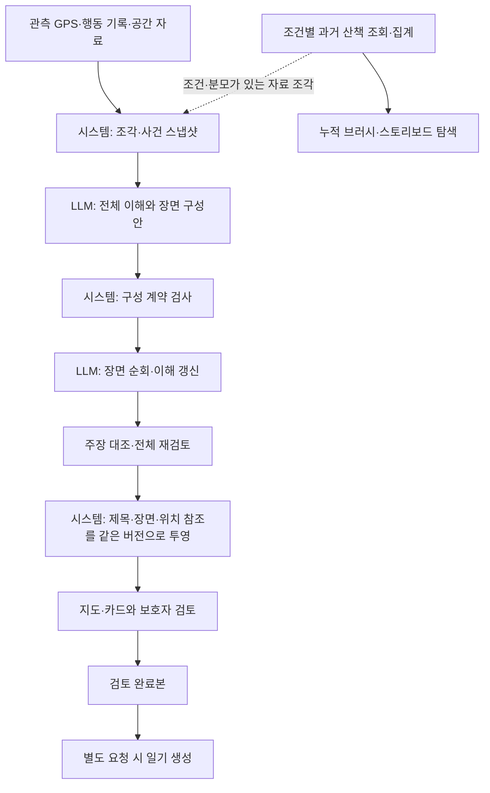

# 산책 스토리보드 LLM층 청사진

> 2026-09-08 후속: 이후의 구성 A/B와 슬롯·스탬프 실험을 거쳐 [현재 작업 경로](stamp-tool.md)를 따로 정리했다.
> 원본·봉투 → 스탬프 툴 → 선택·서술이 현재 기본 경로다. 아래 단계 순서는 당시 비교 계획이며 현재 실행 명령은 새 문서를 따른다.

이 문서는 이 협업 세션에서 이어받은 워크트리를 기준으로 **무엇을 만들고, 어떤 순서로 검증하고, 무엇을 근거로 다음 단계에 갈지** 정한다. 상세 계약은 [아키텍처](llm-architecture.md), 큰 제작 흐름은 [일기 제작 계획](plan.md), 현재 코드의 검증 기록은 [이어받은 작업](../../../research/2026-09-08-event-scene-composition-handoff.md)에 있다. 설계 제안이며 제품 채택 결정이 아니다.

## 1. 목표로 하는 사용자 경험

보호자는 지난 산책 목록에서 동선 썸네일과 제목으로 세션을 고른다. 지도를 열면 전체 동선과 관측된 속도·체류, 사용자가 남긴 액션을 볼 수 있다. AI 장면은 그 안에서 함께 읽을 만한 사건을 묶어 보여준다. 카드의 대표 핀은 실제 사건의 위치이고, 카드 안의 개별 기록은 각자의 시각과 위치를 유지한다.

계절·날씨 조건으로 다른 산책의 공간 빈도를 겹치거나 해당 기록을 모아 읽을 수 있다. 이 배경 집합은 카드 선택이나 목록 페이지 때문에 달라지지 않는다. 조건부 과거 경향을 AI 입력으로 제공하는 기능은 자료의 조회 조건·분모·출처가 준비된 뒤 같은 조각 계약으로 연결한다. 지역 조건과 익숙함/새로움 단정은 이번 범위에 넣지 않는다.

사용자는 구성·문구를 검토하고 수정하거나 장면을 숨길 수 있다. 스토리보드 완료본 저장과 한 편의 일기 생성 요청은 분리한다. 새 자동 결과가 사용자 편집을 덮어쓰지 않는다.

## 2. 데이터와 책임의 뼈대

| 객체 | 책임 | 바뀌지 않아야 할 경계 |
| --- | --- | --- |
| EvidenceSnapshot | 원본 조각과 계산·출처·자료 상태 | 모델 출력이 원자료로 들어가지 않음 |
| Event / 현재 코드의 Candidate | 누가·무엇을·어디서의 관측 시점/구간 | 편집상 묶어도 시간·주체·chain·공간 자격 유지 |
| SceneComposition | 중심 사건·포함 사건·맥락 사건·묶은 이유 | 포함 사건은 한 장면 소유, 맥락은 공유 가능 |
| SceneDraft | 장면 문구와 근거 대응 | 선택 이유가 관측 사실이 되지 않음 |
| StoryboardRevision | 전체 제목·시간순 장면·위치 참조·입력 버전 | 목록과 상세가 같은 결과를 읽음 |
| ReviewedSnapshot | 사용자가 고른 포함 장면과 편집 문구 | 자동 재작성과 분리, 특정 버전에 묶임 |

중심 사례: 사진은 15:00의 point 사건으로 남고, 앞의 공원 접근과 뒤의 하천 근접을 같은 장면의 맥락으로 읽을 수 있다. 장면의 이야기 범위를 사진 촬영 지속시간으로 쓰지 않는다. 대표 사건 시각, 포함 기록의 시각, 카드 표시 순번은 각각 별도 의미다.

## 3. 이미 된 것과 남은 것

| 구간 | 지금 상태 | 다음 확인 |
| --- | --- | --- |
| 3차 보존 입력 → Evidence/Candidate | 구현됨. 입력 해시·원본 사건 참조·point/interval 유지 | 원래 공간 관계의 추가 자료를 새 입력 버전으로 연결 |
| 사건별 / 묶음 구성 계약 | 구현됨. 필수 기록·중복 소유·단절·맥락 참조 검사 | 실제 모델이 유용한 구성을 제안하는지 |
| 전체 구성 → 순회 → 재검토 | 기존 실행기에 연결됨 | 가짜 provider를 넘어 실제 새 구성으로 실행 |
| 재개·요청 재생·사용자 편집 | 관련 오프라인 경로 검증 | 운영 저장·인증·동시성·원자료 정정/삭제의 수명 |
| 구성표·오프라인 결과 | 세 조건×두 방식의 파일 결과가 있음 | 사람이 두 구성안을 비교할 검토 화면 |
| 문장의 주장 단위 검증 | 설계 단계. 현재는 근거 ID와 범위 검사 | 없는 의미 추가와 핵심 의미 삭제를 함께 대조 |
| 대표 배경과 공존 관계 | 3차의 파생 조각을 재사용하는 상태 | 대표 라벨·장소 ID·공존 관계·접근/재방문 구별 |
| 지도 위치·제품 bundle | 보존 입력의 위치는 unresolved | 원본 사건 → 보존 동선 → 실제 앱 표시 위치 대응 |

관련 테스트 45개가 통과했다는 것은 구조와 상태 흐름의 검사 결과다. 오프라인 7카드→3카드는 정해진 검산용 묶음의 결과이며 LLM의 품질 향상을 보여주는 수치가 아니다.

## 4. 다음 작업 순서와 완료 기준

### 단계 1 — 실제 LLM의 구성권 비교

가장 먼저 할 일이다. 본문 작성은 진행하지 않고 **전체 이해와 구성안까지만** 실행한다.

진행 기록: [첫 비교](../../../research/2026-09-08-event-scene-gemini-ab.md)는 0/6 구조 통과였고, [사건 ID 전용 계약으로 바꾼 두 번째 비교](../../../research/2026-09-08-event-scene-gemini-ab-v2.md)는 3/6이 통과했다. 시각·근거 연결은 시스템이 복원한다. 완전한 비교 쌍은 이동 조건 하나이며, 행동·공백 조건의 편집 모순을 해결하고 검토해야 한다. 아래 기준은 유지하며 본문 단계로 자동 진행하지 않는다.

- A: 사건마다 독립 장면을 선택한다.
- B: 동일한 사건 목록에서 중심·포함·맥락을 구성한다.
- 공통: 같은 원자료·후보 생성 정책·모델·명시적 생성 설정·필수 기록·카드 상한·기본 검증을 사용한다. 달라진 프롬프트/스키마/권한은 실행 명세에 기록한다.
- 이동만 / 행동 있음 / GPS 단절 세 조건에 각각 두 안을 생성한다. 1회씩이면 성공 응답 목표 6건인 탐색 비교다. 실패·재시도 요청 수와 미상 사용량은 따로 기록한다. 반복 품질 평가는 이후 고정 입력으로 확대한다.
- 오프라인 fixture의 7개 선택·최대 3개 묶음을 모델에 강제하지 않는다. 전체 후보 목록을 제공하며 모델이 남긴 것·맥락으로 쓴 것·생략한 것을 대조한다.

완료 산출물은 비교 실행 명세, 원본 스냅샷 지문, 요청/응답, 개요, 사건 사용 목록, 구조 검사 결과, 사용량이다. 실행 전 출력 위치·시도/토큰 한도를 정하고 새 run을 사용한다. 한도 내 실패는 실패로 남기며 성공할 때까지 재생성하지 않는다. 현재 실행기에는 완전한 예산 관리가 없으므로 이 비교 실행기의 선행 조건으로 범위를 제한한다.

다음 단계 진입 기준은 카드 수 감소가 아니라, 두 안의 차이를 실제 사례로 설명할 수 있는지다. 중요한 행동·시간·단절을 보존하면서 B가 반복을 줄이거나 흐름을 더 잘 보여준 경우와, 오히려 내용을 묻어버린 경우를 함께 남긴다. 어느 조건에서도 B가 낫다는 결론을 미리 정하지 않는다.

### 단계 2 — 구성안을 지도와 함께 검토

짧은 장면 제목, 중심 사건, 포함 기록, 맥락, 생략 내용을 나란히 보여준다. 문체 때문에 구성의 차이가 가려지지 않도록 본문은 아직 최소화한다. 카드 하나를 고르면 해당 사건들만 강조하고 전체 동선은 계속 보이게 한다.

현재 보존 입력에 좌표가 없으므로 먼저 기존 관측/audit 자료의 이벤트 ID·해시를 확인해 위치를 연결하는 어댑터가 필요하다. 검증할 수 없는 사건은 unresolved로 둔다. 장소 이름이나 최근접 좌표만으로 위치를 추정하지 않는다. 좌표 연결 전에도 시간순 구성 비교 화면은 사용할 수 있다.

완료 기준은 대표 사건과 다른 포함 기록을 구별해 누를 수 있고, 사건별 원래 시각과 GPS 공백을 보존하며, 한 카드가 뒤 이동 전체를 사진 사건으로 표시하지 않는 것이다. 검토 의견은 출력 해시에 연결해 보존한다.

### 단계 3 — 구성을 고정하고 문장·제목 작성 비교

선택된 구성 revision을 고정하고 장면 순회·이해 갱신·전체 재검토를 실행한다. 구성의 효과와 문장의 효과를 섞지 않는다. 대표 제목은 스토리보드 작성 과정에서 함께 만들고 최종 구성에 맞춰 정리한다. 목록 열람 시 다시 생성하지 않는다.

주장 검증은 이 단계의 알려진 실패부터 좁게 붙인다. 정지, 공원 진입, 복귀, 촬영 목적, 감정의 추가와 접근→멀어짐 순서의 삭제를 평가한다. 본문뿐 아니라 제목·요약·선정/생략 이유·한계 설명을 대상으로 한다. 작성자가 스스로 제출한 주장 목록만으로 누락 없이 검토됐다고 판단하지 않는다.

완료 기준은 어떤 구성에서 어떤 문장이 만들어졌는지 추적할 수 있고, 알려진 실패를 발견/수정/미해결로 나누어 제시하는 것이다. 모델이 supported라고 답해도 사실성 보증으로 채택하지 않는다.

### 단계 4 — 자료와 사건 정책 확장

공원·하천의 공존 관계, 장소 유형과 실제 장소 ID, 거리 변화와 재방문 근거를 분리한다. 대표 라벨의 변경을 자동으로 중요한 사건이라고 취급하지 않는다. 검증된 속도·체류 자료를 연결하되 정지 지속시간을 특정 행동의 지속시간으로 옮기지 않는다.

과거 경향을 넣을 때는 조회 기간·계절/날씨·공간 범위·분모·제외 관측·원본 버전을 가진 조각으로 제공한다. 브러시의 보간 농도를 통계 원자료로 쓰지 않는다. 현재 단일 세션 실험의 효과와 과거 경향 추가 효과를 구분해 비교한다.

이 단계는 1차 비교가 자료의 결함으로 막힐 때 앞당길 수 있다. 그때는 입력 버전을 바꾸고 A/B를 함께 새로 실행한다. 한쪽만 더 풍부한 자료를 받아 비교가 흐려지지 않게 한다.

### 단계 5 — Dev/App에 연결할 단위 결정

Geo에서 확보한 입력·구성·실패 사례를 기준으로 제품 저장/API 어댑터를 설계한다. 기존 앱의 목록/지도/편집을 소비자로 삼고 LLM provider를 앱에서 직접 호출하는 구조로 만들지 않는다.

완료 기준은 원본 수정/삭제, 재생성, 오래된 제목, 사용자 편집 보존, 누락 좌표, 부분 실패, 계정/강아지 소유권을 포함한 흐름이 동작하는 것이다. 저장 동선과 서버 구간 참조가 동일 사건을 가리키는지 실제 기기에서 확인한다. 필요한 구현만 목적 저장소 PR로 옮기며 현재 골격 전체를 자동 복사하지 않는다.

## 5. 구성 비교에서 볼 질문

| 관점 | 검토 질문 | 자동 검사와 사람 판단 |
| --- | --- | --- |
| 흐름 | 이 장면들을 읽으면 산책의 전개가 보이는가? | 사람 검토, 근거 있는 짧은 의견 |
| 추가 정보 | 앞뒤 장면에 비해 무엇을 더 알려주는가? | 반복·생략 대조, 자동 중요도 점수는 아직 없음 |
| 행동 보존 | 사용자 기록을 각 시점에서 확인할 수 있는가? | 포함/근거 ID 검사 + 실제 텍스트/표 검토 |
| 묻힌 내용 | 한 중심 사건 때문에 다른 중요한 전개가 사라졌는가? | 사건 사용 목록과 전체 시간선 비교 |
| 범위 | 행동 시간·위치·관측 공백이 바뀌지 않았는가? | 시스템 검사, 좌표 연결은 별도 검증 |
| 의미 | 없는 의미를 추가했거나 있던 방향·순서를 지웠는가? | 주장 대조 + 원문 검토 |
| 비용 | 단계별 요청 수·토큰·지연이 어느 정도인가? | 실제 영수증, 실패의 미상 사용량은 별도 |

평가자는 실제 사용자 검토와 Codex의 검토를 구별해 기록한다. 익명 A/B로 읽을 수 있으면 방식에 대한 선입견을 줄이되, 일부 사례의 선호를 통계적 우월성으로 표현하지 않는다.

## 6. 이번 단계에서 크게 만들지 않을 것

멀티 에이전트, 별도 마이크로서비스, 벡터 DB, 학습한 중요도 모델, 순회 중 자유로운 재구성은 지금 필요한 선행 조건이 아니다. 한 프로세스의 명시적 단계와 파일 영수증으로 구성을 비교하고, 반복된 실패가 어떤 추가 구조를 요구하는지 보고 도입한다.

기록이 적거나 남길 장면이 없으면 지도와 원본 기록만으로도 정상 결과다. 실패를 빈 장면으로 숨기지 않고, 사용자가 기록을 남기지 않았다는 사실을 행동이 없었다는 뜻으로 바꾸지 않는다.

청사진 작성에서는 설계 문서만 추가했다. 새 모델 호출·코드 수정·운영 변경을 수행하지 않았다.
