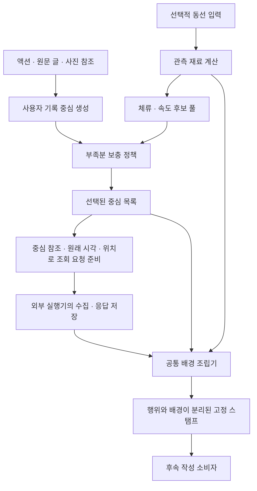

# 장면 중심 생성과 공통 배경 조립

현재 코드 경로는 `StampTool("action_background_v2", source, policy)`다.
사용자 기록만으로 중심을 만들고, 부족할 때만 관측 중심을 보충한 뒤, 두 출처에 같은 배경 조립기를 적용한다.
기존 [보충 정책](action-background.md)의 판정 기준은 유지했다. 이전 `record_how` 조립기를 호출하지 않는다.



외부 수집 위치를 위한 계약까지 열었다. 이번 데모의 수집기는 명시된 합성 응답을 파일에 저장한다.
공공데이터·날씨 API를 실제 호출하거나 LLM 본문을 생성한 단계는 아니다.

## 현재 경계

| 코드와 인터페이스 | 입력 → 결과 | 하지 않는 일 |
| --- | --- | --- |
| [scene_core.py](../../../../scripts/spikes/diary_storyboard/scene_core.py) `user_cores` | 사용자 기록 열 → 출처·시각·위치를 보존한 중심 | 동선·배경 입력과 조회가 필요 없음 |
| 같은 모듈 `choose_supplements` | 사용자 중심·관측 후보·목표 수 → 선택 참조·제외 이유·부족분 | 배경 조립이나 모델 판단을 호출하지 않음 |
| 같은 모듈 `observation_core` | 선택된 관측 → 별도 출처의 중심 | 사용자 기록 저장소에 유사 기록을 생성하지 않음 |
| [scene_pipeline.py](../../../../scripts/spikes/diary_storyboard/scene_pipeline.py) `prepare_scene_plan` | 원본·정책 → 중심 목록·동선 연결·선택 명세 | 배경과 최종 스탬프 없이도 계획을 만들 수 있음 |
| 같은 모듈 `background_requests` | 중심 목록 → 공간·환경 조회 대상 | HTTP 요청을 실행하지 않음 |
| [scene_background.py](../../../../scripts/spikes/diary_storyboard/scene_background.py) `assemble_backgrounds` | 중심·동선·선택된 저장 응답 → 배경·시간 관계 | 행위 내용을 반환하거나 수정하지 않음 |
| `StampTool`의 v2 어댑터 | 위 결과 → 고정 스탬프·책·카드용 재료 | 이전 HOW/행위 조립기를 실행하지 않음 |

사용자 중심 생성은 실제로 사용자 `Record` 목록만 받는다. 공간 정보가 없거나 동선이 사라져도 작동한다.
전체 입력에 들어온 과거 `RecordEnvelopeSnapshot`의 기록별 배경은 별도 변환기가 새 조회 대상에 정확히 대응시킨다.
관측 중심에는 그 관측을 대상으로 저장한 새 배경을 넣을 수 있다. 가까운 사용자 기록의 응답으로 대체하지 않는다.

## 조회 대상과 두 단계 저장

배경의 대상은 최종 스탬프 참조가 아닌 **중심 참조**다. 스탬프가 배경을 포함하므로 그 버전을 조회 대상에 쓰면
배경 조회 전에 최종 버전이 필요해지는 순환이 생긴다. 중심 버전은 원본 행위·시각·위치로 먼저 계산한다.

조회 대상에는 `core_ref`, `session_id`, `event_at`, `point`, `radius_m`가 들어간다.
두 종류의 중심 모두 같은 계약이다. 위치 없는 메모에는 좌표를 만들지 않고 `not_requested` 요청 상태를 남긴다.

실행 순서는 다음과 같다.

1. `prepare_scene_plan(source, policy)`로 중심과 보충 선택을 만든다.
2. `background_requests(plan)`으로 조회 대상을 꺼낸다. 외부 실행기가 수집·캐시·실패를 처리할 자리다.
3. 응답을 `background_envelopes`에 보존하고 소비할 ID를 `selected_background_ids`로 명시한다.
4. 같은 원본·정책으로 `StampTool("action_background_v2", source, policy)`를 만들어 배경을 조립하고 책을 저장한다.

배경을 갱신해도 중심 참조와 행위는 동일하다. 최종 스탬프 버전은 바뀌므로 이전 카드가 새 배경에 조용히 연결되지 않는다.
중심의 시각·위치·출처 참조가 바뀐 캐시는 거절한다. 페이로드 해시, 조회 교체 이력, 선택된 중복 응답,
합성/실제 출처, 사건 날씨의 유효 시간 검사도 적용한다. 조회 시각의 날씨를 사건 당시 날씨로 투영하지 않는다.

## 배경과 보충 정책

`action`은 중심 생성 결과를 그대로 사용한다. `background`에는 공간(`space`), 환경(`environment`),
동선(`trajectory`) 배열이 따로 들어간다. `relations`는 확인된 기록 시각 차이를 표현한다.

공간·환경은 독립 슬롯의 수와 만료 시간을 갖는다. 현재 중심을 대상으로 명시적으로 선택한 응답은 보존하며,
과거 조회 맥락은 같은 검증된 동선 run에서만 전달한다. GPS 공백이나 품질 제외 경계를 넘으면 슬롯을 비운다.
이전 조회에는 `prior_core_query`와 원래 대상 참조를 붙인다. 현재 조회가 없는데 과거 조회가 남아 있어도
`current_query_status`는 `not_requested`로 구분한다.

동선은 두 출처 모두 같은 근접/구간 연결 함수를 사용한다. 지지 구간 안의 실제 대표점, 회전 꼭짓점 근접성을
확인하고 제한된 수를 배경에 남긴다. 사용자 기록 시각을 행동 시작 시각으로 해석하거나 여러 지지 구간을
하나의 행동 기간으로 합치지 않는다. v1의 두 별도 배경 조립 분기를 공통 함수로 바꿨으며,
모든 배경 멤버의 옛 순서까지 보존하는 이식은 아니다. 원래 결과는 v1 어댑터에서 그대로 재생한다.

보충 선택은 v1과 같다. 목표 수는 필수 인자이고, 사용자 기록 우선·체류 우선·관측 길이·중복 제외·미달 허용을 유지한다.
7개 기존 합성 조건에서 선택된 중심 ID·행위 내용·대표 시각·위치·부족분이 v1과 일치했다.
새 ‘읽을 가치’ 점수나 LLM 선정 정책을 이번 구조 변경에 섞지 않았다.

## 자료 부족과 실패

- 동선은 `ready`, `unavailable`, `not_requested`로 표현한다. 동선이 없어도 기록 자체의 확인된 위치로 배경을 받을 수 있다.
- 동선 계산 단계의 `RuntimeError`는 `motion_calculation_failed` 상태로 남긴다. 원본 기록·동선을 그대로 저장하고,
  실패 상태도 책의 입력에 고정하므로 나중에 계산기가 복구돼도 저장본이 다른 장면을 생성하지 않는다.
- 잘못된 세션·낡은 참조·변경된 좌표 같은 `ValueError`는 단순 자료 부족으로 숨기지 않고 거절한다.
- 정상 형식의 배경 조회 실패(`unavailable`)와 빈 결과(`empty`)는 중심을 삭제하지 않는다.
- 실제 provider의 알 수 없는 응답 형식은 기존 projector처럼 `not_supported`다. 수집 실패 처리와 provider별 정규화는 외부 실행기 후속 작업이다.

## 확인 결과와 재현

`test_scene_pipeline.py` 29개와 기존 보충·스탬프·HOW 회귀 58개, **총 87개가 통과**했다.
변경 Python 6파일의 Ruff 검사도 통과했다. 저장된 v1 보충 실험 6권과 이전 Gemini 작성 실험의 입력·출력을 그대로 재생했다.
새 모델 호출·외부 API 호출은 0회다.

```powershell
uv run python -m scripts.spikes.diary_storyboard.scene_pipeline_demo --target-scene-count 3 --out ../diary-lab/scene-pipeline-02
```

여섯 조건에서 중심·행위 보존과 책 재생이 모두 통과했다.

| 조건 | 중심 구성 | 배경 처리 |
| --- | --- | --- |
| 기록+관측 | 사용자 1 + 관측 2 | 같은 계약으로 두 출처 모두에 공간·날씨 연결 |
| 관측만 | 관측 2, 부족분 1 | 사용자 기록 없이 관측 지점에 직접 연결 |
| 동선 없음 | 사용자 1 | 기록에 있는 위치로 공간·날씨 연결 |
| 위치 없는 메모 | 사용자 1 | 메모 보존, 배경 미조회 |
| 배경 조회 실패 | 사용자 1 + 관측 2 | 모두 보존, 실패 상태 표시 |
| GPS 공백 | 사용자 2 | 공백을 넘는 과거 공간 맥락 제외 |

각 조건 폴더에 `scene_plan.json`, `background_requests.json`, `background_snapshot.json`,
`prepared_stamps.json`, `stamp_book.json`을 남긴다. 배경 응답은 명시된 합성 fixture다.
기존 출력 폴더는 덮어쓰지 않는다. 합성 자료에서 경계와 연결을 확인한 결과이며 실제 공간 조회나 일기 문장 품질의 검증은 아니다.

다음 연결점은 외부 실행기가 실제 위치·시각에 맞는 배경 응답을 수집하는 부분이다.
공공데이터·날씨 provider를 이 입력에 연결한 후, 완성된 스탬프를 실제 작성에 전달한다.
