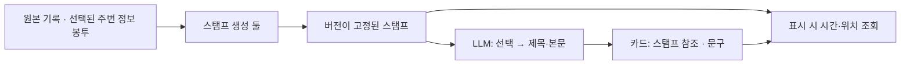

# 스탬프 생성 툴과 카드 소비 경계

현재 제품 기획은 [장면 우선 생성](plan.md)이다. 아래는 기존 Geo 툴·카드 계약이며,
모델에 시간·앞뒤 기록을 전달하는 예시는 당시 구현이다. 새 기획의 장면 입력으로 복사하지 않는다.

현재 구현은 후속 [중심 생성과 공통 배경 조립](scene-pipeline.md)의 `action_background_v2` 어댑터다.
[부족분 보충](action-background.md)의 v1 판정은 유지하며 두 출처를 같은 배경 조립기에 연결했다.
이 문서의 `record_envelopes`/`record_how` 정책과 과거 실험은 재현용으로 유지한다.
공통 `query/project/resolve/anchor/dump/load`와 카드 참조 경계는 새 어댑터도 사용한다.

슬롯·스탬프 [실제 Gemini 실험](../../../research/2026-09-08-slot-stamp-gemini.md) 이후,
이 협업 세션에서 기본 실험 경로를 **원본·주변 정보 봉투 → 스탬프 생성 툴 → 선택·서술**로 접었다.
Geo 실험 코드이며 Dev/App API·DB에는 아직 연결하지 않았다.



## 무엇을 접었나

| 이전 비교 경로 | 현재 기본 실험 경로 |
| --- | --- |
| 후보 목록·선택 계획·장면 구성·사용 결정표를 여러 계약으로 전달 | 시스템이 만든 스탬프를 ID로 선택하고 문구 작성 |
| 작성 결과에 원본 시간·chain을 복사 | 카드에는 `stamp_ref`, `title`, `text`만 저장 |
| 공간·행동 맥락을 실험 실행기가 직접 구성 | 모델과 분리된 `StampTool`이 구성 |
| 원본 재조회나 전처리 변경 시 카드 연결이 달라질 여지 | 원본·정책·프레임·모델용 투영값까지 버전에 포함; 불일치 거절 |

예전 `composition_experiment.py`, `editorial_experiment.py`, `stamp_experiment.py`와 실제 요청·응답은 보존한다.
새 기본 경로는 그 실행기들을 호출하지 않는다. 보존 자료용 `archived_v1` 어댑터만
당시 `stamp_materials.py` 전처리를 재사용한다. 과거 실험 코드 해시나 성공 결과를 덮어쓰지 않는다.
이는 서비스 세 개를 신설하는 변경이 아니라 같은 프로세스 안의 책임 분리다.

## 실제 인터페이스와 저장

| 소유 | 파일과 인터페이스 |
| --- | --- |
| 원본·봉투 | [record_envelopes.py](../../../../scripts/spikes/diary_storyboard/record_envelopes.py): 기존 원본 종류·버전, 봉투 상태·출처·선택 목록 |
| 스탬프 | [stamp_tool.py](../../../../scripts/spikes/diary_storyboard/stamp_tool.py): `StampTool(...)`, `query`, `project`, `resolve`, `anchor`, `dump`, `load` |
| 선택·서술·표시 | [stamp_storyboard.py](../../../../scripts/spikes/diary_storyboard/stamp_storyboard.py): `selection_request`, `accept_selection`, `writing_request`, `accept_writing`, `render` |

완료된 한 산책을 받아 시간순으로 슬롯을 갱신하고 스탬프를 찍는 **배치 툴**이다.
실시간 갱신 서버를 먼저 만들지 않았다. 서로 다른 산책이 섞인 입력은 거절한다.
입력이나 반환 딕셔너리를 수정해도 이미 찍힌 스탬프는 바뀌지 않는다.

`stamp_book.json`에는 원본 스냅샷 한 벌, 정책, 스탬프 참조·프레임, 슬롯 audit를 저장한다.
기록형 프레임은 원본 기록 참조, 주변 봉투 ID, 이전 행동 참조를 가진다. 원본 메모를 프레임마다 복제하지 않는다.
모델용 딕셔너리는 고정 원본에서 계산해 메모리에 고정한다. 재생 시 계산 결과까지 버전을 대조한다.
원본의 다른 부분 하나가 바뀌어도 그 스냅샷의 모든 스탬프 버전이 바뀌는 보수적인 정책이다.
다른 버전의 카드·선택을 새 책에 자동으로 다시 연결하지 않는다.

## 현재 찍는 정책

`record-stamp-v1`은 [기록·봉투 계약](record-envelopes.md)의 행동·글·사진을 받는다.

| 정책 | 지금 값 / 의미 |
| --- | --- |
| 트리거 | 원본 기록 하나마다 스탬프 하나. 원본 종류 유지 |
| 필수 기록 | 행동·글·사진 모두 보존. 현재 기록형 스탬프는 모두 필수 |
| 공간 슬롯 | 이전 공간 조회 최대 3개, 300초 이후 만료 |
| 행동 슬롯 | 이전 행동·사진 기록 최대 2개, 600초 이후 만료; 스탬프에는 가장 최근 하나 참조 |
| 환경 슬롯 | 이전 환경 조회 최대 1개, 300초 이후 만료 |
| 현재 기록의 봉투 | 명시적으로 선택된 봉투는 슬롯 상한과 별도로 보존 |
| 카드 상한 | 기본 7개. 필수 기록이 넘으면 오류. 임의로 버리지 않음 |
| 빈 기록 | 빈 스탬프·빈 보드는 정상. 작성 호출 없음 |

슬롯은 원본 저장소를 지우지 않는다. 교체·만료가 추가 장면이나 물리적 이탈을 만들지 않는다.
페이지 단위는 지금 **각 기록에 대한 조회 결과**다. 같은 공원을 가리킨다고 조회 두 건을 같은 시점의 증거로 합치지 않는다.
장소 ID 기반 재방문·공간 전환 정책이나 슬롯 전략의 품질을 검증한 것은 아니다.

기록별 스탬프를 만든다고 제품의 최종 카드 개수까지 확정한 것은 아니다.
여러 기록을 한 스탬프에 담기, 필수 기록이 많은 세션의 분할, 실제 동선의 전환 트리거는 후속 정책이다.
이동만 있는 산책의 보존 자료는 `archived_v1`로 재생한다. 후속 `record_how` 경로는
[HOW 스탬프 조립](how-stamps.md)에서 합성 동선의 이동 중심 후보를 생성한다.

## 모델에게 넘어가는 관계

합성 fixture의 15:05 사진에서 실제 투영 결과의 필요한 필드만 발췌했다.

```json
{
  "context": [{
    "id": "river-01",
    "status": "known",
    "temporal_basis": "lookup_snapshot",
    "relation_to_stamp": "prior_record_query",
    "elapsed_s": 120,
    "relation_basis": "distance_to_reference_at_target_record"
  }],
  "relations": [{
    "type": "after_action_record",
    "from_id": "stamp:walk_entry:behavior-01",
    "to_id": "stamp:walk_photo:photo-01",
    "elapsed_s": 120,
    "basis": "record_timestamp_difference",
    "continuous_presence": "not_established"
  }]
}
```

2분 전 기록에 붙은 하천 조회와 냄새 맡기 기록을 뜻한다. 사진을 하천에서 찍었거나 2분 동안 냄새 맡았다는 데이터가 아니다.
현재 기록에 직접 연결된 봉투는 `same_record`로 구별한다. `session_fallback` 시각에는 과거 공간·행동을 연결하지 않는다.
원본 글의 공백·줄바꿈을 유지하며 사진의 피사체를 산책 참가자 목록에서 추정하지 않는다.

봉투 원문은 모델에 통째로 보내지 않는다. projector는 명시된 **합성 provider fixture 형식**만 지원한다.
공원·하천은 거리의 기준 형상, 시설은 조회 범위·부분 응답, 날씨는 사건 시각 유효 범위를 유지한다.
`empty`, `unavailable`, `not_requested`, `partial`을 구분한다. 날씨가 조회 시점 스냅샷뿐이면 사건 당시 날씨로 투영하지 않는다.
지원하지 않는 실제 provider 형식과 `movement.window`는 원본 봉투를 보존하되 `not_supported`로 표시한다.
실제 위치·날씨·속도·체류 수집은 이번 변경에 포함하지 않았다.

## 카드와 모델 호출 경계

카드는 `{stamp_ref: {id, version}, title, text}`만 저장한다.
선택 응답은 선택할 수 있는 스탬프 ID뿐이며 필수 기록 누락·중복 선택을 거절한다.
작성 응답은 선택된 ID·제목·본문뿐이다. 시간·좌표 필드는 스키마에서 받지 않는다.
선택된 ID가 정확히 한 번씩 등장해야 하고 저장 순서는 시스템이 원본 순서로 정한다.
모델에게 버전 해시를 다시 쓰게 하지 않고 시스템이 요청의 정확한 참조를 붙인다.

`render`가 같은 책의 스탬프에서 시간과 위치를 읽는다. `rendered.json`은 재생성 가능한 표시 결과다.
새 API는 생성 초안만 지원한다. 사용자 편집·숨김·순서 변경은 별도 편집으로 연결해야 하며,
기존 실행기의 `review`를 자동 이식하거나 사용자 편집을 덮어쓰는 경로를 추가하지 않았다.

## 이번 검증과 읽는 방법

[stamp_demo.py](../../../../scripts/spikes/diary_storyboard/stamp_demo.py)는 합성 기록 6개에서 새 스탬프와 모델용 요청을 만들고,
이전 실제 응답 3조건을 새 카드 계약으로 재생한다. **새 모델 호출은 0회**다. 새 요청의 모델 품질·비용 측정이 아니다.

```powershell
uv run python -m scripts.spikes.diary_storyboard.stamp_demo --out ../diary-lab/stamp-tool-01
```

- `records/stamp_book.json`: 원본과 버전이 고정된 스탬프.
- `records/write_request.json`: 발송 전 딕셔너리·스키마·짧은 프롬프트·참조 버전.
- `{movement,actions,gap}/storyboard.json`: 과거 실제 응답으로 만든 참조·문구만 있는 카드.
- `{movement,actions,gap}/rendered.json`: 같은 문구·원본 시각·chain을 복원한 표시 결과.
- `README.md`, `report.json`: 사람이 읽는 결과와 검산 수치.

3조건의 **21개 카드가 문구·대표 시간·chain 그대로 복원**됐다. 합성 사진은 원래 위치를 조회하고,
위치 없는 글과 좌표 없는 과거 실험은 위치를 만들지 않는다. 구조와 연결 보존을 확인한 결과다.
과거 출력의 ‘기념 촬영’, ‘머무르며’, ‘복귀’ 같은 의미 과장과 반복 선택은 그대로 남아 있다.
`semantic_status`는 항상 `not_evaluated`이며 구조 통과를 사실성 승인으로 바꾸지 않는다.

표적 검사 범위는 `test_stamp_tool.py`, `test_record_envelopes.py`, `test_stamp_experiment.py`다.
원본·정책·투영 변경, 낡은 참조, 봉투 선택/해시, 슬롯 만료·용량, 다른 세션 혼입,
시간차와 현재/과거 조회, 필수 기록 누락, 모델의 시간 필드 추가와 보존 응답 재생을 검사한다.
전체 저장소 검사나 실제 앱·네트워크 검증을 수행한 결과는 아니다.

다음 작업은 provider별 투영과 실제 이동 구간 입력 확장이다. 같은 스탬프를 고정해 선택 정책과 문구 품질을 각각 비교한다.
후속 [HOW 재료 추출기](how-materials.md)는 동선의 체류·직선·뚜렷한 회전·되짚기를 계산한다.
`record_how` 경로의 [조립 정책](how-stamps.md)으로 기록 중심/이동 중심과 제한된 직선 맥락을 연결했다.
WHERE 경계 판정·실시간 HOW 슬롯 스트림은 아직 포함하지 않았다.
LLM HTTP 실행·영수증·사용량 한도를 새 계약에 연결하는 작업과 제품의 저장·검토·지도 어댑터는 남아 있다.
