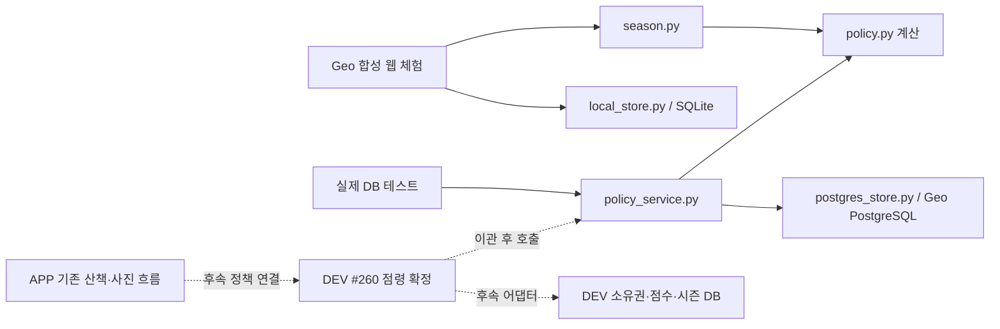

# 산책 점령 게임 — 구현 근거와 Geo → DEV → APP 인수인계

다음 기반 작업은 [산책·점령 세션과 통계 working skeleton 설계](../statistics/activity-statistics-skeleton.md)다.
비교 범위·순위·칭호보다 먼저 기존 세션 ID 연결과 두 도메인의 통계 근거를 구축한다.
아래 게임 구현/이관 현황과 구분한다. [통계 순수 코어](../../../contracts/activity-statistics-core.md)는
구현했고 [DB 저장·재처리 골격](../../../contracts/activity-statistics-postgres.md)도 추가했다.
DEV/APP 제품 연결은 아직 후속 단계다.

이 문서는 **왜 Geo에 코드가 있는지, 무엇을 만들었는지, DEV·APP에 무엇이 이미 있는지,
무엇을 어떤 순서로 옮겨야 하는지**를 설명하는 시작점이다. 작업자는 대화 기록을 읽지 않아도
아래 구현 목록·연결 지점·완료 기준으로 이어서 작업할 수 있어야 한다.

현재는 보호·점수·시즌 계산과 Geo PostgreSQL 저장 기반까지 구현했다. 동네 범위를 정하는
정책과 칭호 수여 기능은 구현하지 않았다. 이 문서와 함께 추가한
[동네 순위·칭호 정책과 계약 초안](../../../contracts/territory-ranking-titles.md)은 검토할 설계이며,
그 기능을 구현하거나 제품 정책을 확정했다는 뜻이 아니다.

읽는 순서: [개발 이유](#2-왜-geo에서-만들었는가) → [현재 반영 상태](#3-확인한-기준점과-반영-상태)
→ [파일별 이관](#5-파일별-목적과-이관-방법) → [DEV 연결](#7-dev에서-연결할-구체적인-지점)
→ [APP 연결](#8-app에서-추가할-지점) → [후속 작업](#11-후속-작업-묶음과-완료-기준).

## 1. 목적과 결정 상태

제품 목표는 산책하며 영역을 차지하고 **우리 강아지를 동네 강자로 알리는 것**이다. 영역을
칠하는 화면만이 아니라, 획득·유지·경쟁의 보상과 시즌이 끝난 뒤 남는 성적·칭호가 필요하다.
개인 지도·미니룸 꾸미기는 이후 범위다.

아래 상태를 구분한다. `구현`은 코드가 있다는 뜻이며 운영 채택·배포와 다르다.

| 항목 | 대화에서 정한 방향 | 현재 코드/결정 상태 |
|---|---|---|
| 점령 보호 | 새 점령·탈취 뒤 10분 보호 | Geo 계산·테스트 구현. 미인증 점유도 보호하는 세부안은 초안 |
| 점령/탈취 보너스 | 실제 소유권 변경에 보상 | Geo 구현. 각각 100점은 변경 가능한 초안 |
| 보유 시간 점수 | 보유 시간을 반영하고 동시 보유 배율 적용 | Geo 구현. 시간당 10점·추가 0.1배·최대 2배는 초안 |
| 반복 탈취 보상 | 반복 지급 문제를 검토해야 함 | 매 변경 지급/강아지·장소별 UTC 하루 한 번 비교 구현. 채택 미정 |
| 미인증 점유 점수 | 인증 상태와 점수 관계를 정해야 함 | 포함/제외 옵션 구현. 기본 포함은 초안 |
| 시즌 | 주기적으로 초기화하고 기록 보존 | 종료 계산·저장 구현. 7일 기본값과 자동 운영 일정은 미확정 |
| 순위 | 동네에서 강아지 성적을 비교 | 현재는 한 시즌 계정 전체의 총점 정렬·공동 순위만 구현 |
| 칭호 | 시즌 이후에도 성과를 남기고 알리기 | 수여 조건·종류·기간 미확정. 계산·DB·API·UI 없음 |
| 이름/사진 공개 | 공개 여부를 선택할 방향 | 게임 공개 프로필·칭호 표시 동의 구현 없음 |

`scope_id`를 넣었다고 동네 정책이 만들어진 것이 아니다. 현재는 호출자가 정한 게임 범위의
식별자다. 실제 경계·가입·여러 동네 활동·공개 기준은 후속 설계가 필요하다.

## 2. 왜 Geo에서 만들었는가

사용자가 Geo에서 먼저 구현하도록 선택했다. 운영 DB 준비를 기다리는 동안 보호·점수·시즌
정책을 독립적으로 계산하고, 재전송·동시 점령·시즌 경계에서 잘못 지급하지 않는 구조를
실행으로 검증하기 위해서다. Geo는 산책·공간 기능의 실험과 계약 검증 원본이며, 실제 서비스
백엔드의 소유권은 DEV, Android 제품 코드의 소유권은 APP에 있다.

**운영 DB 미적용은 개발 불가 사유가 아니다.** DEV용 연결 코드와 migration도 격리 DB에서
먼저 개발할 수 있다. Geo를 고른 것은 작업 위치와 검증 순서에 대한 선택이다. Geo 자체가
운영 서버이거나, Geo 코드를 넣으면 DEV·APP에 자동 반영되는 구조는 아니다.

Geo에서 얻은 결과는 세 가지다.

| 결과 | DEV·APP에 주는 가치 | 그대로 옮길 수 없는 부분 |
|---|---|---|
| 합성 웹 체험 + SQLite | 규칙을 직접 조작하며 보호·탈취·시간·응답 유실을 검토 | 합성 세션/GPS/사진 판정, 수동 시계, 웹 UI, 전체 시즌 JSON 저장 |
| 독립 정책 + 트랜잭션 계약 | 실제 서비스 입력과 저장 책임을 분리. 동일 사례로 검증 가능 | DEV 패키지 경로, 인증된 요청에서 후보를 만드는 호스트 코드 |
| 실제 PostgreSQL 어댑터 + 0033 | SQL 제약, 동시 연결, 원자적 저장, 종료 기록을 실행 검증 | Geo 장소 FK와 소유권 테이블. DEV에서는 #260 원본에 매핑해야 함 |

Geo 화면을 PostgreSQL에 추가 연결하는 것은 선택적인 체험 개선이다. **DEV 승격의 선행
조건이 아니다.** 실제 서비스 연결이 목적이면 기존 DEV #260/APP 경로에 정책을 붙이는 작업이
직접적인 다음 단계다. 동네·칭호 미결 정책은 Geo에서 설계하되 독립적인 DEV 점수 연결을 막지 않는다.

## 3. 확인한 기준점과 반영 상태

다음은 2026-09-06 확인 시점의 저장소 상태다. 브랜치·PR은 이후 바뀔 수 있으므로 새 작업 전에
다시 확인한다. 아래 commit은 코드 대조의 기준이며 운영 배포 버전을 뜻하지 않는다.

| 대상 | 기준 | 확인한 내용 |
|---|---|---|
| Geo 로컬 시즌 체험 | [#241](https://github.com/rkbuhtig/DAENGS_geo/pull/241), `5f7ba7f` | main에 병합 |
| Geo 정책 계약 | [#242](https://github.com/rkbuhtig/DAENGS_geo/pull/242), 최초 `a30c608` | main 대상 PR 열림 |
| Geo PostgreSQL | [#243](https://github.com/rkbuhtig/DAENGS_geo/pull/243), `fc84a08` | #242의 `feat/territory-policy-contract`에 병합. main 병합과 구별 |
| DEV dev | `ec3f46b5d1858c0390666f72af21f6c0a317fe60` | 기본 방문 인증·독립 점유 규칙 존재. Geo 점수/시즌 미승격 |
| DEV 소유권 | [#260](https://github.com/SAJOYO/DAENGS_dev/pull/260), `5b2c8a4c57cdf593c8e5be9f11225ffaab599413` | dev 대상 PR 열림. 소유권 API/DB 구현은 PR에 존재 |
| APP dev | `815443b4f2a175a535df7746f1b20e23cf6574bb` | 기본 서버 조회·영역표시·사진 업로드/판정 연결 존재 |

APP [#161](https://github.com/SAJOYO/DAENGS_app/pull/161),
[#164](https://github.com/SAJOYO/DAENGS_app/pull/164),
[#165](https://github.com/SAJOYO/DAENGS_app/pull/165)는 병합됐다. APP에 온라인 게임 연결을 처음부터
새로 만드는 일이 남았다고 설명하면 틀리다. 기존 경로에 새 정책 응답과 화면을 추가하는 일이다.

APP의 기본 debug는 로컬 게임, `territoryServerRead=true`는 서버 조회,
`territoryServerActions=true`는 조회·세션·영역표시·사진 연결을 사용한다. release의 서버 게임
플래그는 false다. 근거는 확인 commit의
[사진 연결 문서](https://github.com/SAJOYO/DAENGS_app/blob/815443b4f2a175a535df7746f1b20e23cf6574bb/docs/territory-server-photos.md)와
[빌드 설정](https://github.com/SAJOYO/DAENGS_app/blob/815443b4f2a175a535df7746f1b20e23cf6574bb/app/build.gradle.kts)이다.
실제 운영 DB migration·서버 배포·기기 동작 상태는 이 저장소 대조로 확인한 것이 아니다.

## 4. 기능별 구현 범위

| 기능 | Geo | DEV dev / #260 | APP dev |
|---|---|---|---|
| 장소·산책·접촉·사진 기본 흐름 | 합성 체험. 실제 인증 권한 없음 | 방문 인증은 dev, 공유 소유권 연결은 #260 | 서버 연결·복구 코드 있음, 테스트 빌드에서 사용 |
| 10분 보호 | 계산·경계 테스트 있음 | 미승격 | 보호 응답·카운트다운/거절 안내 미추가 |
| 점령 보너스·보유 시간·배율 | 계산·트랜잭션·PostgreSQL 구현 | 미승격 | 점수 응답·표시 미추가 |
| 시즌 생성·초기 점유 반영 | 함수 구현 | 미승격 | 시즌 표시/전환 처리 미추가 |
| 시즌 종료·성적 보존 | 함수·DB·재실행 검증 있음 | 작업 스케줄러·운영 연결 없음 | 과거 성적 화면 없음 |
| 한 시즌 공동 순위 | 종료 시 계산·저장, 로컬 화면 있음 | 게임용 조회 API 없음 | 게임용 순위 화면 없음 |
| 실제 동네 순위 | 경계·귀속·API 미구현 | 미구현 | 미구현 |
| 칭호 | 성적 근거만 있음. 수여·보관·표시 미구현 | 미구현 | 미구현 |

## 5. 파일별 목적과 이관 방법

아래 경로는 Geo 루트 기준이다. DEV의 새 파일명은 제안이며 실제 PR에서 해당 패키지 규칙에 맞춘다.

| Geo 원본 | 현재 책임 | DEV/APP으로 가져갈 방법 |
|---|---|---|
| `app/features/territory/game/policy.py` | 불변 입력, 보호·점수·종료 계산 | DEV `services` 아래 독립 정책 모듈로 이관. Python 계산을 APP에 복제하지 않음 |
| `policy_ports.py` | 같은 트랜잭션의 잠금/저장 인터페이스 | DEV 저장 계약으로 이관. 구현체가 인증된 서버 세션을 사용 |
| `policy_service.py` | 계산과 원자적 저장 순서, 영수증 재생 | DEV 점령 확정과 사진 callback에 연결. 외부 commit 책임 유지 |
| `postgres_store.py` | Geo SQL 어댑터, 초기 반영·조회 | 계정/기록 SQL을 참조하고 소유권/시도 접근은 #260에 맞춰 재작성 |
| `alembic/versions/0033_territory_policy.py` | Geo 정규화 schema·제약·기록 보존 | DEV `db/init`과 날짜별 migration/verify로 변환. 파일 통째 적용 금지 |
| `season.py` | 합성 세션·사진·게임판 명령 처리 | 체험용으로 보존. 운영 세션 서비스를 대체하지 않음 |
| `tools/territory_game/local_store.py`, `tools/territory_game/local_schema.sql` | SQLite 전체 시즌 snapshot과 명령 복구 | Geo 체험용. 운영 DB 어댑터로 승격하지 않음 |
| `tools/territory_game/season_lab.py`, `tools/territory_game/static/season/` | 합성 지도·수동 시각의 HTTP/화면 | 제품 화면 검토 자료. 운영 라우터·APP UI는 기존 제품 경로에서 구현 |
| `scripts/spikes/territory_season/` | 서버 실행, 전략 비교, 브라우저 검증 | 재현 도구로 보존. 운영 워커/시즌 스케줄러가 아님 |
| `tests/territory/test_policy_integration.py` | 계약 재전송·롤백·경계 테스트 | DEV 어댑터에서도 동일 의미의 사례 실행 |
| `tests/territory/test_policy_postgres.py` | 실제 SQL/migration/경쟁 연결 테스트 | #260 원본 테이블을 사용하는 DEV 통합 테스트로 변환 |
| `tests/territory/test_season_game.py`, `tests/tools/territory_game/test_season_store.py` | 계산 회귀·SQLite·HTTP 체험 검증 | 순수 계산 사례 재사용. SQLite 전용 기대는 Geo에 남김 |

정책 코드와 DB 제약의 책임은 DEV가 갖고, APP은 서버의 현재 상태·처리 결과를 표시한다.
APP이 단말 시계로 보호 해제를 확정하거나 보너스를 자체 지급하면 같은 계약이 아니다.

## 6. 현재 실행 경로와 목표 경로

실선은 Geo에서 실행 검증한 관계, 점선은 제품 승격 작업이다. APP의 기본 #260 클라이언트가
이미 존재한다는 사실과 새 정책이 아직 서버에 연결되지 않았다는 사실을 함께 읽는다.
Geo 웹이 PostgreSQL로 저장된다고 주장하지 않는다. 그 화면은 계속 SQLite를 사용한다.

## 7. DEV에서 연결할 구체적인 지점

기준 소스는 #260의
[territory_ownership.py](https://github.com/SAJOYO/DAENGS_dev/blob/5b2c8a4c57cdf593c8e5be9f11225ffaab599413/backend/src/daengs_backend/services/territory_ownership.py)와
[DB 정의](https://github.com/SAJOYO/DAENGS_dev/blob/5b2c8a4c57cdf593c8e5be9f11225ffaab599413/db/init/20_territory_claims.sql)다.

### 7.1 요청에서 정책 후보까지

1. 기존 인증·참여견 소유권·산책·장소·접촉 검증을 유지한다. 지도 조회 같은 네트워크 작업은 행 잠금 전에 한다.
2. 대상 장소의 활성 시즌을 서버에서 결정하고 시도에 고정한다. callback 때 현재 시즌으로 다시 선택하지 않는다.
3. 기존 session/site 잠금보다 먼저 해당 시즌 장벽을 잠근다. 사진 경로의 이미 취득한 photo 잠금은 앞에 둘 수 있다.
4. `mark`의 중립 점령 또는 `_apply_photo`의 인증 강화/탈취 확정에 `OwnershipCandidate`를 만든다.
5. 서비스가 현재 소유권·양쪽 계정·처리 시각을 읽어 검사하고 변경 계획을 계산한다.
6. 소유권·양쪽 점수·지급 키·기록·영수증과 호스트 claim/photo 변경을 같은 DB transaction에 반영한다.

기존 `rules.mark`는 이미 버전을 증가시킨 결과를 반환하고 claim에 그 버전을 저장한다.
새 후보의 `expected_version`은 **정책 적용 전 비교할 버전**이어야 한다. 확정 뒤의 값으로
다시 후보를 만들면 충돌하거나 재시도 identity가 달라진다. mark/photo 처리 단계별 원본 후보를
영수증에 고정하고 #260의 변경 가능한 `expected_site_version`만으로 재구성하지 않도록 설계한다.

### 7.2 테이블 대응

| Geo 데이터 | DEV #260 원본/후속 저장 |
|---|---|
| 장소 버전 | `territory_claim_sites.version` |
| 현재 소유권 | `territory_occupancies` → `territory_claims` → `territory_claim_sessions`로 pet/session/claim 취득 |
| 소유권 attempt ID | `territory_occupancies.claim_id`와 원래 claim ID |
| 정책 session ID | `territory_claim_sessions.id`인 서버 내부 UUID. APP의 `client_session_id`와 구별 |
| 소유권 시각 | `territory_occupancies.occupied_at`. 초기 반영용 원시 시각 보존과 정책 보호 시각의 구분 추가 |
| 시즌 귀속 | #260에는 없음. claim/장소와 시즌 연결을 후속 migration으로 추가 |
| 사진 원본 사건 | `territory_attempts.id`, 연결은 `territory_claim_photos` |
| 시즌·계정·지급·성적 | #260에는 없음. Geo 0033의 논리 구조를 DEV ID/FK/운영 migration 규칙으로 구현 |

Geo의 `territory_policy_site`와 DEV `territory_occupancies`를 두 개의 현재 소유권으로 운영하지
않는다. `save_site`가 #260 원본을 단독으로 갱신하고 기존 `_save_site`와 중복 수행하지 않아야 한다.
자기 강아지의 인증 강화는 원래 claim/session/점령 시각을 보존한다. #260의 시도 기준 인증 강화와
Geo의 동일 pet 기준 정책 차이도 이관 테스트로 명시적으로 맞춘다.

#260의 `_rule_session`과 `_rule_site`는 사용자 간 client UUID 충돌을 피하려고 서버 내부
session UUID를 사용한다. 후보와 현재 소유권에 동일한 ID 체계를 적용해야 같은 산책의 탈취 제한이
맞게 작동한다. HTTP의 client session ID를 후보에 그대로 넣고 현재 소유권에는 서버 ID를 넣지 않는다.

현재 DEV claim은 `UNIQUE(session_id, site_id)`, APP 대기열도 회원/산책/장소 기준으로 고정한다.
한 산책이 시즌 경계를 넘어 같은 장소에 새로 도전하도록 허용하려면 **양쪽 유일성 키와 조회/복구를
시즌까지 포함하도록 변경**해야 한다. 기존 원본을 덮어쓰는 방식으로 해결하지 않는다. 이를 미루면
새 시즌 같은 장소 재도전은 새 산책에서 하도록 명시해야 하며, 정책 선택과 호환 migration이 필요하다.

DEV의 pet/session 삭제 CASCADE와 Geo의 기록 DELETE 거부는 그대로 호환되지 않는다.
탈퇴·반려견 삭제 때 식별자 익명화, 기록 보존 범위, FK 동작을 별도 결정해야 한다. Geo trigger를
그대로 넣어 기존 탈퇴 기능을 막거나, CASCADE로 약속한 성적/칭호를 모두 지우는 선택을 하지 않는다.

### 7.3 오류·잠금·시즌 종료

잠금 순서는 `photo(필요 시) → season → claim/session → site → pet 계정 정렬 순`이다.
시즌 종료는 photo/session을 잠그지 않는다. `apply_photo_decision`은 기존 사진 판정 transaction
내부에서 호출되고 별도 commit하지 않는다. 보호·버전 경합·시즌 종료 같은 업무 거절은 사진의
verified visit을 보존하면서 점유만 거절할 수 있다. SQL 오류/누락 schema/계정 불일치는 전체 rollback이다.

DEV에는 `finalize_in_transaction`을 호출할 서버 작업과 다음 시즌 생성 작업이 필요하다. 기존
Geo 함수가 스케줄링·실패 재시도·작업 관측까지 구현한 것은 아니다. 서버 시각이 종료에 도달하면
새 점령을 막고, 작업이 늦어져도 보유 점수는 종료 시각까지만 반영한다. 새 시즌 생성은 이전 결과
봉인 이후 실행한다. 작업 재실행으로 종료 성적·이후 칭호가 중복되지 않아야 한다.

## 8. APP에서 추가할 지점

APP 루트는 `app/src/main/java/com/daengs/app/`다. 다음은 기존 코드에 덧붙이는 변경이다.

| 기존 경로 | 추가할 책임 |
|---|---|
| `territory/TerritoryOccupancyApi.kt` | 현재 점유 응답의 season/protection 버전 필드 해석, 없는 구형 응답 처리 |
| `territory/TerritoryActionApi.kt`, `TerritoryActionDelivery.kt` | 원본 요청 재전송 유지, 정책 거절과 영수증 확장 처리 |
| `territory/TerritoryActionStore.kt`, `TerritoryActionSync.kt` | 복구 중인 이전 시즌 요청 유지. 시즌 바꿔 새 요청으로 재작성하지 않음 |
| `territory/ServerTerritoryPhotos.kt`와 사진 큐 | 사진 인증 완료와 점유/점수 지급 성공을 따로 표시 |
| `map/features/territory/ServerTerritoryGameProvider.kt` | 서버 시각 기준 보호 안내, 최신 점유 우선, 새 점수 상태 제공 |
| `ui/walk/TerritoryActionCard.kt` 등 산책 UI | 보호 잔여 시간·보너스/보유 점수·시즌 안내. 새 시즌/오래된 응답 상태 구분 |
| 새 게임 성적/칭호 화면 | 서버 API 확정 후 현재 점수·과거 성적·동네 순위·보유 칭호·선택 표시 |

서버 기준 시각과 보호 종료를 받아 잔여 시간을 표시하되 최종 점령 허용은 서버 판정이다.
복구한 성공 영수증을 새 보너스 애니메이션으로 재생하지 않는다. 조회 실패를 0점으로 표시하거나
지난 시즌 계정을 현재 시즌으로 덮지 않는다. 정확한 점수 분자는 문자열로 읽고 소수는 표시용이다.

`protected`도 거절 시점을 구분한다. 시도 생성 전 보호 거절이면 보호 종료 후 최신 접촉으로 새
요청을 허용할 수 있다. 이미 접수된 사진 판정에서의 점유 거절은 원본 claim/사진을 유지한다.
현재 APP의 재전송 가능 오류 목록에 새 코드를 무조건 더하지 말고, 서버 시도 생성 여부와
대표견/원본 고정 계약을 함께 검증한다.

현재 #260 `SiteResponse`에는 version/occupancy, occupancy에는 이름·인증·점령 시각이 있다.
점수·시즌·보호 필드는 없다. Geo의 내부 `OwnershipCandidate`를 APP POST 모델로 노출하지 않는다.
새 HTTP 경로·응답은 DEV/APP이 함께 version/nullable/구형 서버 처리까지 검증해야 한다.

## 9. 제품 HTTP 계약의 후속 범위

다음은 **추가할 계약 목록**이다. 구현된 endpoint 목록으로 읽지 않는다. 경로 이름은 제안이다.

| 제안 경로/확장 | 필요한 의미 |
|---|---|
| 기존 점유/claim 응답의 `policy` | season ID, 규칙 버전, 서버 기준 시각, 보호 종료. 미지원/비활성/준비 중 상태 구분 |
| `GET /app/territory/seasons/current?scope_id=...` | 선택 범위의 시즌과 시작/종료/상태. 없으면 명시적 미개설 상태 |
| `GET /app/territory/seasons/{id}/pets/{pet_id}/score` | 소유자용 정확한 점수·현재 보유 수·정산 기준. 서버 권한 검사 |
| `GET /app/territory/seasons/{id}/results` | 봉인된 성적과 결과 버전. 공개/소유자 조회 구분 |
| 동네 순위·칭호 경로 | [별도 초안](../../../contracts/territory-ranking-titles.md)의 경계·노출·pagination·수여 상태 적용 |

claim 처리 결과는 과거 영수증, 지도와 계정 조회는 현재 상태다. 두 응답의 시점이 다르다는 점을
계약에 담는다. 구형 APP이 알 수 없는 추가 필드를 안전하게 무시하는지, 구형 서버에서 새 APP이
정책 기능을 준비 안 된 상태로 처리하는지 함께 테스트한다. 시간 조작·임의 수여 API는 APP에 없다.

## 10. 동네 순위·칭호는 어디부터 남아 있는가

현재 `plan_finalization`은 한 시즌 계정 전체를 정확한 총점 내림차순으로 정렬하고 동일 점수에
공동 순위를 부여한다. PostgreSQL이 이 결과를 보존한다. 이 사실은 다음 기능의 완료를 뜻하지 않는다.

| 남은 기능 | 현재 없는 정책/계약/구현 |
|---|---|
| 동네 식별 | 경계 데이터 원본, 경계 version, 장소 귀속, 동네 이동/선택 의미 |
| 랭킹 모집단 | 어느 강아지가 어느 시즌/동네 순위에 들어가는지, 공개 거부 시 순위 표시 |
| 실시간 순위 | 동일 기준 시각·페이지 snapshot·계정별 내 순위 조회 |
| 칭호 수여 | 종류, 자격, 공동 1위 처리, 수여 시점, 재시도/취소/재수여 |
| 칭호 기록/표시 | 지급 원장, 보유 기간, 현재 대표 칭호, 공개 이름/사진 설정과 연동 |

이번 문서 묶음은 위 항목의 구체적인 검토안을 남긴다. 어떤 안을 채택했는지는 별도 결정으로
닫고, 그다음 계산/저장/API/APP을 구현한다. 칭호를 즉시 DEV로 복사할 기존 Geo 구현은 없다.

## 11. 후속 작업 묶음과 완료 기준

| 순서 | 작업 위치 | 구체 산출물 | 완료 판정 |
|---|---|---|---|
| A | Geo | #242에 포함된 정책/DB 원본과 이 인수인계의 main 반영 | 코드·문서 기준 commit과 PR 확인. #243 병합만으로 main 완료라 하지 않음 |
| B | DEV | #260 원본 위 정책·저장 매핑, 후속 init/migration/verify | 인증된 mark/사진 callback의 실제 DB 통합 테스트, 같은 transaction/버전/초기 반영 대조 |
| C | DEV + APP | 보호/점수/시즌 HTTP 계약과 기존 APP 화면 확장 | 구형/신형 조합, 계정 전환·재시작·응답 유실·이전 시즌 callback 검증 |
| D | Geo 설계 → DEV/APP 구현 | 동네·칭호 미결 결정, 버전 계약, 계산·지급·조회·화면 | 별도 문서의 승인 항목/검증표 충족. 결정 없이 확정 정책으로 출고하지 않음 |
| E | DEV 운영 | 시즌 작업 스케줄러, DB 준비 검사, 초기 반영 검증, 기능 상태 관측 | 격리 환경 end-to-end와 장애/재시도 검증, 대상 배포 기록 |
| F | APP/서버 대상 환경 | DB 준비 → 서버 → APP 기능 활성화 | 실제 기기 GPS/카메라·네트워크 복구·랭킹/칭호 노출 범위 확인 |

B는 #260의 운영 DB 적용 전에도 개발할 수 있다. #260이 미병합이면 그 브랜치 위 후속 PR로
개발하고, 의존 PR 순서를 명시한다. D의 칭호가 미정이라고 B의 점수 트랜잭션 개발까지 막지 않는다.
Geo 웹의 PostgreSQL 연결은 위 필수 단계에 넣지 않는다.

## 12. 검증 증거와 검증하지 않은 것

### 12.1 한 사례로 보는 현재 기능과 후속 기능

설명용으로 1시간짜리 시즌·장소 한 개·초안 보너스 100점/시간당 10점을 가정한다. 실제 출시
시즌 길이나 배점을 확정하는 예시가 아니다.

| 시각/사건 | 서버가 처리할 의미 | APP이 표시할 의미 |
|---|---|---|
| 0분: 보리 최초 점령 | 보리 소유권과 100점 보너스를 함께 저장 | 현재 주인 보리, 보호 종료 10분, 확정 보너스 |
| 5분: 두부의 도전 | 보호 때문에 소유권/점수 지급 거절 | 보호 중 안내. 실패한 도전을 탈취 성공으로 표시하지 않음 |
| 10분: 두부의 새 유효 사진 도전 | 보리의 10분 보유 점수 정산, 두부 소유권/100점 지급 | 현재 주인 두부. 사진 인증 사실과 점유 결과 구분 |
| 같은 사진 callback 재전송 | 기존 영수증 반환. 새 보너스/소유권 변경 없음 | 최신 지도를 유지하고 획득 효과를 다시 재생하지 않음 |
| 60분: 시즌 종료 | 보리 총점 101⅔, 두부 108⅓을 정확한 분자로 봉인. 현재 점유 초기화 | 확정 성적과 종료 시즌 표시 |
| 칭호 수여 | **미구현 후속**: 채택한 정책이 제안 v0라면 두부에게 해당 동네/시즌 award 저장 | 서버 수여 완료를 받은 뒤 보유 칭호 표시 |
| 다음 시즌 | 새 season ID의 점수 0·중립 시작, 지난 결과 유지 | 현재 점수와 과거 성적/칭호 구분 |

현재 Geo는 칭호 이전의 계산·SQL 저장을 검증할 수 있다. 이 모든 단계가 실제 APP/DEV와
연결돼 있다는 의미는 아니다. 칭호 이후 동작은 별도 정책 채택과 구현이 필요하다.

### 12.2 기록된 검증

Geo `fc84a08`의 [CI 실행](https://github.com/rkbuhtig/DAENGS_geo/actions/runs/34026547108)은
실제 PostGIS 전체 migration과 DB 사례 17개를 포함해 백엔드 1,376개 통과, 1개 skip이었다.
skip은 기존 Shapely 선택 의존성이고 정책 DB 사례는 모두 실행했다. Ruff와 Android CI도 통과했다.
이는 해당 코드 기준의 증거이며 이후 문서/코드 변경의 테스트 횟수로 자동 갱신하지 않는다.

| 사례 | 현재 증거 | 승격 때 추가할 검증 |
|---|---|---|
| 중복 사진/응답 유실 | 같은 원본 사건 한 번 지급, 영수증 재생 | 실제 #260 photo/claim과 APP durable queue 조합 |
| 동시 탈취·다중 장소 | 여러 PostgreSQL 연결, 버전 충돌, 이전 배율 정산 | DEV 계정·FK·삭제·기존 잠금과 함께 실행 |
| SQL 중간 실패 | 소유권·계정·영수증·지급 키 전체 rollback | 사진 verified visit과 기존 워커 재시도 포함 |
| 시즌 종료 | 경계 새 점령 거절, 결과 봉인, 재실행/늦은 callback | 스케줄러 지연·실패·새 시즌 생성 순서 |
| 초기 점유 반영 | 원래 시각 보존, 0 보너스, 보유 수 집계 | 실제 #260 자료의 대상 수·상태·카운터 대조 |
| 성적 보존 | 계정 삭제 차단, 공동 순위 재생, immutable 결과 | 탈퇴/공개 변경 계약, 칭호의 과거 근거 추적 |

Geo DB 테스트는 매번 자기 schema를 생성/제거한다. local Docker는 기동되지 않아 실제 SQL 검증은
CI의 격리된 PostGIS에서 수행했다. Geo 웹의 실제 GPS·VLM·운영 로그인, DEV 운영 DB 적용,
실서비스 end-to-end, 동네·칭호 제품 검증, 대규모 부하 검증은 이 결과에 포함되지 않는다.

## 13. 문서와 승격 기록 유지 규칙

- 이 문서: 전체 방향, 저장소별 상태, 작업 순서의 시작점.
- [시즌 게임](territory-season-game.md): 체험 실행, 초안 배점, 로컬 동작.
- [정책 연결 계약](../../../contracts/territory-policy-integration.md): 현재 Python 입력/출력·잠금·트랜잭션 책임.
- [PostgreSQL 어댑터](../../../contracts/territory-policy-postgres.md): 실제 Geo schema·실행·초기 반영·조회.
- [동네 순위·칭호](../../../contracts/territory-ranking-titles.md): 아직 미구현인 후속 정책과 HTTP/저장 계약 초안.
- [9월 5일 제작 계획](territory-production-plan.md), [정기 정산 탐색](territory-season-scoring.md): 당시 기록. 최신 완료 상태의 원본으로 사용하지 않음.

DEV/APP 채택 PR이 병합된 뒤 채택한 Geo commit, 대상 commit, 의도적으로 달라진 정책/저장
매핑, 통과한 검증을 이 문서와 승격 기록에 남긴다. `docs/promotion-ledger.toml`은 완료된 승격
기준점이므로 아직 없는 target commit을 만들어 채우지 않는다. 정책 변경은 규칙 version과
해당 시즌 snapshot으로 추적하고, 미결 표의 항목을 조용히 기본값으로 확정하지 않는다.
