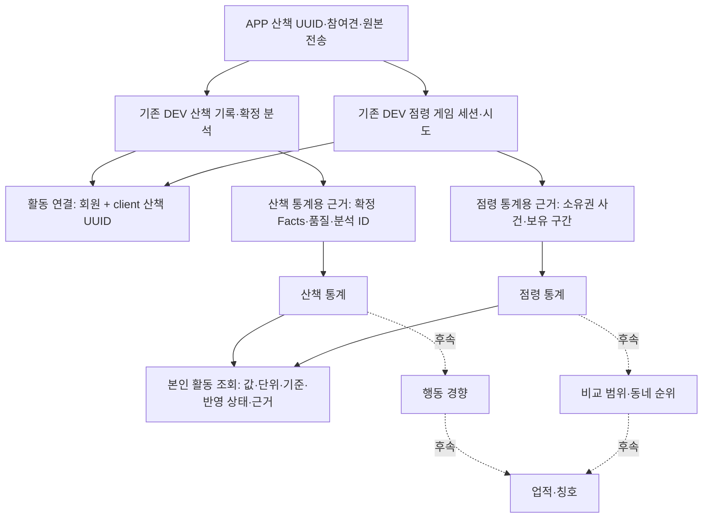
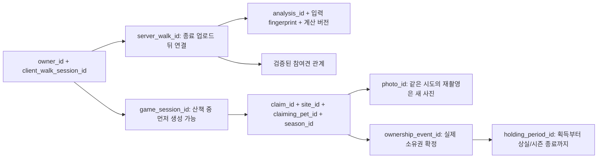

# 산책·점령 세션과 통계 — working skeleton 설계

**목표는 같은 강아지의 활동을 추적할 수 있는 ID 연결과, 원본까지 설명할 수 있는 두 종류의
통계를 만드는 것이다.** 산책 통계와 점령 통계는 별도 도메인으로 두고 식별·버전·반영 상태만
공유한다. 경향 해석, 다른 강아지와 비교, 동네 순위, 칭호는 이 통계를 읽는 후속 소비자다.

사용자가 통계 기록과 세션 ID 관리를 먼저 만들기로 정했다. 아래 구조·필드·작업 순서는 이를
구현하기 위한 설계다. S1·S2의 ID 연결과 순수 통계 계산은 [코어 계약과 실행](../../../contracts/activity-statistics-core.md)에
구현 근거를 남겼다. S3의 [PostgreSQL 저장·재처리 골격](../../../contracts/activity-statistics-postgres.md)도
추가했다. DEV의 실제 분석/점령 입력과 APP 기능 연결은 아직 후속이다.
기존 게임 구현/이관은 [인수인계](../game/territory-game-handoff.md), 순위·칭호는
[별도 초안](../../../contracts/territory-ranking-titles.md)을 참고한다.

## 1. 큰 그림: 통합할 것과 분리할 것

공통 부분은 작은 연결 레지스트리와 통계 반영 장치다. 모든 활동을 하나의 범용 Session/Event/
Metric 테이블로 합치거나 산책 기록을 게임 아래로 넣지 않는다. 처음에는 같은 백엔드·같은
PostgreSQL 안의 두 모듈과 하나의 재실행 가능한 집계 작업이면 된다. 별도 메시지 브로커나
새 마이크로서비스를 선행 조건으로 만들지 않는다.

| 공유할 것 | 각 도메인이 소유할 것 |
|---|---|
| 회원·pet 식별, client UUID와 서버 ID 연결 | 산책 상태와 점령 게임 상태 |
| 입력 identity·중복 방지·원본 revision | 유효 이동거리/시간 계산과 소유권/보유 시간 계산 |
| 집계 generation·반영 확인·재생 절차 | 산책 품질/참여견 귀속과 점령 대표견/인증 상태 |
| 본인 조회 권한과 근거 추적 형식 | 산책 완료 기준과 점령/시즌 종료 기준 |

비교 범위는 뒤로 미루지만 **어느 시점의 어떤 원본에서 나온 값인지**는 지금부터 남긴다.
장소·시즌 ID를 없애거나 시간 범위 없는 lifetime 합계 하나만 저장하면 나중에 다시 묶을 수 없다.

## 2. 기존 코드에서 출발해야 하는 이유

2026-09-06 기준으로 읽은 원본은 다음과 같다. 이름만 비슷하다고 같은 세션/통계로 간주하지 않는다.

| 기존 원본 | 확인한 역할 | 이번 설계에서의 사용 |
|---|---|---|
| APP `walk/store/WalkRows.kt` | `WalkSessionRow.id`, owner ID, 참여견 연결, `serverWalkId` | client UUID를 유지. 새 산책 UUID 체계를 만들지 않음 |
| DEV `models/walk.py` | `walks.id`, UNIQUE(owner, client_session_id), `walk_pets` | 서버 산책의 원본. 끝난 산책이 업로드됨 |
| DEV `walk_analyses`, `walk_capsules` | 입력 fingerprint·계산 버전별 불변 분석과 봉인 | 실제 확정된 산책 통계의 입력 |
| DEV #260 claim session | 산책 중 등록, 내부 UUID와 client UUID·참여견·phase | 산책 업로드 이전에도 존재할 수 있는 게임 세션 |
| Geo `walk/facts.py`, `walk/models.py` | 단일 dog 모델의 Facts와 canonical 계산 | 순수 측정 재료/검증. DEV 다견 계약을 대체하지 않음 |
| Geo `territory/game/policy.py`, `postgres_store.py` | 점수·소유권 변경·시즌 결과 | 점령 사실을 생산할 연결 지점, 통계 입력의 점수 권위로 사용하지 않음 |
| Geo `territory/spatial_stats.py` | 셀로판 공간 통계, 분자/분모/표본·세대 | 나중 공간 통계로 확장할 재료. 게임 소유권 통계가 아님 |

확인 기준: DEV dev `ec3f46b5d1858c0390666f72af21f6c0a317fe60`, APP dev
`815443b4f2a175a535df7746f1b20e23cf6574bb`, DEV #260
`5b2c8a4c57cdf593c8e5be9f11225ffaab599413`.
[DEV 산책 모델](https://github.com/SAJOYO/DAENGS_dev/blob/ec3f46b5d1858c0390666f72af21f6c0a317fe60/backend/src/daengs_backend/models/walk.py),
[APP 산책 모델](https://github.com/SAJOYO/DAENGS_app/blob/815443b4f2a175a535df7746f1b20e23cf6574bb/app/src/main/java/com/daengs/app/walk/store/WalkRows.kt),
[#260 모델/DB](https://github.com/SAJOYO/DAENGS_dev/blob/5b2c8a4c57cdf593c8e5be9f11225ffaab599413/db/init/20_territory_claims.sql).

중요한 차이 두 가지:

1. **산책 기록은 나중에 도착한다.** 게임 세션이 생길 때 `walks.id`는 없을 수 있다. 산책 미업로드가 점령 저장 실패를 뜻하지 않는다.
2. **원본 보존 방식이 다르다.** Geo는 finalize 뒤 raw fix를 purge하는 계약이고, DEV는 원본 chunk 보존 계약이다. 통계 설계 때문에 어느 쪽의 보존 정책도 묵시적으로 바꾸지 않는다.

## 3. ID와 수명: 한 산책에서 갈라지는 연결

### 3.1 연결 레지스트리 제안

`ActivitySessionLink`의 키는 `(owner_id, client_walk_session_id)`다. 필드는 선택적인
`server_walk_id`, `game_session_id`, 연결 revision과 대조 결과다. 새로 만든 임의의 “통합 산책
세션 ID”로 기존 APP/DEV ID를 교체하지 않는다. 내부 surrogate key가 필요하더라도 외부 identity는 유지한다.

- 현재 #260 UNIQUE 기준에서는 한 연결에 산책 기록 0..1, 게임 세션 0..1이다. 점령을 하지 않은 산책도 정상이다.
- 서버가 먼저 확인한 게임 세션으로 link를 만들고, 종료 산책이 오면 같은 회원/client UUID에 서버 walk ID를 붙일 수 있다.
- 반대 순서, 동시 도착, 재전송도 같은 link로 수렴해야 한다. ID를 추정하거나 가짜 완료 산책 행을 만들지 않는다.
- 회원·client UUID·시작 시각·참여견 관계를 검증한다. 단말 UUID가 같아도 다른 회원이면 다른 활동이다.
- 참여견 불일치는 임의 합집합으로 복구하지 않는다. 두 도메인의 이미 유효한 원본은 유지하고 링크를 `CONFLICT`로 둬 조사한다.
- game-only/walk-only는 실패 상태가 아니다. 조회는 각 원본의 존재 여부와 `WAITING_FOR_WALK` 같은 연결 상태를 구분한다.
- 이 link는 두 세션의 권위를 대신하지 않는다. 참여견 변경·탈퇴·원본 삭제는 기존 원본 계약을 따라 별도 반영한다.

강제 종료로 APP 산책이 끝나지 않아 업로드되지 않았어도 이미 확정된 점유는 존재할 수 있다.
link가 미완성이라고 점령 통계를 버리거나 이를 완료 산책 1회로 세지 않는다. 두 원본이 다른
시점에 도착하는 것을 정상적으로 처리하는 것이 첫 skeleton의 핵심이다.

### 3.2 개별 ID의 유지/교체 기준

| ID | 유지되는 경우 | 새로 생기는 경우 |
|---|---|---|
| client walk UUID | pause/resume, 앱 재진입, 같은 종료 기록 업로드 재시도 | 사용자가 새 산책 시작 |
| server walk ID | 같은 회원/client UUID의 재업로드 | 새로운 산책 기록 접수 |
| analysis ID | 동일 입력 fingerprint·계산 세대의 반복 finalize | 새 계산 세대. 어떤 결과가 통계 현재 근거인지 별도 선택 |
| game session ID | 같은 게임 세션 재전송·phase 변경 | 새로운 산책의 게임 등록 |
| claim ID | 같은 시도 재전송·재촬영 | 기존 계약이 허용한 새로운 시도. 시즌 경계 키 확장은 별도 migration 필요 |
| photo ID | 같은 사진 업로드·판정 재시도 | 실제 재촬영 |
| ownership event ID | 같은 원본 확정 사건의 재전송 | 실제 새로운 소유권 변경 또는 인증 변경 사건 |
| holding period ID | 자기 영역 인증 강화, 산책 종료, 조회 시각 진행 | 새로운 소유권 획득. 과거 구간을 끝내고 새 구간 시작 |

사진 인증 성공이 곧 소유권 변경 사건은 아니다. `CERTIFIED`는 기존 보유 구간의 인증 전환이고,
`UNCHANGED`는 새로운 획득이 아니다. receipt를 읽은 횟수나 HTTP 성공 수를 점령 횟수로 세지 않는다.

## 4. 산책 통계: 완료 기록과 측정 근거

### 4.1 원본과 집계 단위

기본 단위는 **확정 분석이 연결된 산책 한 건**이다. 통계용 `WalkStatSource`에는 서버 walk ID,
analysis ID, 입력 fingerprint, Facts/계산/receipt 버전, 시작/종료 시각, 승인된 참여견 관계와
품질/관측 상태를 남긴다. 이미 계산한 Facts를 읽고 GPS acceptance를 다시 구현하지 않는다.

`WalkSessionStatistics`는 그 원본에서 선택한 값과 자격 상태를 저장한다. 같은 원본에 대한
계산 결과를 보존하는 것이며 `walks`에 버전 없는 총거리 컬럼을 추가하자는 뜻이 아니다.
Geo 단일 dog Facts를 DEV 다견의 모든 강아지별 독립 측정 결과로 복제하지 않는다.

첫 범위의 지표:

| 지표 | 의미/집계 | 필수 주의점 |
|---|---|---|
| `recorded_walk_count` | 완료·확정된 서로 다른 산책 수 | 단말 미업로드/열린 산책은 별도 pending. 산책하지 않았다고 해석하지 않음 |
| `moving_distance_m` | canonical moving distance의 합 | raw GPS 누적 거리와 구별, 표시 과정에서 재계산하지 않음 |
| `moving_s` | canonical 이동 시간 합 | wall time·일시정지·비관측 공백을 더하지 않음 |
| `stop_count`, `stop_s` | 기존 계산 정책이 판정한 정지 | 냄새 맡기·휴식 같은 의미를 추가하지 않음 |
| `observed_walk_count` | 관측 자격을 충족해 거리/시간 집계에 실제 기여한 산책 수 | recorded count와 구별, 제외 이유·표본 수 제공 |

기록은 있으나 위치가 전혀 없는 산책과, 유효한 관측에서 이동이 0인 산책은 다르다. 전자는
거리/시간 통계의 `UNAVAILABLE` 원본, 후자는 값 0의 유효 원본으로 표현한다. mock/unknown·
구형 미지원 계산 세대·품질 미달은 제거해 숨기지 않고 원본 상태와 집계 제외 사유를 남긴다.
첫 구현의 관측 자격은 receipt가 증명하는 입력/계산 가능 여부를 사용하며 새 “좋은 산책” 점수는 만들지 않는다.

### 4.2 다견·기간·평균

산책 경로는 세션당 한 번 측정됐다. 참여견별 통계는 **그 강아지가 참여한 것으로 등록된 산책의
측정값**이다. 첫 제안은 검증된 전체 세션 참여 관계로 연결하되, 독립된 반려견 센서 측정이라고
표현하지 않는다. 개별 도중 합류/이탈 시간이 없다면 임의의 참여 구간을 만들지 않는다.

두 강아지가 함께 걸은 400m는 산책 전체 합계에 한 번, 각 강아지의 참여 산책 내역에는 각각
참조된다. 강아지별 값을 다시 합산해 회원이 800m 걸었다고 표시하지 않는다. 참여견이 없는
산책은 회원 기록으로 유지하고 임의의 강아지에게 귀속하지 않는다.

첫 기간 조회는 `[from_ms, to_ms)` 안에 **종료 시각이 있는 산책 전체**를 선택한다. 응답에
`window_basis=walk_end`를 명시한다. 이것은 “그 시간대에 실제 걸은 거리”와 다르다. 자정을
넘는 산책을 양 날짜에 전부 중복 집계하거나 시간 비율로 거리 나누기를 하지 않는다.

실제 활동 일수·시간대 경향·일별 정확한 거리/시간이 필요해지면 canonical 계산 시 비좌표
시간 구간별 contribution을 보존하는 후속 계약을 만든다. Geo의 purge 이전 consumer 경계를
지키며, 이미 원본이 없는 과거에 대해 재계산 가능하다고 약속하지 않는다. 그전에는 완료일 수를
활동일 수라고 부르지 않는다. 시간대별 묶음을 추가할 때 zone/bucket policy version도 필요하다.

평균 이동 속도는 `sum(moving_distance_m) / sum(moving_s)`로 계산하며 분모가 0이면 null이다.
세션별 평균을 단순 평균하지 않는다. 이동 시간/거리는 같은 자격·계산 세대 집합에서 가져온다.

## 5. 점령 통계: 사건과 소유권 유지 구간

### 5.1 점수 원장과 사실 통계의 관계

점령 통계의 원본은 **확정된 소유권 사건과 보유 구간**이다. `Score`는 배점 정책의 결과이며
그 bonus 숫자를 나눠 점령 횟수를 역산하지 않는다. 통계는 점수 계정을 수정하거나 보너스를
다시 지급하지 않는다. 기존 score의 카운터는 대조 자료로 사용한다.

첫 지표는 `acquisition_count`, `takeover_count`, `held_site_ms`, `verified_held_site_ms`,
현재 `owned_site_count`, 시즌 내 `peak_owned_site_count`다. 점령 시도/사진 실패 횟수는
사용자 활동 성과와 구분되는 후속 운영 통계다. 셀 방문·시설 접근을 자동 점령으로 세지 않는다.

### 5.2 보유 구간 모델

`HoldingPeriod`는 pet/site/season, 시작 사건 ID와 획득 시각, 종료 사건/시각, 최초 인증 시각을
갖는다. ID는 원본 획득 사건에 고정한다. 동일 사건 재처리 때 다른 구간을 만들지 않는다.

- 중립 점령/타인에게서 탈취: 새 구간 시작. acquisition 1 증가, takeover는 이전 주인이 있을 때만 1 증가.
- 자기 영역 인증 강화: 구간 ID·획득 시각 유지. `verified_from_ms`만 기록, 획득 횟수 증가 없음.
- 타인에게 상실: 현재 구간을 닫고 새 주인 구간 시작. 시간은 `[start_ms, end_ms)`로 취급.
- 산책 pause/end: 보유 구간을 닫지 않는다. 점유는 산책 밖에서도 계속 유지될 수 있다.
- 시즌 종료: 해당 시즌의 모든 열린 구간을 종료 시각에 닫는다. 일반 산책 세션 종료와 다르다.
- 초기 점유 반영: `origin=IMPORTED`인 시작 근거를 별도로 남긴다. 실제 획득/탈취 횟수는 증가하지 않음.

현재 정책의 인증은 같은 구간에서 UNVERIFIED → VERIFIED로 강화되는 형태다. 인증 취소/
재인증 반복이 도입되면 인증 시간 구간 목록으로 계약을 확장한다. 첫 skeleton에서 범용 상태
전이 엔진을 만들지 않는다.

기간 보유량은 각 구간과 조회 기간의 교집합 길이를 합산한다. 열린 구간은 동일한 서버 `as_of_ms`
또는 시즌 종료 중 이른 시각까지만 읽는다. 두 장소를 1시간씩 보유하면 `held_site_ms`는 2시간이며
실제 산책 시간이나 한 장소의 연속 보유 시간과 다르다.

현재/최대 보유 수는 **첫 구현에서는 pet/season 단위**다. lifetime 최대값에 시즌별 peak를
더하지 않는다. 같은 시각의 여러 사건은 원본의 시즌 내 적용 순서로 재생한다. 전체 시즌들을
합친 최대 동시 보유 수는 별도의 시간/순서 계약과 재생 없이는 제공하지 않는다.

### 5.3 기존 저장의 보강 지점

Geo `append_event`의 ownership plan은 시작/상실/인증 변경의 재료다. 하지만 현재 bootstrap은
일반 점령 사건을 만들지 않고, finalize도 장소마다 상실 사건을 남기지 않는다. 따라서 구현 때
**초기 반영 완료 근거와 시즌 종료 근거**를 같은 원본 transaction에 추가해야 한다. 기존 영수증을
나열하는 것만으로 과거 보유 구간이 완전히 복원된다고 가정하지 않는다.

기존 자료에 초기 근거가 없으면 새 activation 기준의 baseline으로 표시하고 `coverage_start_ms`를
남긴다. 과거 점령 횟수·원래 총 보유 시간을 지어내지 않는다. 현재 지도를 baseline으로 가져올 때도
기존 영수증의 전량 재생과 동시에 더해 이중 집계하지 않도록 기준 revision을 고정한다.

## 6. 처리, 재시도, 재계산의 계약

### 6.1 원본 확정과 통계 계산

원본을 확정하는 기존 transaction에 작은 `StatisticsChange`를 함께 저장한다. 이 행에는
원본 ID, revision, 변경 종류와 처리에 필요한 확정 근거만 담는다. 원본 GPS를 복제하거나
CanonicalTrail을 DB/로그/메시지에 보관하지 않는다. 별도 Kafka나 새 서비스는 첫 단계에 필요 없다.

변경 종류는 다음 두 계열로 나눈다.

- 산책: 분석 head 선택, 참여 관계 변경, 원본 철회/삭제.
- 점령: 실제 소유권 변경, 인증 강화, 초기 소유권 반영 완료, 시즌 종료.

통계 처리기는 변경을 읽어 contribution 또는 보유 구간을 갱신하고, 처리 영수증과 checkpoint를
**같은 통계 transaction**에 기록한다. 계산 실패는 이미 확정된 산책/점령을 되돌리지 않는다.
다만 원본 transaction에서 변경 근거를 기록하는 데 실패하면 원본 확정도 rollback한다.
이 둘을 구분해야 기록 유실을 막으면서 통계 계산 장애를 격리할 수 있다.

같은 원본 ID/revision/통계 generation의 재전달은 기존 결과를 반환한다. 같은 식별자에 다른
payload가 들어오면 덮어쓰지 않고 충돌로 처리한다. 앞선 원본 변경이 누락되면 해당 순서의
처리를 기다린다. DB sequence 발급 순서는 commit 순서가 아니므로 `MAX(id)`만 저장해
미완료 변경을 건너뛰면 안 된다. 미처리 영수증 확인과 원본 단위의 확정 revision이 필요하다.

### 6.2 분석 선택과 재계산

한 산책에 여러 `WalkAnalysis`가 있어도 generation별 head는 하나다. 수집 시각이 가장 늦다는
이유만으로 분석을 선택하지 않는다. 검증된 분석/캡슐 버전과 입력 fingerprint를 기준으로
선택 정책을 명시하고, 바뀌면 이전 contribution을 대체한다. 누적 덧셈으로 처리하지 않는다.

계산 버전이 다른 수치를 자동으로 같은 모집단에 섞지 않는다. 새 통계 계산은 새 generation에서
원본을 재생한 뒤 검증하고 읽기 head를 전환한다. 원본 삭제/철회와 참여 관계 수정도 재생 대상이다.
이미 제거된 raw 자료를 요구하는 새 계산은 과거에 소급할 수 있다고 약속하지 않는다.

첫 구현은 작은 contribution/보유 구간을 조회해 합산한다. 일별 캐시와 lifetime 집계 테이블은
실제 조회 비용이 확인된 뒤 추가한다. distinct 일수나 최대 동시 보유 수는 단순 가감만으로
수정할 수 없으므로, 이후 캐시를 만들 때도 원본 구간으로 재계산할 경로가 있어야 한다.

### 6.3 늦은 통계에서 열린 보유 구간을 읽는 방법

처리기가 탈취 사건을 아직 읽지 않았다면 이전 강아지의 열린 구간을 현재 시각까지 연장하는 것은
잘못이다. 마지막 처리 시각이나 마지막 사건 시각만으로도 최신 상태를 증명할 수 없다.

점령 읽기에는 `confirmed_through_ms`와 원본의 확정 revision이 필요하다. 기존 시즌 barrier 안에서
`(source_revision, as_of_ms)` 기준점을 잡고, 처리기가 그 revision까지 모두 반영했음을 확인한
범위까지만 보유 시간을 계산한다. 원본은 이후에도 계속 진행할 수 있다. S3의
`StatisticsPolicyTransaction`이 이 기준점 생성을 제공한다. 기존 정책 어댑터와는 별도 연결부다.

산책과 점령은 각자의 freshness를 반환한다. 최근 산책 업로드가 늦었다고 점령 시간을 멈추거나,
점령 처리 지연 때문에 확정 산책 수를 숨기지 않는다. 서로 다른 확정 시점을 하나의 “실시간”
표시로 합치지 않는다.

## 7. 저장 구조와 코드 경계

아래는 목표 저장 논리 구조다. 일부 ID/기여분/보유 구간은 순수 코어의 값 객체로 구현했지만,
S3의 실제 테이블 매핑은 [PostgreSQL 계약](../../../contracts/activity-statistics-postgres.md)에 남겼다.
DEV 이식에서는 기존 키 및 삭제 정책에 맞춰 제약과 타입을 다시 맞춘다.

| 구조 | 책임 | 핵심 중복 방지/참조 기준 |
|---|---|---|
| `ActivitySessionLink` | 기존 산책/게임 식별자 연결, 미완성 연결과 충돌 표시 | owner + client walk UUID, 각 서버 ID의 단일 연결 |
| `StatisticsChange` | 원본 확정과 함께 남기는 처리 근거 | source kind + source ID + revision |
| `WalkStatContribution` | 선택한 분석의 산책 수치와 근거 | walk + analysis + projection generation |
| `WalkStatHead` | 조회에 사용할 contribution 선택 | walk + generation당 하나 |
| `TerritoryStatEvent` | 통계 재생에 필요한 소유권/인증/초기화/종료 근거 | 원본 사건 식별자와 시즌 내 확정 순서 |
| `HoldingPeriod` | 시작·인증·종료가 연결된 장소별 보유 구간 | acquisition 또는 baseline의 안정된 ID |
| `StatisticsApplied` / checkpoint | 재처리 영수증, 누락 없는 처리 범위, 조회 기준점 | consumer + generation + source identity/revision |

`TerritoryStatEvent`는 점령 정책의 authoritative ownership event를 대체하지 않는다. 기존 원본이
필요한 보존 기간/필드를 충족하면 참조로 충분하며, 새 테이블을 무조건 복제하지 않는다.
보존 정책 때문에 별도 projection이 필요하면 최소 확정 근거만 보존한다.

코드 책임은 다음처럼 나눈다.

- 연결 resolver: owner와 기존 식별자를 검증하고 양쪽 도착 순서에 관계없이 연결한다.
- 산책 projector: 확정 분석과 참여 관계를 받아 산책 contribution을 계산한다.
- 점령 projector: 순서가 있는 사건을 받아 횟수와 보유 구간을 계산한다.
- store/runner: transaction, 영수증, 재시도, generation 전환을 담당한다.
- read service: 권한, 기간, 계산 가능 범위와 확정 시점을 포함해 조회한다.

두 projector의 계산은 서로 import하지 않는다. 앱 조립 지점에서 원본 생산자와 저장 어댑터를
연결해 순환 의존을 피한다. Geo의 단일 dog fixture 어댑터와 DEV의 다중 참여 산책 어댑터는
동일한 입력 계약을 만족하되, 원본 모델의 차이를 숨기지 않는다. 행동 분류기는 이번 범위에 없다.

## 8. 첫 working skeleton의 합격 시나리오

여기서 skeleton은 클래스 틀만 만드는 것이 아니다. **한 산책의 확정 수치와 연결된 점령 보유
이력을 저장하고, 중복 전달·재시작 후에도 같은 결과와 원본 근거를 조회하는 작은 실행 흐름**이다.

### 8.1 끝까지 통과할 한 시나리오

같은 owner의 강아지 P1/P2가 있고, 시각은 fixture 시작 후 경과 분이다.

1. 0분: 산책 W1과 게임 G1이 시작된다. 서버 `walks` 행 없이 연결 registry에 게임 쪽이 먼저 온다.
2. 2분: P1이 장소 A를 점령한다. acquisition 한 번과 보유 구간 H1을 연다.
3. 4분: 같은 점령이 인증된다. H1에 인증 시작을 기록하며 점령 횟수는 늘지 않는다.
4. 10분: W1이 끝난다. 업로드는 지연된다. H1은 계속 열린 상태다.
5. 12분: 새 산책 W2/게임 G2의 P2가 A를 탈취한다. 10분 보호를 충족한 실제 소유권 변경으로
   H1 `[2, 12)`를 닫고 H2를 연다.
6. 15분: W1 업로드와 확정 분석이 도착한다. 이동 거리 400m, 이동 시간 480초의 분석을 선택한다.
   owner 기준 산책 한 번/400m이며, P1/P2 참여 기록은 같은 산책 근거를 참조한다.
7. 위의 산책/점령 변경을 여러 번 다시 전달해도 수치와 구간 수가 늘지 않는다.
8. 20분의 원본 기준점까지 반영한 조회에서 P1 보유 10분/인증 보유 8분, P2 보유 8분을 반환한다.
   확정 산책은 W1 하나이며, 아직 끝나지 않은 W2는 완료 산책 수에 포함하지 않는다.
9. 프로세스를 재시작하고 새 generation으로 재생해도 같은 결과가 나온다. 점수를 다시 지급하지 않는다.

Geo에서 가짜 입력만 계산하는 단계 다음에 **격리 PostgreSQL에 실제 저장하고 재시작하는 단계**까지
통과해야 저장 skeleton이 완성된다. 현재는 메모리에서 정책 결과·늦은 연결·통계 재생까지 검증했다.
PostgreSQL 저장과 별도 프로세스의 복원 검증은 S3의 실제 DB 테스트로 추가했다.
첫 실행 인터페이스는 테스트/CLI로 충분하다. 화면이나 공개 HTTP API가 선행 조건은 아니다.

### 8.2 처음 제공할 조회 형태

경로 이름을 확정한 API 명세가 아니라 read service가 보장할 최소 결과다.

| 조회 | 결과 |
|---|---|
| 내 세션 연결 | client walk UUID, server walk ID, game session ID, 연결 상태 |
| 내 산책 한 건 | 선택한 분석 수치, 참여 강아지, 분석/캡슐 근거 |
| 강아지의 기간 산책 통계 | `window_basis=walk_end`, 완료 건수, 관측 가능 건수, 거리/시간, 제외 건수 |
| 강아지의 시즌 점령 통계 | 획득/탈취, 보유/인증 보유 시간, 현재/최대 보유 수, 확정 기준점 |
| 수치의 근거 | 권한 내 산책 분석 또는 점령 사건/보유 구간 참조 |

공통 메타데이터는 통계 버전/generation, 원본 버전, 조회 기간 기준, coverage 시작, 확정 시점,
제외 건수와 근거 참조다. `READY`, `PENDING`, `STALE`, `UNAVAILABLE`, `CONFLICT`를 구분한다.
알 수 없는 값은 0으로 채우지 않는다. 다른 보호자의 원본 산책/좌표/사진은 근거 조회에 노출하지 않는다.

## 9. 구현 때 확인할 실패 경계

| 상황 | 기대 결과 |
|---|---|
| 산책/게임이 먼저 또는 동시에 도착 | 같은 owner/client UUID에 하나의 연결로 수렴 |
| 서로 다른 owner가 같은 client UUID 사용 | 별개 세션, 교차 연결 불가 |
| 같은 ID에 다른 시작 시각/참여 정보 도착 | 충돌 또는 명시적 원본 수정 처리, 무조건 합집합 금지 |
| 산책 중 앱 종료, 업로드 영구 미도착 | 미완성 연결 보존, 존재하지 않는 완료 산책 집계 금지 |
| 같은 산책의 새 분석 선택 | 이전 contribution 대체, 두 분석 중복 합산 금지 |
| 다중 강아지/참여 강아지 없는 산책 | owner 한 번 집계, 참여 관계 별도, 임의 pet 지정 금지 |
| mock 또는 불충분한 관측 | 버전별 eligibility/제외 사유 표시, unknown을 0으로 변환 금지 |
| 산책 종료 후 인증/보유 지속 | 해당 점령 근거에 반영, 완료 산책 시간 연장 금지 |
| 같은 점령 재시도/인증 강화 | 획득·탈취 중복 증가 없음, 같은 보유 구간 유지 |
| 초기 소유권/시즌 종료 | bonus 없이 baseline 열기, 종료 시 열린 구간 닫기 |
| 원본 변경 기록 실패/통계 처리 중 실패 | 원본 transaction rollback 또는 통계 transaction 재처리로 구분 |
| 변경 순서 역전/미완료 commit | 누락 revision 건너뛰지 않음 |
| 탈취 반영이 늦은 조회 | 이전 소유자의 구간을 미확인 현재 시각까지 연장하지 않음 |
| 원본 철회/삭제 후 재전달 | 철회 기준 적용, 제거된 기여분 부활 금지 |
| 재시작/새 generation 재생 | 배치 기준 계산과 동일, 점수/보너스 재지급 없음 |

삭제는 별도 보존 정책을 갖는다. 산책 삭제가 관련 점령의 소유권까지 자동 취소하는 것은 아니다.
DEV의 반려견/계정 삭제와 기존 cascade를 확인해 개인별 통계 삭제 또는 연결 해제를 설계해야 한다.
게임 기록의 불변성 규칙을 그대로 복사해서 개인정보 삭제 경로를 막으면 안 된다.
철회 표식/원본 생존 여부 확인은 재생으로 삭제된 통계가 부활하지 않게 하되, 삭제한 개인정보를
영구 tombstone에 다시 보관하는 방식은 피한다. 실제 삭제 마이그레이션 전에 이 경계를 검증한다.

## 10. Geo에서 DEV/APP까지의 실행 순서

| 단계 | 장소 | 완료 기준 |
|---|---|---|
| S1. 식별자·입력 계약 | Geo 문서/fixture, DEV/APP 원본 대조 | 늦은 연결, 다중 참여, 분석 선택, 보유 구간 계약 확정 |
| S2. 두 순수 projector | Geo | DB 없이 중복·시간 경계·관측 제외·baseline/종료 계산 통과 |
| S3. 저장 skeleton | Geo 격리 PostgreSQL | 후속 migration, 어댑터/runner, 8절의 저장·재시작·재생·근거 조회 통과 |
| S4. 실제 생산자 연결 | DEV | 산책 분석 확정과 #260 소유권 transaction에 변경 근거 연결, 권한/삭제/경합 검증 |
| S5. 제품 조회 | DEV API + APP | 기존 세션 ID/재전송 유지, 확정 시점과 미계산 상태를 표시하는 조회 |
| 후속. 의미/비교 층 | 별도 계약 | 활동일/추세, 비교 범위, 순위 snapshot, 칭호 판정·이력 |

S1·S2는 [순수 코어](../../../contracts/activity-statistics-core.md), S3는
[PostgreSQL 저장 골격](../../../contracts/activity-statistics-postgres.md)으로 구현했다.
S4/S5의 DEV 생산자 연결·권한·삭제·APP 표시는 아직 후속이다.
Geo의 실험 UI를 PostgreSQL에 붙이는 작업은 필요하면 S3 검증 도구로 선택할 수 있지만,
실험 입력을 제품 서버의 신뢰 입력으로 만드는 작업과 동일하지 않다.

DEV 이식은 Geo 테이블을 그대로 복사하는 일이 아니다. DEV의 owner/pet/walk/claim FK,
다중 참여, 서버 분석, 삭제 정책에 맞춰 어댑터와 migration을 만든다. 운영 반영은 #260 및
후속 DB 준비·검증 → DEV 서버 연결 → APP 표시/기능 활성화 순서를 유지한다.

## 11. 이번에 정할 것과 뒤로 둘 것

| 이번 설계의 선택 | 이유/한계 |
|---|---|
| 기존 ID를 보존하고 늦게 연결 | 게임이 완료 산책 업로드보다 먼저 생김 |
| 산책/점령의 원본과 projector 분리 | 수명, 측정 근거, 정정 방식이 다름 |
| 확정 분석/소유권 사건만 기여 | 앱 표시 값이나 점수에서 통계를 역산하지 않음 |
| contribution과 보유 구간부터 저장 | 근거·정정·재생을 확보하고 캐시는 이후 추가 |
| 비동기 계산 + 확인된 기준점 조회 | 중복 처리와 지연을 드러내고 보유 시간 과대 계산 방지 |
| 완료 산책 기준 기간 통계 우선 | 실제 활동일/자정별 거리는 추가 시간대별 근거 필요 |
| 점령 현재/최대 보유는 pet/season 우선 | 시즌을 넘는 최대 동시값은 별도 재생 계약 필요 |

비교 지역, 상대 순위, 칭호 조건·수치, 행동 성향의 해석은 이 문서에서 정하지 않는다.
나중에 이 통계의 버전·근거·조회 기준점을 사용하는 소비자로 설계한다. 칭호를 위해 통계
원본 구조를 특정 칭호 조건에 종속시키지 않는다.

구현 PR에서는 이 문서의 상태와 실제 파일/명령/검증 결과를 갱신해야 한다. 설계상의 예상과
실제로 실행한 PostgreSQL/제품 연동 결과를 구분해서 남긴다.
