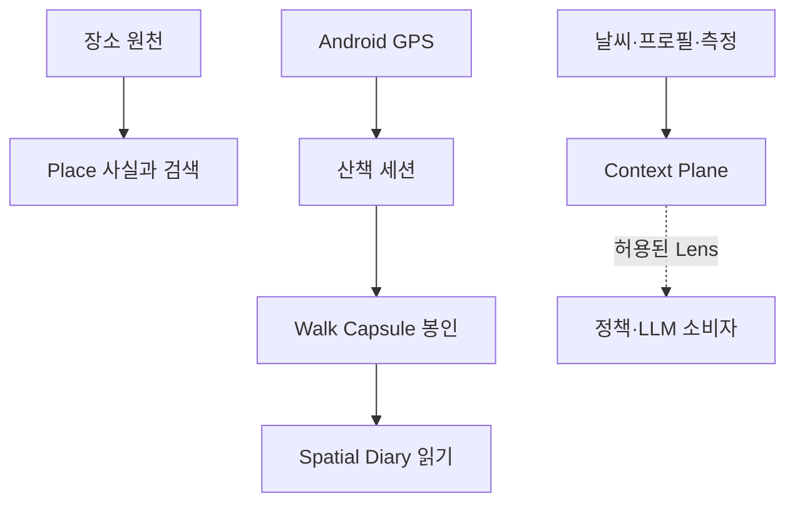

# 컨셉 · 범위

> 현재 범위 검증: 2026-09-02 · 기준 결정
> [#65 Place 우선](decisions/2026-08-26-place-first-discovery.md),
> [#71 병원 진입](decisions/2026-08-27-hospital-place-entry.md),
> [#74 Spatial Diary](decisions/2026-09-01-spatial-diary.md),
> [#75 Capsule finalize](decisions/2026-09-01-walk-capsule-finalize.md),
> [#84 CanonicalTrail consumer boundary](decisions/2026-09-03-canonical-trail-consumer-boundary.md),
> [#83 Context Plane](decisions/2026-09-01-context-plane-v0.md)

## 한 문장

**DAENGS_geo는 장소 원천과 산책 측정을 재현 가능한 공간 증거로 만들고, 사용자가 증언한
장면만 안정 기억으로 승격해 조건별 공간 일기로 다시 읽는 R&D·검증 원본이다.**

이 저장소에 Place 검색·Journey·Android 코드가 남아 있다고 해서 운영 소유권도 이곳에 있다는
뜻은 아니다. 운영 Place/Journey 백엔드의 canonical 저장소는
[SAJOYO/DAENGS_dev](https://github.com/SAJOYO/DAENGS_dev), 운영 Android 앱은
[SAJOYO/DAENGS_app](https://github.com/SAJOYO/DAENGS_app)이다. 이곳에서는 아직 확정되지 않은
산책·공간·검색 가설을 측정·계약·fixture로 닫고, 채택할 단위만 운영 저장소로 승격한다.

## 현재 시스템



산책 종료의 생산 경로는 다음 순서를 지킨다.

```text
start / fixes / finish
→ canonical fix chain
→ WalkFacts · occurrence · micro observation
→ 8u Cellophane · MeasurementReceipt · TrailContextSnapshot
→ WalkCapsuleManifest seal
→ raw fix purge
```

Capsule 자식과 마지막 manifest가 한 트랜잭션으로 완성되기 전에는 원좌표를 지우지 않는다.
이때 raw fix를 검증해 만든 `CanonicalTrail`은 저장 원본이 아니라 finalize 동안만 사는 공통
증거다. 일기 동선과 점령 게임이 채택되더라도 이 입력까지만 공유하고, 각자의 eligibility·저장·
실패·화면 상태는 분리한다. 현재 영구 공간 형태가 Cellophane 하나라는 #69는 별도 route
privacy·retention 결정 전까지 유지된다.
같은 finish를 다시 보내면 이미 봉인된 결과를 반환한다. 원좌표를 지웠다는 사실이 남은
Cellophane과 Pin을 비민감 데이터로 바꾸지는 않는다.

## 소유권과 성숙도

| 축 | 이 저장소의 역할 | 현재 상태 |
|---|---|---|
| Place 검색·Journey | 새 원천·분류·ranking·계약 후보의 검증 원본 | canonical Place v2 구현, 운영 원본은 `DAENGS_dev` |
| Android 지도·산책 수집 | 제품 코드와 대조하는 기준 구현 | foreground service·Room·종료 업로드 구현, 운영 원본은 `DAENGS_app` |
| Walk·Capsule | 산책 증거 생산 계약의 원본 | finish 트랜잭션과 DB 저장 구현 |
| Territory·Spatial Diary | 조건별 공간 읽기와 사용자 기억 경계의 원본 | View·Pin·Memory Place·Journal·Snapshot API 구현 |
| Context Plane | 판단 재료의 출처·시점·용도를 제한하는 공용 경계 | typed 계약·registry·adapter 구현, 전면 이행은 아직 |
| 자연어 Place intent | 검색 의미 경계 실험 | dev-only lab, 제품 공개 진입점 아님 |

Spatial Diary API는 인증 principal을 요구한다. 실제 인증 dependency가 조립되기 전 기본 구현은
503으로 fail closed한다. 따라서 “API와 DB가 있다”와 “운영 사용자가 쓸 수 있다”를 같은 상태로
표현하지 않는다.

## Place — 원천 분류와 사실이 먼저다

장소 발견의 최상위 identity는 공통 `Place`다. 원천 category를 canonical `kind`로 정규화하고,
사용자가 종류를 고른 뒤 그 후보에 사실 조건을 적용한다. 태그와 AI 해석은 Place identity를
만들거나 원천 사실을 덮는 권한이 없다.

`POST /v2/places/search`는 kind별 독립 그룹과 공통 Place 계약을 사용한다. 병원은 UI에서 바로
들어갈 수 있지만 검색 identity와 순위는 canonical `hospital` kind를 따른다. 전화·운영정보는
선택한 Place의 의료용 표현일 뿐 별도 병원 검색 세계를 만들지 않는다.

자연어 intent proposer, search hypothesis, lens, open discovery는
`app/discovery/place_intent`의 dev 검증 경로다. LLM은 후보를 제안할 수 있지만 실행 가능한
target과 hard condition은 서버 compiler·registry가 정한다. 제품 Place 검색의 필수 전제가 아니다.

## Walk Capsule — 쓰기 모델

`app/features/walk`는 Android가 보낸 세션·fix를 canonical 사실과 봉인 증거로 바꾸는 생산자다.
`WalkFacts`와 그 canonical 자식에는 시간·거리·속도·정지·시설 occurrence 같은 관측 사실만 있고
목표·보상·개의 목소리·행동 원인·일기 문장은 없다. 이 부재는 산책 기능 전체가 수집에서
끝난다는 뜻이 아니라,
**생산자가 소비자의 해석을 사실로 위장하지 않는다는 뜻**이다.

Walk Capsule은 기존 결과를 복제한 JSON이 아니라 다음 자식이 모두 준비됐음을 선언하는 manifest다.

- `WalkFacts`와 canonical 파생
- 산책별 Macro Cellophane과 versioned Micro Observation
- raw fix purge 전의 `MeasurementReceipt`
- 당시 값을 미상·실패까지 포함해 동결한 `TrailContextSnapshot`
- 다시 읽을 수 있는 현상을 선언하는 `ObservationCapability[]`

나중의 날씨나 현재 프로필로 과거 산책을 자동 보충하지 않는다.

## Spatial Diary — 읽기 모델

Spatial Diary는 Capsule을 덮어쓰는 저장 원본이 아니라 같은 증거를 조건과 질문에 따라 다시
조립하는 읽기 모델이다.

| 객체 | 권위 |
|---|---|
| `SpatialDiaryView` | 기간·강수·낮밤으로 Capsule을 고른 현재 공간 읽기 |
| `EpisodeCandidate` | 현재 정책으로 계산한 임시 후보 |
| `EpisodeOfferSnapshot` | 사용자에게 실제로 보여 준 제시본 |
| `OfferInteraction` | view/dismiss 기록, 증언 아님 |
| `WalkAttestation` | 사용자가 실제로 답한 의미와 불확실성 |
| `EpisodePin` | Attestation을 통해 남긴 안정 장면 identity |
| `MemoryPlaceBiography` | 서로 다른 산책의 Pin을 명시적으로 묶은 장소 전기 |
| `WalkJournalProjection` | 사실·문맥·현재 Pin을 재생성한 자동 일기 |
| `PublishedJournalSnapshot` | 사용자가 제목·요약·대표 Pin을 확정한 비공개 불변본 |

Candidate가 생겼거나 Offer를 봤다는 이유만으로 행동 의미가 생기지 않는다. 사용자 증언만 안정
기억으로 승격된다. 의미 정정은 Pin을 교체하지 않고 append-only Attestation correction으로 남겨
현재 Journal과 Memory Place가 correction head를 읽는다.

## Context Plane — 판단 재료의 경계

날씨 API 응답, DogProfile, 측정 영수증을 각 기능이나 LLM 프롬프트에 직접 꽂지 않는다.

```text
Provider → typed ContextAtom → derived ContextFacet → purpose Lens → policy/LLM
```

v0 capability는 Trail weather, dog profile, walk measurement 세 가지다. Atom은 provider·source
authority·관측/as-of/captured 시각·공간/시간 support와 `unknown`·`not_fetched`·실패를 구분한다.
Facet은 evidence Atom과 policy version을 가진 재계산 값이고, Lens는 목적별 capability와 용도를
제한한다.

속도·거리·시간·환경·주변 공간 조건·측정 품질·구조화된 프로필 사실은 객관적 원판과 경향으로
사용할 수 있다. 사용자가 일기에 쓴 감정·생각·사적인 해석은 Context Plane과 행동 경향에 넣지
않는다. 비공개 일기 작성 재료와 다른 산책의 판단 근거는 별개다.

현재는 typed 계약·registry·기존 객체 adapter까지 구현됐다. 모든 기존 소비자가 Context Plane을
통해서만 동작하도록 전환됐다는 뜻은 아니다.

## 주장과 개인정보 경계

- 원좌표는 Capsule seal 뒤 삭제한다. Android debug export는 제품 보관 정책 밖의 개발 artifact다.
- Cellophane은 궤적을 직접 저장하지 않아도 반복 장수가 쌓이면 생활권과 경로 topology가 드러날 수
  있는 민감한 공간 집계다.
- 응답하지 않은 Offer와 단순 interaction은 행동 사실이 아니다.
- `not_observed`는 충분한 노출, 관측 capability, 방법이 명시된 drift `not_suspected` 평가가
  함께 있을 때만 허용한다. 아니면 `unjudgeable`이다.
- LLM은 사실을 표현하거나 제한된 intent 후보를 제안할 수 있지만 원인·진단·안전 판정을 확정하지 않는다.
- 세션과 subject 삭제는 Capsule·Pin·Memory Place membership·Published Snapshot까지 같은 수명을 따른다.

## 이 저장소가 소유하지 않는 것

- 사용자 인증·계정과 반려견 프로필의 원본
- 운영 앱의 배포·release 설정과 운영 인프라
- 수의학적 진단, 보행·피부·안구 진단 모델, 증상 문진 챗봇
- 사용자의 속마음을 재사용 가능한 성격·행동 경향으로 바꾸는 것
- 공개 일기 링크, 수신자 ACL, 공유용 위치·시간 마스킹
- 지도 앱 안의 실제 turn-by-turn navigation

이 기능들이 앞으로 필요 없다는 뜻이 아니라 현재 Geo 증거와 공간 일기의 권위 경계에 포함되지
않는다는 뜻이다.

## 왜 한 저장소에 있는가

Place는 주변 세계의 후보와 사실을 제공하고, 산책은 그 세계를 실제로 이용한 측정을 만든다.
Capsule은 측정을 보존 가능한 증거로 바꾸고, Spatial Diary는 사용자가 증언한 의미를 그 위에
얹는다. Context Plane은 이 재료가 기능과 LLM으로 흘러갈 때 출처·시점·용도를 잃지 않게 막는다.

운영 저장소와의 관계는 전체 폴더 동기화가 아니라 **실험 → 측정 → 계약 → 선택적 승격**이다.
현재 승격 기준점과 차이는 [promotion-ledger.toml](promotion-ledger.toml)과
`uv run python -m scripts.promotion_status`로 확인한다.
