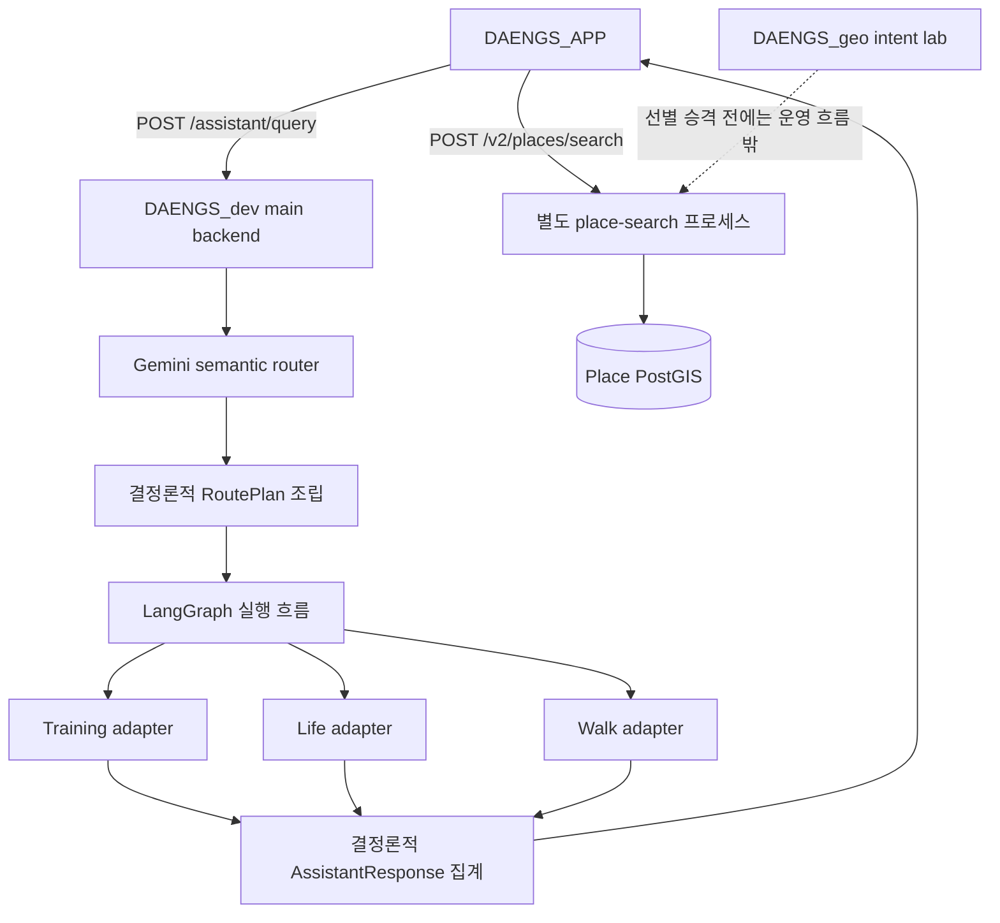
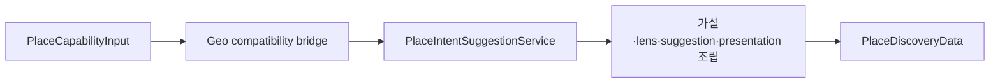

# Place 자연어 검색의 운영 오케스트레이션 접점

> 상태: **연결 준비 메모**
>
> 작성일: 2026-09-03
>
> 이 문서는 `place`를 `EXECUTE`와 `HANDOFF` 중 어디에 넣을지 확정하지 않는다.
> 세 저장소의 현재 책임과, 어느 선택에도 다시 쓸 수 있는 Place 도메인 계약 경계만 고정한다.

## 1. 왜 이 문서가 필요한가

`DAENGS_geo`의 Place intent lab에서는 다음 문제를 순서대로 실험했다.

- 서로 다른 공공데이터 원천을 같은 의미로 취급하지 않고 source facts로 분리한다.
- 자연어 한 문장을 하나의 종류로 억지 확정하지 않고 복수의 검색 가설로 보존한다.
- `강아지가 좋아하는 곳`처럼 목적이 불명확한 요청도 후보를 먼저 제공하고 refinement로 좁힌다.
- `조용한 곳`, `싸게 갈 수 있는 곳`처럼 직접 보장하기 어려운 조건은 사실의 존재 여부와 한계를 함께 표시한다.
- KTO와 KCISA가 연결된 경우에도 어느 원천의 어떤 사실을 채택했는지 숨기지 않는다.
- 검색 결과를 단순 레코드가 아니라 카드·지도 팝업·상세 화면이 공유할 `PlacePresentation`으로 만든다.

이 설계를 실제 제품에 연결하려면 Android 앱만 보면 안 된다. 자연어 진입점과 LLM
라우팅은 `DAENGS_dev`가 이미 소유하고 있고, 운영 Place 검색도 같은 저장소가 정본이다.
따라서 Geo에서 별도의 공통 LLM/오케스트레이터를 새로 만들거나 앱이 Geo 실험 API를 직접
부르면 운영 경계를 우회하게 된다.

이 문서는 기능을 더 확장하기 전에 현재 구조와 선택 이유를 남기고, 후속 작업이 다시
큰 설계 논의에서 시작하지 않도록 하는 체크포인트다.

## 2. 확인한 기준점

2026-09-03에 각 저장소의 기본 개발 브랜치를 다음 커밋에서 확인했다.

| 저장소 | 확인 브랜치와 커밋 | 현재 책임 |
|---|---|---|
| `rkbuhtig/DAENGS_geo` | `main` · `122813b466964a22273e6f493ebd126c1a1415df` | Place 자연어 해석·검색 정책·source facts·표시 정책의 연구와 계약 검증 |
| `SAJOYO/DAENGS_dev` | `dev` · `b388a25ebd6ed6aa4c723627a25418da8963b97b` | 운영 backend, 자연어 오케스트레이션, canonical Place 검색 서비스 |
| `SAJOYO/DAENGS_APP` | `dev` · `09791f4f40055390e454c9d5a821892d5166bbe1` | 실제 Android 사용자 화면, 지도·Place 카드·자연어 입력 |

근거가 되는 운영 문서와 구현은 다음과 같다.

- [`DAENGS_dev/backend/docs/place/UPSTREAM.md`](https://github.com/SAJOYO/DAENGS_dev/blob/dev/backend/docs/place/UPSTREAM.md)는 이관 이후 Place 검색의 canonical 구현이 `DAENGS_dev`이고 Geo의 사본은 동결된 연구 사본이라고 명시한다.
- [`DAENGS_dev/docs/orchestration-architecture.md`](https://github.com/SAJOYO/DAENGS_dev/blob/dev/docs/orchestration-architecture.md)는 Place/Journey가 아직 v1 오케스트레이션 실행 대상이 아니라고 기록한다.
- [`DAENGS_dev/backend/src/daengs_backend/orchestration/contracts.py`](https://github.com/SAJOYO/DAENGS_dev/blob/dev/backend/src/daengs_backend/orchestration/contracts.py)의 현재 EXECUTE 범위는 `training`, `life`, `walk`이고 HANDOFF는 `skin`, `gait`이다.
- [`DAENGS_APP/app/src/main/java/com/daengs/app/place/PlaceApi.kt`](https://github.com/SAJOYO/DAENGS_APP/blob/dev/app/src/main/java/com/daengs/app/place/PlaceApi.kt)는 장소 화면에서 `/v2/places/search`를 직접 호출한다.
- [`DAENGS_APP/app/src/main/java/com/daengs/app/assistant/AssistantApi.kt`](https://github.com/SAJOYO/DAENGS_APP/blob/dev/app/src/main/java/com/daengs/app/assistant/AssistantApi.kt)는 자연어를 `/assistant/query`로 보내지만 Place 결과를 해석하거나 장소 화면으로 넘기지 않는다.

`docs/promotion-ledger.toml`의 Place 운영 승격 기준점은 여전히 Geo
`c5f0d5f738410e90cac294fd5f407cd88f5330ac`이다. 그 뒤 Geo에서 만든 intent와
presentation 작업은 연구 저장소에는 있지만 운영 Place 정본에는 자동으로 반영되지 않는다.

## 3. 현재 제품 요청 흐름



현재 자연어 흐름과 Place 화면 흐름은 같은 앱에 있지만 서로 연결되지 않는다.

### 3.1 전역 LLM이 소유하는 것

`DAENGS_dev`의 `GeminiSemanticRouter`는 `gemini-3.1-flash-lite`를 사용하고, 다음의
**목적지 선택만** 구조화 출력으로 만든다.

- 실행할 능력: `training`, `life`, `walk`
- 전용 화면으로 넘길 대상: `skin`, `gait`
- 전체 발화가 순수 인사·감사·작별인지 여부

모델은 payload, 좌표, CLARIFY, handoff reason, 실행 결과와 사용자 답변을 만들지 않는다.
잘못된 출력은 스키마 검증 후 한 번만 재시도하며, 계속 실패하면 어떤 능력도 실행하지 않는다.

### 3.2 결정론적 계층이 소유하는 것

- planner가 원문과 신뢰된 구조화 context로 typed payload를 조립한다.
- 좌표는 LLM 출력이 아니라 검증된 `context.location`에서만 가져온다.
- LangGraph는 계획 검증, 능력 실행, 결과 수집 순서만 제어한다.
- adapter가 도메인 응답을 공통 `CapabilityResult` 상태로 번역한다.
- 최종 `AssistantResponse` 집계에는 LLM을 사용하지 않는다.

### 3.3 도메인 LLM이 소유하는 것

Training과 Life는 각각 자기 검색·근거·안전 정책을 통과한 뒤 Gemini로 근거 기반 답변을
생성한다. Walk는 결정론적 계산이다. 모델 공급자가 같더라도 각 도메인의 생성 정책은 공통
오케스트레이션 계약이 아니다.

Place도 같은 원칙을 따른다. 전역 라우터가 `place` 목적지만 선택하고, `조용한 곳`을 어떤
정보 요구로 볼지, 복수의 가설을 어떻게 만들지, 어떤 사실을 표시할지는 Place 도메인이
소유해야 한다.

## 4. 이번에 선택한 방향

다음은 `EXECUTE`/`HANDOFF` 결정과 무관하게 유지할 원칙이다.

1. **새 공통 LLM 계층을 만들지 않는다.** 인증, 자연어 진입점, provider 실패 처리,
   RoutePlan과 CapabilityResult는 `DAENGS_dev`의 기존 오케스트레이션을 사용한다.
2. **전역 라우터는 Place 세부 필터를 만들지 않는다.** 전역 라우터의 책임은 요청이 Place
   도메인으로 가야 하는지 선택하는 데서 끝난다.
3. **Place 의미 해석은 Place 도메인 안에 둔다.** LLM 제안, 원문 evidence grounding,
   검색 가설/lens, refinement, 후보 검색, 표시 정책을 한 소유권 아래 둔다.
4. **앱이 원천 facts를 다시 해석하지 않는다.** Android는 서버가 만든 구조화 presentation과
   refinement 선택지를 렌더하고 사용자 행동을 다시 구조화 요청으로 보낸다.
5. **Geo의 공통 계약 복제는 만들지 않는다.** Geo의 bridge는 Place가 소유할 데이터 모양만
   검증하고 `RoutePlan`, `CapabilityResult`, LangGraph 구현은 복사하지 않는다.

## 5. 잠정 접점: Place가 소유하는 입력과 출력

아래 이름은 bridge에서 사용할 작업명이며 운영 공개 이름으로 확정된 것이 아니다.

### 5.1 `PlaceCapabilityInput`

```text
PlaceCapabilityInput
  query                 사용자가 보낸 원문. Place 계층이 임의로 다시 쓰지 않는다.
  location              인증과 무관한 신뢰된 구조화 좌표. LLM 출력에서 받지 않는다.
  dog_conditions        크기·무게·나이 등 값 projection. dog_id 자체가 아니다.
  search_limits         허용 반경·종류별 제한 등 서버 정책 범위 안의 값.
```

전역 planner 또는 Place adapter는 이 입력을 조립할 수 있지만, 그 안의 자연어 의미를
판정하지 않는다. `active_dog_id`가 들어오더라도 소유권 확인 없이 검색 조건으로 사용하지
않고, 권위 있는 profile projection이 준비되기 전에는 값만 받는 기존 Place 계약을 유지한다.

### 5.2 `PlaceDiscoveryData`

```text
PlaceDiscoveryData
  interpretation_summary    사용자에게 설명 가능한 해석 요약
  search_lenses             서로 독립적으로 실행·표시할 검색 가지
  groups                    가지별 검색 후보와 정렬/coverage
  presentations             카드·지도 팝업·상세 화면이 공유하는 semantic view model
  refinements               해석을 제거하거나 구체화할 사용자 선택지
  notices                   확인 불가·근거 부족·안전/결정 관련 공지
  receipts                  적용한 정책과 채택한 사실의 출처 영수증
```

LLM의 원출력이나 내부 trace는 이 공개 데이터에 넣지 않는다. 앱에 필요한 것은 검증·정규화된
해석, 후보, 표시 결과와 다음 행동이지 provider 디버그 정보가 아니다.

`PlaceDiscoveryData`는 나중에 `CapabilityResult.data`에 직접 담을 수도 있고, Place 화면을
여는 handoff가 참조하는 서버 측 결과가 될 수도 있다. 이 선택 때문에 Place 내부 계약을 다시
만들지 않도록 둘을 분리한다.

## 6. 아직 결정하지 않는 것

### 6.1 `place`는 EXECUTE인가 HANDOFF인가

| 선택 | 장점 | 닫아야 할 문제 |
|---|---|---|
| `EXECUTE` | 한 자연어 요청 안에서 검색까지 실행하고 구조화 결과를 보존할 수 있다. 다중 capability 결과와도 같은 봉투를 쓴다. | 큰 결과의 응답 크기, place-search 호출 경계, 앱이 일반 `results[].data`를 읽는 계약을 정해야 한다. |
| `HANDOFF` | 지도 중심의 상호작용을 전용 Place 화면에 남기고 대화 응답을 가볍게 유지한다. | 현재 handoff는 `target + reason`뿐이라 질의·해석·검색 결과를 운반할 수 없다. payload 확장 또는 안전한 서버 측 참조가 필요하다. |

단순히 `target="place"`만 추가하는 것은 충분하지 않다. 사용자가 말한 의미와 이미 만든 검색
가지를 잃고 앱에서 처음부터 다시 해석하게 되기 때문이다.

### 6.2 그 밖의 보류 사항

- Place 결과를 `/assistant/query` 응답에 전부 담을지, 별도 결과 식별자로 조회할지
- 후보가 많을 때 페이지네이션과 응답 크기를 어디서 제한할지
- `place-search`가 intent endpoint까지 직접 소유할지, main backend adapter가 조립할지
- 자연어 Place 요청의 인증·rate limit·타임아웃 정책
- clarification을 전역 `CLARIFY`로 종료할지, 후보와 함께 Place refinement로 제공할지
- 앱이 챗봇에서 자동으로 `PlacesScreen`을 열지, 사용자가 CTA를 눌러 이동할지
- 관측 로그에서 원문을 남기지 않으면서 수정·취소·검색 실패를 어떻게 집계할지

현재 제품 원칙은 정보가 부족해도 가능한 후보와 한계를 먼저 보여주고 사용자가 좁히게 하는
것이다. 따라서 Place 내부의 모호성을 곧바로 전역 배타적 `CLARIFY`로 바꾸지 않는다. 최종
상태 매핑은 실제 실패 사례와 앱 상호작용을 본 뒤 확정한다.

## 7. 다음 bridge 실험의 제한된 범위

후속 Geo 작업은 다음 한 경로만 검증한다.



bridge가 해야 할 일:

- 원문과 신뢰된 좌표/조건을 기존 Place intent 서비스에 전달한다.
- LLM proposal을 서버 evidence에 고정한 뒤에만 검색 가설로 사용한다.
- 복수 가설과 refinement를 보존한다.
- 검색 결과와 presentation을 공개 가능한 Place 데이터로 투영한다.
- `PlaceDiscoveryData`가 JSON 직렬화되어 공통 결과 봉투의 `data`가 될 수 있음을 테스트한다.

bridge가 하지 않을 일:

- Geo에 `DAENGS_dev`의 `CapabilityName`, `RoutePlan`, `CapabilityResult`를 복제하지 않는다.
- LangGraph, 인증, `/assistant/query` 또는 production endpoint를 Geo에 만들지 않는다.
- 전역 semantic router prompt를 Geo에서 수정하지 않는다.
- Android 화면이나 운영 Place DB를 변경하지 않는다.
- EXECUTE/HANDOFF 결정을 코드로 선점하지 않는다.

## 8. 운영 승격 순서

1. **Geo bridge 검증**

   현재 intent·lens·presentation 계약이 오케스트레이션 형태의 입력과 출력 사이에서 닫히는지
   fixture와 순수 테스트로 확인한다.
2. **승격 대조표 작성**

   `docs/promotion-ledger.toml`의 Place 기준점 이후 변경 중 운영에 필요한 계약·정책·테스트만
   골라 `DAENGS_dev`의 canonical `daengs_place` 구조에 대응시킨다.
3. **`DAENGS_dev` Place 도메인 착륙**

   source facts, intent planning, presentation을 운영 패키지명과 프로세스 경계에 맞춰 옮긴다.
   이 단계까지는 오케스트레이션 enum을 넓히지 않아도 된다.
4. **오케스트레이션 편입 결정**

   EXECUTE/HANDOFF와 전송 방식을 사람 결정으로 닫은 뒤 router gold set, prompt schema,
   planner payload, adapter, aggregate 회귀를 함께 변경한다.
5. **`DAENGS_APP` 연결**

   앱이 검증된 Place 결과를 파싱해 기존 `PlacesScreen`, `PlaceDiscoveryController`,
   `PlaceDiscoveryPanel`과 지도 marker에 연결한다.
6. **종단 평가**

   자연어 입력부터 후보·지도·카드·refinement까지 실제 KTO/KCISA 데이터로 확인하고,
   빈 결과·근거 부족·복수 해석·부분 실패를 별도로 측정한다.

## 9. 이 체크포인트의 완료 기준

- 세 저장소의 책임과 canonical 경계가 문서에서 모순 없이 설명된다.
- 공통 LLM/오케스트레이션을 새로 만들지 않는 이유가 남는다.
- 전역 capability 선택과 Place 내부 의미 해석이 분리된다.
- EXECUTE/HANDOFF를 아직 확정하지 않았음이 코드와 문서에서 명확하다.
- 다음 bridge가 검증할 입력·출력과 하지 않을 일이 구체적이다.
- 다른 작업을 진행한 뒤 돌아와도 운영 승격 순서를 이 문서만으로 복원할 수 있다.
