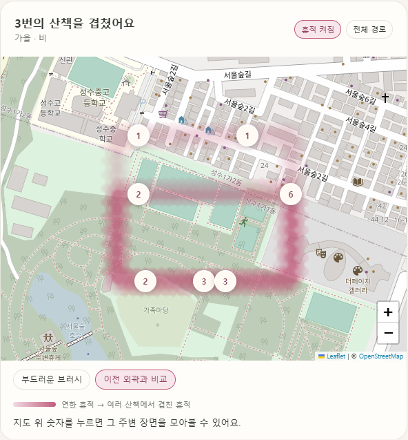
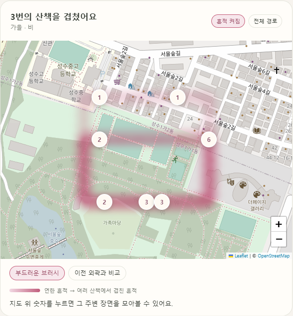
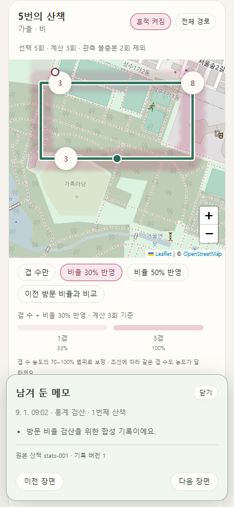
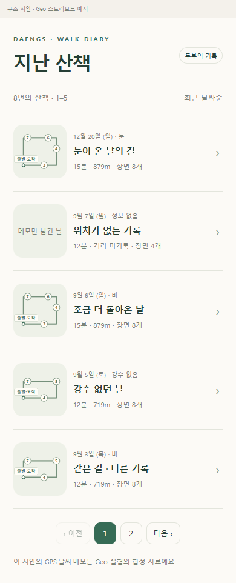

# 산책 지도 일기 실험 종합: 셀로판에서 장면 조각과 Gemini까지

2026-09-07 KST. 상태: **탐색 결과와 설계 판단 기록**. 제품 채택 결정이나 자동 생성 품질 보증이 아니다.

작성: 이 협업 세션의 Codex. 아래 실험은 이 세션에서 사용자가 방향을 제안·정정하고, 내가 직접 코드와 HTML을 작성해 실행·검토한 작업이다. 외부 팀의 실험을 조사한 보고서가 아니다. 문서화할 때 저장된 영수증과 캡처를 다시 대조했다. 사용자의 판단, 내가 구현한 선택, 모델 출력, 내 해석을 구분해 남긴다.

## 1. 이번까지 무엇을 확인했나

산책을 목록에서 골라 하나의 지도에서 읽고, 조건에 맞는 다른 산책을 셀로판처럼 겹쳐 보는 흐름을 실험했다. 처음에는 Hex를 어떻게 자연스러운 붓으로 보여줄지, 기록이 쌓일 때 농도를 무엇으로 정할지에 집중했다. 이후 한 산책의 의미를 채우는 장면으로 관심이 옮겨가 공공 공간 자료, 사용자 행동 핀, Gemini의 선정·서술을 단계별로 비교했다.

현재까지 가장 뚜렷한 결과는 **표시·집계·장면 선정·문장 작성의 책임을 나누면 문제를 구체적으로 볼 수 있다**는 것이다. 반면 공간 변화가 검출됐다고 좋은 장면이 되는 것은 아니며, 근거 ID가 정확해도 문장은 그 근거를 넘어설 수 있었다.

| 질문 | 실행한 것 | 확인한 결과 | 아직 확인하지 못한 것 |
| --- | --- | --- | --- |
| Hex가 그대로 보여야 하는가? | 계산용 셀과 표시용 raster를 분리하고 외곽을 평활화 | 각진 외곽이 부드러워졌고 사용자도 개선을 긍정적으로 평가 | 실제 GPS·Android 성능·보편적인 미적 선호 |
| 기록이 쌓이면 무엇이 진해져야 하나? | 시간 밀도 → 방문 비율 → 겹 수 → 혼합 농도 비교 | 한 번의 100%를 연하게, 반복은 진하게 표현하는 방향 선택 | 통계적으로 추정된 최적 농도 계수 |
| 일기는 어디서 여는가? | 페이지 목록 → 단일 지도 → 장면·다른 산책 탐색 | 동선 썸네일과 출발/도착, 시간순 번호의 역할 정리 | 이 PR에 포함한 HTML 시안의 운영 성능 |
| 어떤 공간 재료가 이야기 재료인가? | 경계·상권·공원·하천 조합을 수기 편집 비교 | 공간 배경의 변화와 사용자 메모가 장면 구성을 바꿈 | 자동 선정의 성공률 |
| 누가·무엇을·어디서만 주면 되는가? | raw 조각을 Gemini에 전달한 1차 실험 | 조각→장면→지도 연결은 가능, 과도한 병합·수식 발생 | 사실적인 자동 서술 |
| 공간 관계로 가공하면 나아지는가? | 2차에서 배경·거리 추세·짧은 사건 제공 | 사진 시점 보존, 입력 토큰 감소. 관계 선택은 15장면 중 1개 | 관계를 제공하는 것만으로 선정이 좋아지는지 |
| 장면의 역할까지 주면 어떨까? | 3차에서 행동·전환·연결 분리, 남길 이유·중심 근거 제공 | 연결 18개 제외, 공간 전환이 본문에 나타남 | 중복 제거·선택 균형·근거 밖 서술 방지 |

## 2. 기록을 읽는 범위

실험 코드는 Geo `185747f` 기반 로컬 `experiment/walk-cohort-season-weather`에서 작성했다. 이 문서 PR은 구조 정리 이후 `1e46851`을 기준으로 **문서와 보존 결과만** 추가한다. 당시 실행 코드·원천 캐시·키·로컬 서버를 이 PR에 싣지 않는다. 따라서 단계별 문서의 명령을 이 PR 체크아웃만으로 실행할 수 있다고 해석하면 안 된다.

11개 단계별 문서는 당시 상태를 보존했다. 예를 들어 초기 지도 실험의 숫자는 밀집 장면 수였지만 이후 일기 시안에서는 시간순 장면 번호로 정정됐다. 아래의 진행 순서와 최종 방향을 함께 읽는다.

[보존 자료 안내](2026-09-07-walk-diary-evidence/README.md)에 모델 입력·출력·프롬프트·검토 의견·사용량, 일부 브라우저 결과와 캡처를 넣었다. localhost 화면을 열지 못해도 원문과 숫자를 검토할 수 있다. 외부 데이터 전체나 실행 코드를 복원하는 패키지는 아니다.

기존 [일기 제작 계획](../explorations/walk/diary/plan.md)의 전체 이해 → 장면 순회 → 전체 재검토 → 사용자 검토 흐름은 별도로 존재한다. 이번 Gemini 1~3차는 후보 제공·선택·서술을 **조건별 한 번의 호출**로 비교했으며, 그 제작 흐름 전체나 과거 공간 경향 입력까지 구현·평가한 것은 아니다. 아래 역할 분리와 후속 제안도 그 계획을 대체하는 제품 규칙으로 확정하지 않는다.

## 3. 사용자가 정리한 제품 의도

| 요소 | 이번 대화에서 정리한 역할 |
| --- | --- |
| 한 산책의 동선 | 기록이 적어도 경로 모양·속도·체류가 시각적인 재미와 관측 정보를 제공 |
| 사용자 액션 핀 | 그 시점에 무엇을 했는지 의미를 채움. 이동이나 체류만으로 행동 원인을 단정하지 않음 |
| 누적 브러시 | 조건에 맞는 여러 산책의 공간적 빈도를 시각화. 체류가 길다고 여러 번 걸은 것으로 세지 않음 |
| 셀로판 조건 | 계절·날씨로 산책과 스토리보드를 모아 읽는 선택 장치. 지역 정책은 우선 보류 |
| 자동 서술 | 익숙함/새로움을 판정하지 않음. 공간을 겹친 모습만으로 사용자가 비교할 수 있게 하고, 차이 해석은 별도 검토 |
| 목록 | 산책 세션을 찾는 입구. 페이지 단위 조회이며 목록 페이지가 누적 집계의 모집단을 제한하지 않음 |
| 지도 번호 | 해당 산책 안의 시간순 장면 번호. 밀집 개수와 구별 |
| 대표 제목 | 스토리보드 생성 시 함께 만들고 같은 버전으로 저장하는 방향. 제목이 없으면 날짜 기반 대체 제목 |

이는 이번 화면 기획의 범위다. 누적 표시의 역할을 공간 빈도로 정한 것을, 기존 제작 계획에서 과거 경향 조각의 가능한 쓰임 전체를 금지한 것으로 확대하지 않는다.

## 4. 셀로판·브러시·탐색 UI의 진행

### 4.1 같은 조건이 지도와 장면에 적용되게 만들었다

[계절·강수 첫 실험](2026-09-07-walk-cohort-season-weather.md)에서는 합성 산책 13회를 실제 Geo `compute_facts → paint_sheet → spatial_field`에 넣었다. 축 안의 조건은 OR, 축 사이는 AND로 묶고 KST 시작 날짜로 계절을 정했다. 날씨 미상과 강수 없음, 알려진 빈 장과 관측 누락을 구별했다. 타깃 35개 검사와 CLI 예상 집합 12/12가 통과했다.

[지도 실험](2026-09-07-walk-cohort-map-lab.md)에서는 합성 8회에 Geo 스토리보드 생성기를 연결했다. 기본 가을+비 집합은 산책 3회·24장면이었다. 그중 좌표 없는 시작/끝 6장면은 목록에 남겼고 지도 좌표를 임의로 채우지 않았다. 선택 장면·경로가 바뀌어도 배경의 집합과 분모가 유지되는지 확인했다.

초기 강수 어댑터를 비교하면서 Geo의 강수량 문턱 기반 분류와 당시 Dev의 관측 종류/WMO 코드 기반 분류가 다름을 발견했다. 이번 문서 등록이 어느 운영 계약을 통일한 것은 아니다.

### 4.2 셀은 계산에 남기고 외곽만 붓처럼 바꿨다

원본 support를 화면 외곽까지 강제하면 셀 굴곡이 남았다. 표시용 2m raster에 sigma 5m Gaussian 평활화를 적용하고, 표시 단계에서 원본 Hex 외곽으로 다시 잘라내지 않았다. 원본 Hex 집계와 좌표 조회는 유지했다.

| 초기 셀 외곽 | 표시용 평활화 후 |
| --- | --- |
|  |  |

두 캡처는 초기 외곽 비교다. **캡처의 숫자는 당시 밀집 장면 수이며 최종 시간순 번호 정책의 예시가 아니다.** 이때 사용자는 부드러운 표시가 훨씬 낫다고 평가했다. 단일 협업 검토의 반응이며 사용자 연구 결과는 아니다.

이후 브러시가 너무 두꺼워 가까운 경로의 변별이 떨어진다는 의견에 따라 산책별 표시 support를 약 2m 안쪽으로 줄였다. sigma를 3m로 낮춘 시도는 셀 굴곡을 다시 드러냈다. 최종 실험에서는 sigma 5m를 유지하고 smoothstep으로 연한 바깥 자락을 걷어냈다. 이미 같은 Hex에 합쳐진 원본 경로를 복원한 것은 아니다. [가는 브러시 기록](2026-09-07-walk-overlap-thin-brush.md).

### 4.3 농도의 의미를 순서대로 바꿔 비교했다

[3·30·100회 실험](2026-09-07-walk-cohort-density-lab.md)은 각각 24·240·800장면을 만들고 20행 페이지와 줌별 묶음을 적용했다. 기본 줌 17에서 지도 표시 수는 6·14·14개였다. 100회에서 좌표 있는 600장면이 한 번씩 묶음에 포함됐다. 반복 경로군의 합성 자료이며, 실제 GPS 100회나 Android 성능을 대표하지 않는다.

농도는 다음 순서로 검토했다.

1. 초기 시간 질량/평균 밀도: 오래 머무른 것과 여러 번 걸은 것을 시각적으로 구별하기 어렵다.
2. [방문 비율](2026-09-07-walk-visit-colour-policy.md): 산책당 셀 방문을 한 번으로 세고 `k/N`을 고정 색으로 표현했다. 2/3과 20/30, 추가 체류, 누락 추가에 따른 불변성을 확인했다. 그러나 1/1과 100/100이 같은 색이어서 ‘쌓인 흔적’이라는 목적에 부족했다.
3. 겹 수: 서로 다른 산책의 겹 수에 로그 농도를 적용했다. 한 번은 연하고 반복은 진해졌다.
4. [혼합 모형](2026-09-07-walk-hybrid-brush.md): 겹 수 농도에 조건 내 비율을 제한적으로 반영했다. 사용자와 다음 구현 방향으로 선택한 시각 모형은 `hybrid30`이다.

```text
k_display = 산책별 부드러운 표시 마스크의 합
N = 위치 관측이 complete로 명시된 산책 수
p_display = clamp(k_display / N, 0, 1)
base = 0.72 × log(1 + min(k_display, 100)) / log(101)
alpha = base × (0.7 + 0.3 × p_display)       # N=0이면 alpha=0
```

| 원본 중심 조건 | 겹 수만 alpha | hybrid30 alpha |
| --- | ---: | ---: |
| 1/1 | 0.108 | 0.108 |
| 2/3 | 0.171 | 0.154 |
| 20/30 | 0.475 | 0.427 |
| 20/20 | 0.475 | 0.475 |
| 20/100 | 0.475 | 0.361 |

로그 곡선·100겹 상한·30% 보정은 **시각 실험의 임시 계수**다. 관측 횟수·분모라는 통계에 연결했지만 통계적 신뢰도나 최적 계수를 추정한 것은 아니다. 분모가 다른 집합에서는 적은 겹이 더 진할 수도 있다. 정확한 횟수·비율은 원본 Hex 정수 `k/N`으로 조회하고, 가장자리의 부드러운 표시 값을 원본 방문율로 주장하지 않는다.

선택한 산책은 탐색에 남기되 집계에서는 partial/missing/unknown을 제외했다. 실제 로그의 complete 판정 기준과 이 제외로 생기는 선택 편향은 미해결이다. 같은 산책의 반복 통과·체류는 추가 한 겹이 되지 않는다.

### 4.4 목록에서 단일 지도 일기를 열도록 정리했다

[탐색 HTML 시안](2026-09-07-walk-diary-navigation-preview.md)은 최근 산책을 5개씩 보여주고 선택한 세션의 지도·장면을 연다. 겹쳐 보기에서 계절·날씨를 선택하고, 다른 세션을 고르면 배경 조건을 유지하면서 전경 경로와 카드를 바꾼다. 목록으로 돌아갈 때 페이지·스크롤을 유지한다.

썸네일은 동선 형태와 출발/도착이 우선이다. 장면 번호는 공간이 허용할 때만 표시하며 빠진 번호를 당겨 다시 매기지 않는다. 위치가 없는 기록은 경로를 만들어 넣지 않는다. HTML 시안의 예시 제목은 합성 자료 label이며 Gemini가 모두 생성한 제목이 아니다.

| 혼합 브러시와 선택 카드의 모바일 캡처 | 목록·경로·출발/도착 시안 |
| --- | --- |
|  |  |

좌측은 이전 겹침 실험 UI여서 묶음 수를 표시한다. 우측은 이후 시간순 장면 번호 정책이다. 두 캡처를 같은 버전의 완성 화면으로 읽지 않는다.

## 5. 공공 공간 자료로 장면 재료를 만들었다

[재료 조합 비교](2026-09-07-storyboard-ingredient-comparison.md)는 동일한 38분 49초 합성 산책을 두고 경계, 상권, 공원·하천, 네 재료 전체, 가상 메모 추가, GPS 누락의 6안을 Codex가 편집했다. 총 34장면이다. **이 단계는 별도 Gemini 호출이나 자동 생성 평가가 아니다.**

| 재료 | 실제 사용한 범위 | 넘어가면 안 되는 추론 |
| --- | --- | --- |
| 경계 | SGIS 2025-06-30 행정동 면 경계, 사용자 제공 ZIP | 행정동이 달라졌다는 이유만으로 중요한 사건이라고 판단 |
| 상권 | 2026-09-04 수집 상가 4,647개 캐시, 조회 반경 125m의 수·업종 | 보행자 수, 활기, 실제 영업, 해당 시설 이용 |
| 공원 | 강남구 공원 대표점과 거리 | 공원 내부 진입·횡단·입구 통과 |
| 하천 | EGIS 하천 형상과 거리. 표준자료에서 부족한 양재천 등을 보완 | 산책로 이용·다리 통과·물가에서 쉼 |
| 참가자·행동 | 가상 보호자·반려견 두부, 10분 냄새 맡기와 15분 사진 메모 | 실제 사용자·실제 사진 내용·정지·즐거움 |
| 경로 | 기존 합성 관측 꼭짓점에서 약 1분 간격 후보 40개, 누락안 39개 | 실제 보행 가능한 경로나 GPS 정확도 검증 |

10분 지점의 반경 125m 등록 상가는 98개였고, 15분에는 0개·늘벗근린공원 대표점 9m·양재천 형상 138m였다. 21분에는 상가 85개가 다시 잡혔고 업종 구성도 달랐다. 여러 자료를 결합하니 ‘상가가 없는 곳’보다 ‘상가 구간에서 공원·하천 가까이로 이어진 흐름’을 구성할 수 있었다.

가상 사진 메모 하나를 더한 편집안에서는 제목과 중심 장면이 달라졌다. 반대로 16:35–19:45 GPS를 제거한 안은 17분의 하천 근접 장면을 사용할 수 없었다. 없는 경로를 메우지 않고 앞뒤 기록을 구분했다.

여기서 얻은 아이디어가 ‘누가·무엇을·어디서’를 독립 조각으로 만들고 시간순으로 엮는 방식이다. **장면은 좌표 하나에 붙인 장소 소개보다, 행동과 주변 변화가 연결된 사건일 수 있다**는 가설로 다음 실험을 진행했다.

## 6. Gemini 실험 1~3차

### 6.1 공통 조건과 평가 범위

모델은 `gemini-3.1-flash-lite`, temperature 0.2. 이동만 / 행동 핀 추가 / 행동 핀+GPS 누락의 세 조건으로 비교했다. 참가자와 행동은 가상이며 공간 자료는 같은 공공 캐시를 사용했다. 모델이 좌표를 새로 쓰지 않고 선택 ID를 시스템이 관측 좌표에 연결했다.

각 차수는 입력·프롬프트·출력 계약을 함께 바꿨다. 조건당 성공 출력 1개이므로 특정 정책만의 인과 효과나 일반 성공률을 말할 수 없다. 구조 통과와 서술의 사실성은 별도로 검토했고, 제목·본문·요약·이유·한계 설명을 수정 없이 남겼다.

### 6.2 1차: 관측 지점의 raw 조각을 전달

[상세 기록](2026-09-07-who-what-where-gemini.md) · [입출력 원문](2026-09-07-walk-diary-evidence/gemini-01.json)

독립 ID를 가진 누가·무엇을·어디서 164~171개 조각을 제공했다. 모델은 관측 후보를 묶어 3~7장면, 대표 위치 ID, 제목·본문·근거·선정 이유를 반환했다. 주체, ID 소속, 시간순, 단절을 넘는 병합 등을 검사했다.

이동만 4장면, 행동 추가 3장면, 누락안 4장면이 나왔다. 행동 메모는 중심 장면이 됐으나 사진 장면이 15:00~38:49의 25개 관측 후보를 흡수했다. ‘활기차게’, ‘잠시 멈춰’, ‘다정한 사진’, ‘산책로’처럼 근거 밖 표현도 나왔다. 근거를 많이 인용해도 글이 정확해지지는 않았다.

### 6.3 2차: 시스템이 공간 관계와 사건 범위를 계산

[상세 기록](2026-09-07-spatial-relations-gemini.md) · [입출력 원문](2026-09-07-walk-diary-evidence/gemini-02.json)

공원/하천 100m 이내와 상가 수에 따라 대표 배경을 정하고, 다른 배경이 연속 2개 후보에서 나타나야 전환했다. 같은 대상의 3개 이상 관측에서 거리 변화율 중앙값을 계산했다. 접근/멀어짐은 거리 차이 35m 이상·변화율 0.25m/s 이상을 임시 기준으로 삼았다. 접근 뒤 멀어짐도 별도 관계로 만들었다. 목적지나 진입 의도는 계산하지 않았다.

배경 변화·행동 핀·단절·최대 300초로 사건을 나누고 임의 병합을 금지했다. 행동 핀은 한 시점으로 보존했다. 후보 11/15/18개에서 각각 5장면이 나왔다. 사진이 15분에 남고 뒤 이동이 분리됐으며 성공 응답 입력 토큰은 1차 대비 약 73.5% 줄었다.

하지만 거리 관계를 인용한 장면은 총 15개 중 1개였다. 많은 장면이 행정동과 장소 배경을 나열했다. ‘기념’이라는 목적과 입력에 장소명이 없다는 잘못된 한계 설명도 남았다. **관계를 계산해 주는 것과 모델이 그것을 중심 사건으로 고르는 것은 별개**였다.

### 6.4 3차: 행동·공간 전환·연결 이동으로 역할 분리

[상세 기록](2026-09-07-scene-purpose-gemini.md) · [입출력 원문](2026-09-07-walk-diary-evidence/gemini-03.json)

후보마다 역할, 카드 자격, 남길 이유, 중심 근거를 붙였다. 행동은 필수 보존, 채택 기준에 맞는 공간 전환은 선택 후보, 연결 이동은 지도에만 남기고 카드 선택을 금지했다. 행정동은 모델 입력에서 제외했다. 5분 강제 분할을 없애고 장면 수를 0~7개로 허용했다. 미선택 후보 전부에 생략 이유를 요구했다.

| 조건 | 후보: 행동 / 전환 / 연결 | 선택: 행동 / 전환 | 장면 수 |
| --- | --- | --- | ---: |
| 이동만 | 0 / 7 / 4 | 0 / 7 | 7 |
| 행동 핀 추가 | 2 / 7 / 6 | 2 / 3 | 5 |
| 행동 핀+단절 | 2 / 8 / 8 | 2 / 5 | 7 |

연결 후보 18개는 모두 제외했고 두 조건에 등장한 행동 4개도 모두 보존됐다. 선택된 전환 15개가 지정한 중심 근거를 인용했다. 이는 **시스템 규칙을 따른 결과**이며 모델의 독립적인 중요도 판단 성공률이 아니다.

‘상가가 모인 구간을 지나 공원 가까이로 이동’, ‘공원 가까이에서 하천 가까이로 변화’처럼 전환이 본문에 나타났다. 단순 이동 12분을 장면 0개로 처리하는 사례도 오프라인 테스트에서 확인했다. 그 12분 통제 입력은 Gemini에 호출하지 않았다.

### 6.5 수치 비교

| 차수 | 장면 수: 이동 / 행동 / 단절 | 성공 응답 입력 토큰 | 성공 응답 전체 토큰 | 성공 호출 지연 합계 | 생성 요청 시도 / 성공 |
| --- | --- | ---: | ---: | ---: | --- |
| 1차 raw 조각 | 4 / 3 / 4 | 49,355 | 58,693 | 36.140초 | 3 / 3 |
| 2차 공간 관계 | 5 / 5 / 5 | 13,082 | 15,675 | 13.672초 | 4 / 3 |
| 3차 장면 역할 | 7 / 5 / 7 | 11,506 | 15,631 | 20.703초 | 3 / 3 |
| 합계 | 45장면 | 73,943 | 89,999 | 70.515초 | 10 / 9 |

2차 첫 이동 요청은 응답 없이 연결이 종료되어 재시도했다. 실패 요청의 처리·사용량·지연은 위 합계에 포함하지 못한다. 인증 확인용 모델 목록 조회 1회는 생성 요청 수에 포함하지 않는다. 사용량은 API 응답 기준이며 청구 금액을 확인한 결과가 아니다. 3차 입력이 더 짧다고 응답도 더 빨라지지는 않았다.

### 6.6 성공과 별도로 남겨야 할 실패

| 실제 관측 | 왜 문제인가 | 다음 검토 대상 |
| --- | --- | --- |
| 3차 이동만 조건에서 전환 7개 전부 선택 | 검출된 변화 모두가 독립 카드로 유의미한 것은 아님 | 반복 전환의 묶음과 상대적 선택 가치 |
| 3차 행동 조건에서 5개만 만들고 후반 4후보를 ‘장면 수 제한’으로 생략 | 상한은 7개라 설명과 출력이 맞지 않음 | 세션 전체 선택 분포와 생략 이유의 일관성 |
| ‘거리가 줄었다가 다시 늘어남’을 인용하고 ‘거리가 변화했다’로 서술 | ID는 맞지만 방향·순서 정보가 사라짐 | 문장이 중심 근거의 의미를 보존하는지 |
| 단절 조건에서 ‘멈춰 냄새를 맡았다’ | 냄새 핀에 정지 근거가 없음. 2차에서 안 나온 오류가 재발 | 행동·수식의 근거 대응 |
| ‘기념 사진’, ‘상가 구간으로 복귀’ | 촬영 목적, 동일 장소로의 복귀를 추가 추론 | 제목까지 포함한 목적·장소 동일성 검토 |
| 단절을 ‘이동 경로로만 처리했다’는 한계 설명 | 실제 시스템은 단절을 연결하지 않음 | 모델의 자기 설명도 사실 검토 대상 |

후반을 반드시 채우거나 카드 수를 늘리면 해결된다는 뜻은 아니다. 중요한 후보가 없으면 생략할 수 있어야 하지만, 생략 이유가 입력과 맞아야 한다.

## 7. 작업하며 느낀 점과 판단

아래는 위 출력과 협업 검토에서 얻은 **Codex의 해석**이다. 사용자 평가나 운영 성능으로 입증한 결론과 구별한다.

내 구현에서 돌아봐야 할 선택도 있었다. 처음에는 밀집 개수를 지도 숫자로 썼고, 사용자가 원한 시간순 장면 번호와 달랐다. 비율 전용 농도는 1/1을 짙게 만들어 누적 흔적이라는 목적을 놓쳤다. 2차의 5분 분할은 긴 병합을 막았지만 사건의 의미보다 시간 상한을 앞세운 임시 대응이었다. 관계를 계산해 주기만 하면 모델이 사용할 것이라는 기대도 실제 출력과 달랐다. 각각 사용자의 정정이나 결과 비교를 통해 다음 구현으로 수정했다.

**첫째, 시각화는 설명을 강요하지 않아도 가치가 있다.** 사용자는 부드러운 붓과 겹친 모양을 보는 데 만족을 표현했다. 그 사실만으로 ‘익숙한 길’이라는 문장을 붙일 이유는 없다. 빈도 표시는 스스로 읽을 수 있어야 하고, 자동 해석의 가치는 별도로 입증해야 한다.

**둘째, 전처리는 단순 압축보다 무엇을 사건으로 볼지 정하는 작업이다.** raw 지점들을 던질 때는 모델이 큰 시간 덩어리를 만들었다. 관계와 역할을 주니 문장의 초점이 달라졌다. 다만 시스템이 먼저 잘라놓은 범위 밖의 연결은 모델이 발견하기 어렵고, 짧은 사건에는 거리 추세 계산에 필요한 관측 3개조차 부족해질 수 있다. 계산용 관측 창과 표현할 사건 범위는 분리해서 검토할 필요가 있다.

**셋째, 공간 변화와 기억할 만한 장면은 다르다.** 상가→공원→하천을 모두 문장으로 만들면 장소 안내가 반복될 수 있다. 이번에는 사용자 행동이 중심을 만들고 공간 정보가 배경·앞뒤 흐름을 채울 때 더 자연스럽게 느껴졌다. 그러나 행동이 없는 산책을 가치 없는 산책으로 취급하거나 모든 전환을 행동에 종속시키는 규칙까지 검증한 것은 아니다.

**넷째, 선정 오류와 서술 오류를 따로 평가해야 한다.** 후반 생략은 선정 문제이고, ‘멈춰’ 추가는 문장 문제다. 단계를 나눠 비교하면 무엇이 개선됐는지 알기 쉬워진다. 이것이 반드시 API 호출을 여러 번 해야 한다는 결론은 아니다.

**다섯째, 근거 추적은 필요하지만 사실성 보증은 아니다.** ID·시간·주체·단절 검사는 잘못 연결된 핀을 막는 데 유용하다. 반면 수식·목적·장소 진입·감정·정보 손실까지 잡으려면 문장의 주장과 근거를 비교해야 한다. 요약·제목·한계 설명도 제외할 수 없다.

**여섯째, 구조가 풍성한 것과 카드가 많은 것은 다르다.** 연결 이동은 지도에 남아 세션 전체를 보여주고, 필요한 장면만 카드로 읽을 수 있다. 기록이 없을 때 탐색 틀을 유지하는 UI와, 근거가 부족할 때 빈 장면을 허용하는 생성 정책은 함께 갈 수 있다.

## 8. 다음에 비교할 작업 — 아직 실행하지 않음

1. **같은 조각으로 구성 두 안 비교:** 공간 전환 중심 구성과, 행동을 중심으로 필요한 전환을 붙인 구성을 나란히 읽는다. 단순 무핀 산책도 포함한다. ‘이날 이렇게 걸었지’라는 흐름과 장소 설명의 반복 정도를 본다.
2. **선정과 작성 분리 평가:** 동일한 후보·출력 예산에서 먼저 선택안을 고정하고 문장을 비교한다. 선택한 이유·생략한 이유·시간대 분포를 함께 보되 시간대별 카드 할당을 강제하지 않는다.
3. **주장 단위 근거 확인:** 행동·장소 진입·복귀·목적·감정·거리 방향을 제목/본문/요약/설명에서 추출해 근거와 대조한다. ID가 맞아도 의미가 사라진 경우를 평가 항목에 넣는다.
4. **사례 확대와 반복 실행:** 여러 경로·핀 수·누락·GPS 흔들림·공간 변화가 적은 조건을 고정 fixture로 만들고, 정책 하나씩 바꿔 비교한다. 지금의 단일 출력들을 성공률로 재해석하지 않는다.
5. **운영 연결 별도 판단:** 관측 완전성, 보존 동선과 서버 거리/구간 대응, 사건·bundle 버전, 사진·액션 편집 시 재생성, 제목 대체, 실제 기기 성능을 확인한 뒤 Dev/App로 가져갈 범위를 정한다.

## 9. 검증 기록과 제품 상태

아래는 **각 실험 당시 실행한 검사**다. 중복된 회귀 테스트가 있어 행을 합산한 고유 테스트 수로 제시하지 않는다. 이 문서 PR에서 전체 스위트나 Gemini를 다시 실행한 것은 아니다.

| 당시 범위 | 기록된 검증 |
| --- | --- |
| 계절·강수 | 타깃 35개, CLI 집합 12/12, Ruff |
| 지도 연결 | 관련 45개; 외곽 개선 뒤 관련 10개; 브라우저 필터·핀·빈 상태 |
| 3·30·100회 | 관련 15개, 브라우저 장면 소속·20행 페이지·줌·반응형 |
| 방문 비율 | 관련 19개, 2/3·20/30·체류·누락 비교, 원본 셀 클릭 |
| 가는 브러시 | 관련 13개 후 외곽 수정분 4개 재검증 |
| hybrid30 | 브라우저 수치·농도·배경 유지·모바일 검토 |
| 공공자료 수기 편집 | 6안·34장면의 좌표·근거·시간·단절 검사 |
| Gemini 1차 | 구조 3건, 오프라인 8개, 지도/카드 연결 |
| Gemini 2차 | 구조 3건, 오프라인 17개, 원문과 근거 비교 |
| Gemini 3차 | 구조 3건, 오프라인 23개, 역할·생략 이유·사진 핀·단절 UI |

브라우저는 데스크톱 Windows Edge/headless 또는 Codex 인앱 브라우저에서 확인했다. 모바일 폭 캡처는 Android 실기기 검증과 다르다. 농도 실험의 콜드 100회 로드는 당시 약 17.19초, 캐시 조회는 약 1.8초였으며 합성 생성·로컬 전송 비용이 포함됐다. 보존 브라우저 JSON의 `timing`은 그 보고서 실행에서 측정한 값으로 초기 콜드 측정과 혼용하지 않는다.

관련 앱 [PR #186](https://github.com/SAJOYO/DAENGS_APP/pull/186)은 문서 작성 중 GitHub에서 `MERGED`, 머지 커밋 `86c0e6e178a85a509dff0b47432aa4f672566a93`, 머지 시각 2026-09-07 08:31:15 UTC로 확인했다. PR 본문에는 5개 페이지 목록·Canvas 경로 썸네일·속도/체류·액션 편집·대표 제목 계약과 제한된 검증 범위가 기록돼 있다. 본문의 과거 ‘draft 유지’ 문구보다 현재 GitHub 상태를 따른다. 이 확인은 최신 앱 실행·배포 상태나 Gemini 장면 선정 로직의 운영 반영을 검증한 것이 아니다.

Geo 원장이나 기존 채택 결정을 이번 PR로 갱신하지 않는다. 현재 확보한 것은 UI 방향과 실험 근거이며, 실제 사용자 산책·실제 사진·날씨 조건별 LLM 품질·운영 자동 생성의 완료는 아직 주장할 수 없다.

## 10. 단계별 기록 바로가기

| 단계 | 기록 |
| --- | --- |
| 조건·집합 | [계절·강수](2026-09-07-walk-cohort-season-weather.md) |
| 지도·부드러운 외곽 | [지도 실험](2026-09-07-walk-cohort-map-lab.md) |
| 장면이 쌓일 때 탐색 | [3·30·100회](2026-09-07-walk-cohort-density-lab.md) |
| 비율의 기준 | [방문 비율](2026-09-07-walk-visit-colour-policy.md) |
| 겹 수와 폭 | [가는 브러시](2026-09-07-walk-overlap-thin-brush.md) |
| 현재 시각 모형 후보 | [hybrid30](2026-09-07-walk-hybrid-brush.md) |
| 목록·지도·번호 | [일기 탐색 시안](2026-09-07-walk-diary-navigation-preview.md) |
| 공간 재료 조합 | [수기 편집 비교](2026-09-07-storyboard-ingredient-comparison.md) |
| Gemini 1차 | [raw 조각](2026-09-07-who-what-where-gemini.md) |
| Gemini 2차 | [공간 관계](2026-09-07-spatial-relations-gemini.md) |
| Gemini 3차 | [장면 역할](2026-09-07-scene-purpose-gemini.md) |
| 원문·수치·캡처 | [보존 자료](2026-09-07-walk-diary-evidence/README.md) |
